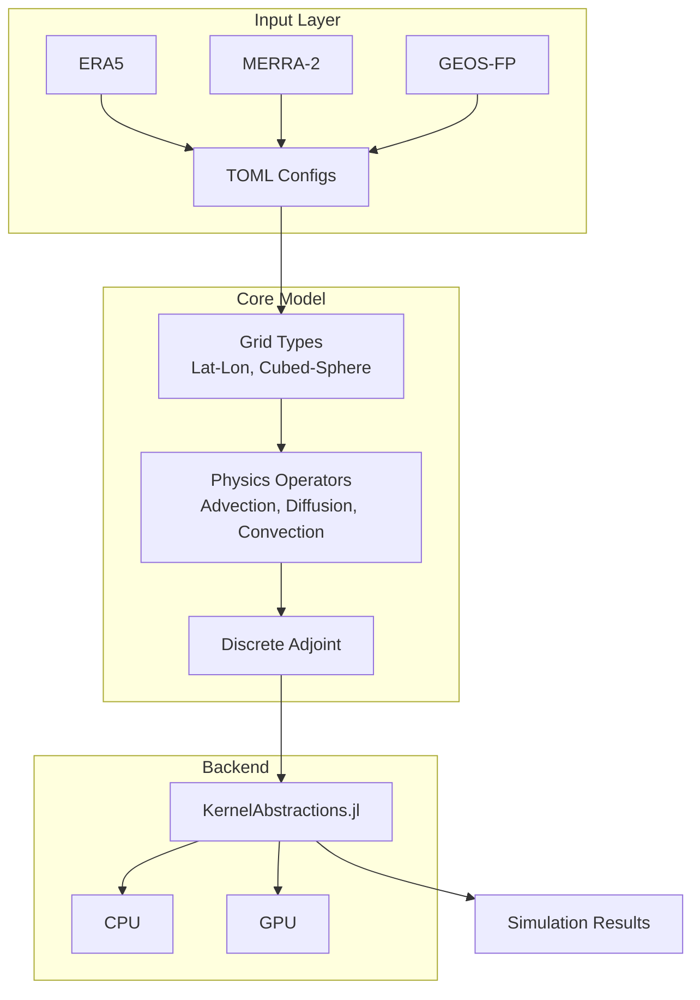

# AtmosTransport.jl

[](https://RemoteSensingTools.github.io/AtmosTransport/dev/)

A Julia-based atmospheric transport model for GPU and CPU, inspired by TM5 and designed with
[Oceananigans.jl](https://github.com/CliMA/Oceananigans.jl)-style multiple dispatch patterns.

### Column-Mean CO₂ Transport (ERA5 + EDGAR, GPU)


*One-month forward simulation (June 2024) of anthropogenic CO₂ transport on a
1° × 1° × 137-level grid, driven by ERA5 model-level spectral winds and
[EDGAR v8.0](https://edgar.jrc.ec.europa.eu/) surface emissions. The animation
shows the column-averaged mixing ratio enhancement (ppm, delta-pressure weighted)
in Robinson projection.*

**Simulation details.** Mass fluxes are pre-computed from ERA5 hybrid-level u/v/omega
fields following TM5's continuity-consistent approach: horizontal mass fluxes are
derived from the winds, and vertical fluxes are diagnosed from horizontal convergence
to guarantee column mass conservation. Transport uses TM5-faithful mass-flux advection
(Russell--Lerner slopes scheme with Strang splitting) and boundary-layer diffusion
(implicit Thomas solver). The entire simulation loop --- advection, diffusion, source
injection, air-mass bookkeeping, and column-mean diagnostics --- runs on a single
NVIDIA L40S GPU via [KernelAbstractions.jl](https://github.com/JuliaGPU/KernelAbstractions.jl)
in Float32 arithmetic. Key GPU optimizations include a parallelized tridiagonal
(Thomas) solver for vertical diffusion, device-to-device air-mass resets eliminating
per-substep host transfers, GPU-side column-mean and surface diagnostics, and
memory-mapped flat-binary I/O for mass-flux ingestion (~15× faster than NetCDF).

## Features

- **Multi-grid:** Latitude-longitude and cubed-sphere grids with hybrid sigma-pressure vertical coordinates
- **Multi-backend:** Single codebase for CPU and GPU via [KernelAbstractions.jl](https://github.com/JuliaGPU/KernelAbstractions.jl)
- **Multi-met-data:** Readers for ECMWF ERA5, NASA MERRA-2, and GEOS-FP with automatic regridding
- **Hand-coded discrete adjoint:** TM5-4DVar-style adjoint with Revolve checkpointing for bounded memory
- **Extensible:** Every physics operator is behind an abstract type; new schemes, grids, and data sources plug in via multiple dispatch without modifying core code
- **Operator splitting:** Symmetric Strang splitting (advection, convection, diffusion, sources) with paired forward/adjoint operators

## Architecture Overview



## Quick start

```julia
using AtmosTransport
using AtmosTransport.Grids
using AtmosTransport.IO: default_met_config, build_vertical_coordinate

# Build vertical coordinate from TOML config (ERA5 137 levels, GEOS-FP 72, etc.)
config = default_met_config("era5")
vert = build_vertical_coordinate(config; FT=Float64)

grid = LatitudeLongitudeGrid(CPU();
    FT   = Float64,
    size = (360, 180, n_levels(vert)),
    longitude = (-180, 180),
    latitude  = (-90, 90),
    vertical  = vert)

model = TransportModel(;
    grid       = grid,
    tracers    = (:CO2, :CH4),
    advection  = SlopesAdvection(),
    diffusion  = BoundaryLayerDiffusion(),
    convection = TiedtkeConvection())
```

## Design principles

- **Julian:** Multiple dispatch, parametric types, no OOP inheritance chains
- **TM5-aligned:** Slopes advection, Tiedtke convection, operator splitting, discrete adjoint
- **Grid-agnostic:** Physics code dispatches on grid type; never assumes lat-lon layout
- **Adjoint-paired:** Every forward operator has a hand-coded adjoint counterpart
- **Extension-friendly:** Abstract types + interface contracts; adding a new scheme never requires editing core

## Validation

- **Tests:** 209 unit and integration tests (including 18 mass-flux advection tests); gradient tests for the adjoint. See `docs/VALIDATION.md`.
- **Mass-flux advection:** TM5-faithful co-advection of tracer mass and air mass with machine-precision conservation. See `docs/MASS_FLUX_EVOLUTION.md`.
- **Reproducible run:** `julia --project=. scripts/run_reference_ecmwf.jl` (ECMWF/ERA5 reference case; see `docs/REFERENCE_RUN.md`).
- **TM5 comparison:** Run TM5 locally (see `docs/TM5_LOCAL_SETUP.md`), then `scripts/compare_tm5_output.jl our_output.nc tm5_output.nc`.
- **GPU:** The full simulation loop (all advection directions, vertical diffusion, source injection, diagnostics) runs on GPU via KernelAbstractions when `grid = LatitudeLongitudeGrid(GPU(); ...)` and `using CUDA`.

## Documentation

[](https://RemoteSensingTools.github.io/AtmosTransport/dev/)

Full documentation is available at [RemoteSensingTools.github.io/AtmosTransport](https://RemoteSensingTools.github.io/AtmosTransport/dev/), including:

- **Theory:** Mathematical framework for mass-flux advection and TM5 comparison
- **Tutorials:** Step-by-step guides for running forward simulations with ERA5 and GEOS-FP
- **Developer Guide:** Validation results, TM5 code alignment, design history
- **API Reference:** Auto-generated docstrings for all exported types and functions

Source files for the documentation are in `docs/literate/` (Literate.jl scripts) and `docs/` (markdown reference docs).

## References

- Krol et al. (2005): TM5 two-way nested zoom algorithm
- Huijnen et al. (2010): TM5 tropospheric chemistry v3.0
- Russell & Lerner (1981): Slopes advection scheme
- Putman & Lin (2007): Finite-volume on cubed-sphere grids

## License

MIT
