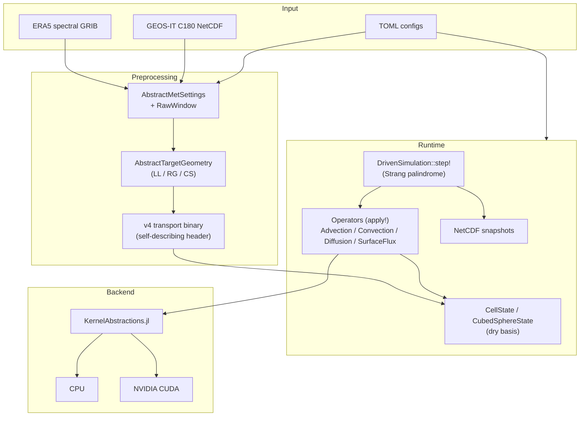

# AtmosTransport.jl

> **Work in Progress.** This project is under rapid active development. We
> regularly break things and fix them afterwards. APIs, file formats, and
> physics implementations may change without notice. If you are interested
> in contributing or following along, feel free to open an issue.

[](https://RemoteSensingTools.github.io/AtmosTransport/dev/)

A Julia-based, GPU-portable atmospheric tracer transport model for offline
chemistry / chemical-transport applications. Designed for **mass-conserving**
advection, convection, and boundary-layer diffusion on **lat-lon, reduced
Gaussian, and cubed-sphere** grids, driven by **ERA5** or **GEOS** met data,
with a clean separation between offline preprocessing and runtime stepping.

### Column-Mean CO₂ Transport (ERA5 + EDGAR, GPU)


*One-month forward simulation (June 2024) of anthropogenic CO₂ transport on a
1° × 1° × 137-level grid, driven by ERA5 model-level spectral winds and
[EDGAR v8.0](https://edgar.jrc.ec.europa.eu/) surface emissions. The animation
shows the column-averaged mixing ratio enhancement (ppm, delta-pressure weighted)
in Robinson projection.*

**Simulation details.** Mass fluxes are pre-computed from ERA5 hybrid-level
vorticity / divergence / log-PS spectral fields following TM5's continuity-
consistent approach (Holton synthesis): horizontal mass fluxes are derived
from the spectral fields, and vertical fluxes are diagnosed from horizontal
convergence to guarantee column mass conservation. Transport uses TM5-faithful
mass-flux advection (Russell-Lerner slopes scheme with Strang splitting) and
boundary-layer diffusion (implicit Thomas solver). The entire simulation loop
— advection, diffusion, source injection, air-mass bookkeeping, and
column-mean diagnostics — runs on a single NVIDIA L40S GPU via
[KernelAbstractions.jl](https://github.com/JuliaGPU/KernelAbstractions.jl)
in Float32 arithmetic.

## Features

- **Multi-grid:** Regular lat-lon, reduced Gaussian, and cubed-sphere
  (gnomonic and GEOS-native panel conventions). Hybrid σ-pressure vertical
  coordinate.
- **Multi-source:** ERA5 spectral preprocessor (LL / RG / CS targets) and
  GEOS-IT C180 native cubed-sphere preprocessor. GEOS-FP and MERRA-2 are
  declared but not yet implemented (the source-axis abstraction is in place).
- **Multi-backend:** Single codebase for CPU and GPU via
  [KernelAbstractions.jl](https://github.com/JuliaGPU/KernelAbstractions.jl).
  CUDA path is end-to-end through the runtime driver; an Apple Silicon /
  Metal weakdep extension exists.
- **Mass-conserving:** Dry-basis air-mass bookkeeping, with **write-time
  replay gates** in the preprocessor (always on) and **opt-in load-time
  replay validation** at runtime. Tolerances `1e-10` (F64) / `1e-4` (F32).
- **Operator-modular:** Every physics operator is behind an abstract type
  with a `No<Operator>` no-op default; swap schemes via type dispatch
  without modifying core code.
- **Advection schemes:** `UpwindScheme` (1st order), `SlopesScheme`
  (Russell-Lerner, 2nd order in smooth regions), `PPMScheme` (Putman-Lin,
  3rd order in smooth regions), `LinRoodPPMScheme{ORD}` for cubed-sphere
  with FV3 cross-term advection (`ORD ∈ {5, 7}` selects the boundary
  stencil).
- **Convection:** `CMFMCConvection` (GCHP-style RAS / Grell-Freitas, for
  GEOS sources) and `TM5Convection` (TM5 four-field entrainment /
  detrainment, for ERA5 sources) — different physics, identical
  `ConvectionForcing` plumbing.

> **Note on adjoint maturity.** A discrete adjoint is on the roadmap but
> **not yet shipped**. The forward operators are designed adjoint-ready
> (Thomas-solver coefficient layout, time-pure `ConvectionForcing`
> dispatch, Strang palindrome time symmetry) but the adjoint kernels
> themselves are pending. See
> [Adjoint status](https://RemoteSensingTools.github.io/AtmosTransport/dev/theory/adjoint_status/)
> for details.

## Architecture



## Quick start

The fastest way to get a real simulation running:

```bash
# 1. Clone + install
git clone https://github.com/RemoteSensingTools/AtmosTransport.git
cd AtmosTransport
julia --project=. -e 'using Pkg; Pkg.instantiate()'

# 2. Verify the install (synthetic-fixture suite, no external data)
julia --project=. -e 'using Pkg; Pkg.test()'

# 3. Download the quickstart bundle (preprocessed ERA5 binaries)
bash scripts/download_quickstart_data.sh ll       # newcomer path; just LL (~1 GB)
# or `bash scripts/download_quickstart_data.sh`   # both LL and CS bundles (~2.7 GB)

# 4. Run a 3-day advection-only simulation (defaults to GPU; set
#    [architecture] use_gpu = false in the TOML for CPU)
julia --project=. scripts/run_transport.jl config/runs/quickstart/ll72x37_advonly.toml
```

The bundle is hosted as assets on the
[`data-quickstart-v1` GitHub Release](https://github.com/RemoteSensingTools/AtmosTransport/releases/tag/data-quickstart-v1)
and contains preprocessed transport binaries at four grid configurations
(LL 72×37, LL 144×73, CS C24, CS C90, all F32, Dec 1-3 2021). See the
[Quickstart with example data](https://RemoteSensingTools.github.io/AtmosTransport/dev/getting_started/quickstart/)
docs page for the full walkthrough.

## Documentation

Full documentation lives at
[RemoteSensingTools.github.io/AtmosTransport](https://RemoteSensingTools.github.io/AtmosTransport/dev/).
The reading order:

1. **[Getting Started](https://RemoteSensingTools.github.io/AtmosTransport/dev/getting_started/installation/)** — install, quickstart, first run, inspecting output.
2. **[Concepts](https://RemoteSensingTools.github.io/AtmosTransport/dev/concepts/grids/)** — grids, state & basis, operators, binary format.
3. **[Tutorials](https://RemoteSensingTools.github.io/AtmosTransport/dev/tutorials/_generated/synthetic_latlon/)** — Literate-driven, runnable end-to-end examples.
4. **[Preprocessing](https://RemoteSensingTools.github.io/AtmosTransport/dev/preprocessing/overview/)** — ERA5 spectral, GEOS native CS, regridding, conventions cheat sheet.
5. **[Theory & Verification](https://RemoteSensingTools.github.io/AtmosTransport/dev/theory/mass_conservation/)** — mass-conservation derivation, advection schemes, conservation budgets, validation status, adjoint status.
6. **[Configuration & Runtime](https://RemoteSensingTools.github.io/AtmosTransport/dev/config/toml_schema/)** — TOML schema, output schema, data sources.
7. **[API Reference](https://RemoteSensingTools.github.io/AtmosTransport/dev/api/)** — auto-generated per submodule.

A high-signal in-repo summary of invariants and "fast failure triage" lives
at [`CLAUDE.md`](CLAUDE.md) in the repo root.

## Design principles

- **Julian:** Multiple dispatch, parametric types, no OOP inheritance chains.
- **TM5-faithful where it matters:** Russell-Lerner slopes (`SlopesScheme`)
  and TM5 four-field convection (`TM5Convection`) implement the same
  numerics as the corresponding TM5 routines (`advectx__slopes` /
  `advecty__slopes` for slopes; `entu / detu / entd / detd` for
  convection), verified by parity tests in `test/test_tm5_*.jl`.
- **GCHP-style for GEOS sources:** CMFMC convection
  (`CMFMCConvection`) for the GEOS native CS path matches GCHP's RAS /
  Grell-Freitas physics.
- **Grid-agnostic operators:** Physics code dispatches on grid type via
  multiple dispatch; never assumes lat-lon layout.
- **Extension-friendly:** Abstract types + interface contracts; adding a
  new scheme never requires editing core code.

## Validation

- **Verification (synthetic-fixture suite):** ~39 core test files run on
  every push and PR — uniform-tracer invariance, mass-budget conservation,
  cross-window replay closure, conservative-regrid mass closure, CPU/GPU
  agreement bounded by 4-16 ULP.
- **Cross-day continuity (real GEOS-IT data):** preprocessor closes
  write-time replay gate at machine epsilon (`5.94e-16` F64,
  `~3.5e-7` F32 measured).
- **Multi-month + observational closure:** *not yet done*; the forward
  operators have the fidelity, the cross-model intercomparison reports
  haven't been written yet. See
  [Validation status](https://RemoteSensingTools.github.io/AtmosTransport/dev/theory/validation_status/)
  for the honest current-state report.

## References

- Krol et al. (2005): TM5 two-way nested zoom algorithm.
- Huijnen et al. (2010): TM5 tropospheric chemistry v3.0.
- Russell & Lerner (1981): Slopes advection scheme.
- Putman & Lin (2007): Finite-volume on cubed-sphere grids.
- Tiedtke (1989): Mass flux scheme for cumulus parameterization.
- Colella & Woodward (1984): Piecewise Parabolic Method (PPM).

## License

MIT.
