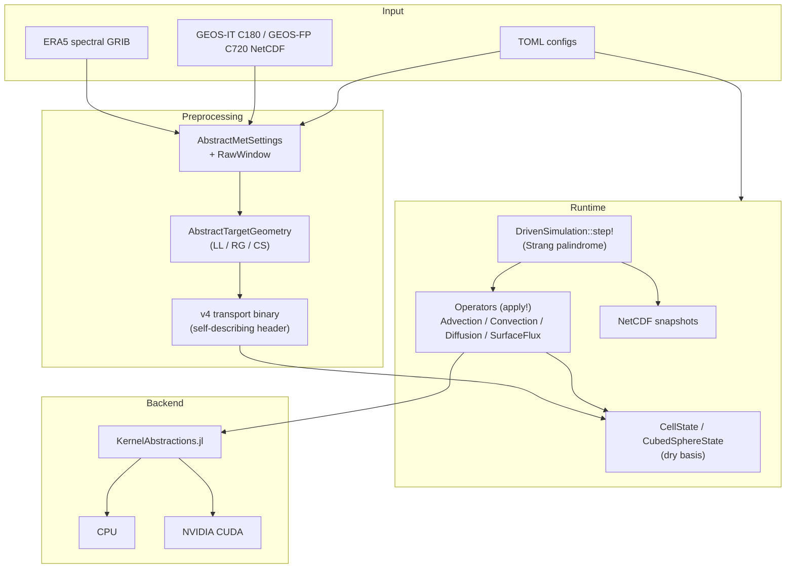

# AtmosTransport.jl

> **Actively developed research software.** Supported CPU and NVIDIA CUDA
> workflows have regression tests and documented numerical checks. Interfaces
> and numerical results can change between releases; pin a version for
> reproducible experiments and read the [release notes](CHANGELOG.md) before
> upgrading. Broader Metal coverage and some inversion workflows still have
> validation gaps, described in the status tables below.

[](https://RemoteSensingTools.github.io/AtmosTransport.jl/stable/)

A Julia-based, GPU-portable atmospheric tracer transport model for offline
chemistry / chemical-transport applications. Designed for **mass-conserving**
advection, convection, and boundary-layer diffusion on **lat-lon, reduced
Gaussian, and cubed-sphere** grids, driven by **ERA5** or **GEOS** met data,
with a clean separation between offline preprocessing and runtime stepping.

## Quick start

The fastest way to get a real simulation running:

```bash
# 1. Clone + install
git clone https://github.com/RemoteSensingTools/AtmosTransport.jl.git
cd AtmosTransport.jl
julia --project=. -e 'using Pkg; Pkg.instantiate()'

# 2. Generate a small current-format binary and run it
julia --project=. examples/generate_synthetic_quickstart.jl
julia --project=. scripts/run_transport.jl config/examples/minimal_template.toml
```

The result is `data/quickstart/synthetic_output.nc`. No external meteorology,
account, or GPU is required. Production configs use
`$ATMOSTRANSPORT_DATA_ROOT/...`, which defaults to `~/data/AtmosTransport`
when unset.

## Documentation

The [stable manual](https://RemoteSensingTools.github.io/AtmosTransport.jl/stable/)
describes the latest release. Use the
[development manual](https://RemoteSensingTools.github.io/AtmosTransport.jl/dev/)
when working from `main`, or select a version in the manual for older releases.
The reading order:

1. **[Start Here](https://RemoteSensingTools.github.io/AtmosTransport.jl/stable/getting_started/installation)** — installation, Julia orientation, zero-download quickstart, real meteorology, and output inspection.
2. **[Architecture tour](https://RemoteSensingTools.github.io/AtmosTransport.jl/stable/concepts/architecture)** — the binary-to-model pipeline and source map.
3. **[User Guide](https://RemoteSensingTools.github.io/AtmosTransport.jl/stable/concepts/grids)** — grids, state and basis, operators, and the binary contract.
4. **[Workflows](https://RemoteSensingTools.github.io/AtmosTransport.jl/stable/config/toml_schema)** — runtime configuration and meteorology preprocessing.
5. **[Examples](https://RemoteSensingTools.github.io/AtmosTransport.jl/stable/tutorials/_generated/synthetic_latlon)** — executable, Literate-driven tutorials.
6. **[Theory & Validation](https://RemoteSensingTools.github.io/AtmosTransport.jl/stable/theory/mass_conservation)** — conservation, numerics, evidence, and known gaps.
7. **[Learn adjoints](https://RemoteSensingTools.github.io/AtmosTransport.jl/stable/getting_started/adjoints)** — a checked emission footprint, then a synthetic inversion with explained observations, controls and priors.
8. **[API Reference](https://RemoteSensingTools.github.io/AtmosTransport.jl/stable/api/)** — the curated public API and per-module docstrings.

## Features

- **Multi-grid:** Regular lat-lon, reduced Gaussian, and cubed-sphere
  (gnomonic and GEOS-native panel conventions). Hybrid σ-pressure vertical
  coordinate.
- **Multi-source:** ERA5 spectral preprocessing (LL / RG / CS targets) and
  native cubed-sphere preprocessing for GEOS-IT C180 and GEOS-FP C720,
  plus a preview MERRA-2 wind-derived CS path. MERRA-2 data must currently
  be staged outside the unified downloader.
- **Multi-backend:** Single codebase for CPU and GPU via
  [KernelAbstractions.jl](https://github.com/JuliaGPU/KernelAbstractions.jl).
  CUDA path is end-to-end through the runtime driver; an Apple Silicon /
  Metal weakdep extension exists.
- **Mass-conserving:** Dry-basis air-mass bookkeeping, with **write-time
  replay gates** enabled by default in the preprocessor and **opt-in load-time
  replay validation** at runtime. Tolerances `1e-10` (F64) / `1e-4` (F32).
- **Operator-modular:** Every physics operator is behind an abstract type
  with a `No<Operator>` no-op default; swap schemes via type dispatch
  without modifying core code.
- **Advection schemes:** `UpwindScheme` (1st order), `SlopesScheme`
  (Russell-Lerner, 2nd order in smooth regions), `PPMScheme` (Putman-Lin,
  3rd order in smooth regions), `LinRoodPPMScheme{ORD}` for cubed-sphere
  with FV3 cross-term advection (`ORD ∈ {5, 7}` selects the boundary
  stencil).
- **Convection:** `CMFMCConvection` (GCHP-style RAS / Grell-Freitas, for
  GEOS sources) and `TM5Convection` (TM5 four-field entrainment /
  detrainment, for ERA5 sources) — different physics, identical
  `ConvectionForcing` plumbing.

> **Note on adjoint maturity.** The cubed-sphere discrete-adjoint and
> surface-flux 4D-Var stack ship for the supported advection/operator matrix,
> with checkpointing, covariance preconditioning, and optimization drivers.
> Coverage is not universal: the optimized/clamped convection variants and
> TM5-4DVAR cross-validation remain open. See
> [Adjoint status](https://RemoteSensingTools.github.io/AtmosTransport.jl/stable/theory/adjoint_status)
> for details.

## Architecture


```mermaid
flowchart TD
    subgraph IN["Input"]
        ERA5["ERA5 spectral GRIB"]
        GEOS["GEOS-IT C180 / GEOS-FP C720 NetCDF"]
        TOML["TOML configs"]
    end
    subgraph PRE["Preprocessing"]
        SRC["AbstractMetSettings<br/>+ RawWindow"]
        TGT["AbstractTargetGeometry<br/>(LL / RG / CS)"]
        BIN["v4 transport binary<br/>(self-describing header)"]
    end
    subgraph RT["Runtime"]
        STATE["CellState / CubedSphereState<br/>(dry basis)"]
        OPS["Operators (apply!)<br/>Advection / Convection / Diffusion / SurfaceFlux"]
        STEP["DrivenSimulation::step!<br/>(Strang palindrome)"]
        SNAP["NetCDF snapshots"]
    end
    subgraph BACK["Backend"]
        KA["KernelAbstractions.jl"]
        CPU["CPU"]
        CUDA["NVIDIA CUDA"]
    end
    ERA5 --> SRC
    GEOS --> SRC
    TOML --> SRC
    TOML --> RT
    SRC --> TGT
    TGT --> BIN
    BIN --> STATE
    STEP --> OPS
    OPS --> STATE
    STEP --> SNAP
    OPS --> KA
    KA --> CPU
    KA --> CUDA
```

### Column-Mean CO₂ Transport (ERA5 + EDGAR, GPU)

One-month forward simulation (June 2024) of anthropogenic CO₂ transport on a
1° × 1° × 137-level grid, driven by ERA5 model-level spectral winds and
[EDGAR v8.0](https://edgar.jrc.ec.europa.eu/) surface emissions. The diagnostic
uses the column-averaged mixing ratio enhancement (ppm,
delta-pressure weighted) in Robinson projection.

**Simulation details.** Mass fluxes are pre-computed from ERA5 hybrid-level
vorticity / divergence / log-PS spectral fields following TM5's continuity-
consistent approach (Holton synthesis): horizontal mass fluxes are derived
from the spectral fields, and vertical fluxes are diagnosed from horizontal
convergence to guarantee column mass conservation. Transport uses TM5-faithful
mass-flux advection (Russell-Lerner slopes scheme with Strang splitting) and
boundary-layer diffusion (implicit Thomas solver). Transport, diffusion, source
injection and air-mass bookkeeping run on a single NVIDIA L40S GPU via
[KernelAbstractions.jl](https://github.com/JuliaGPU/KernelAbstractions.jl)
in Float32 arithmetic. The current output path uses Float64 accumulation for
column and global mass diagnostics, independently of transport precision.

## Status tracker

Single source of truth for what is production-ready, what is preview /
experimental, and what is planned. Reviewed `2026-09-06`. Items move out
of "experimental" only after a passing CPU+GPU regression suite and a
documented validation run.

### Legend

| Symbol | Meaning |
| :---: | --- |
| ✅ | **Stable.** Used in production runs; CPU+GPU regression-tested; covered by docs. |
| 🟡 | **Preview.** Implementation complete and tested in isolation; not yet validated on a multi-day campaign. Expect rough edges. |
| 🧪 | **Experimental.** Wired in but the contract is not stable; API may move; treat output as research-only. |
| 📐 | **Planned.** Scoped in a plan / memo; not yet implemented. |
| ❌ | **Not supported.** Out of scope today; no current path to "yes". |

### Grids and topology

| Capability | Status | Notes |
| --- | :---: | --- |
| Lat-Lon (structured) | ✅ | Full operator suite, multi-tracer fused kernels |
| Reduced Gaussian (face-indexed) | ✅ | Spectral path + ring-aware Poisson balance |
| Cubed-sphere (gnomonic) | ✅ | Six-panel split-sweep + Lin-Rood ORD=5/7 |
| Cubed-sphere (GEOS-native) | ✅ | Panel-5 rotation, GEOS-IT C180 validated |
| Hybrid σ-pressure vertical | ✅ | TOA at k=1, surface at k=Nz |

### Met sources and preprocessing

| Capability | Status | Notes |
| --- | :---: | --- |
| ERA5 spectral → LL / RG / CS | ✅ | CDS API; `pin_global_mean_ps!` enabled |
| GEOS-IT native → CS (C180) | ✅ | Adaptive substep schedule per window |
| GEOS-FP native → CS (C720) | 🟡 | Native hourly reader and unified preprocessor ship; production validation remains limited |
| MERRA-2 native → CS | 🟡 | Wind-derived C180 preprocessor ships; unified OPeNDAP download execution remains unavailable |
| LL → CS conservative regrid | 🟡 | Works; separate regrid entry point |
| Compressed binaries at rest (zstd) | ✅ | User-side; runtime always reads uncompressed |

### Advection schemes

| Scheme | LL | RG | CS split-sweep | CS Lin-Rood | Multi-tracer fused |
| --- | :---: | :---: | :---: | :---: | :---: |
| `UpwindScheme` (1st order) | ✅ | ✅ | ✅ | — | ✅ |
| `SlopesScheme` (Russell-Lerner) | ✅ | ❌ | ✅ | — | ✅ |
| `PPMScheme` (Putman-Lin) | ✅ | ❌ | ✅ | — | ✅ |
| `LinRoodPPMScheme{5}` | — | — | — | ✅ | ❌ (per-tracer loop) |
| `LinRoodPPMScheme{7}` | — | — | — | 🟡 | ❌ (per-tracer loop) |

### Diffusion (vertical)

| Kz field | Status | Notes |
| --- | :---: | --- |
| `ProfileKzField` (static) | ✅ | Constant or analytic profile |
| `DerivedKzField` (Beljaars–Viterbo) | ✅ | Default for ERA5 runs |
| `WindowPBLKzField` | ✅ | PBL-aware variant |
| Local Holtslag–Boville Kz | ✅ | Computed from current meteorology |
| Exact TM5 interface exchange (`:dkg`) | ✅ | Dry-air kg s⁻¹ payload in binary v4 |
| `DiffusiveSurfaceFluxBoundary` | 🟡 | LL/CS `S(dt) → V(dt)` placement; RG supports midpoint splitting only |

### Convection

| Operator | Status | Notes |
| --- | :---: | --- |
| `CMFMCConvection` (GCHP-style) | ✅ | Consumes `:cmfmc` (+ optional `:dtrain`) |
| `TM5Convection` (four-field) | ✅ | Consumes `:entu / :detu / :entd / :detd` |
| Placement: after-FV (GCHP-style) | ✅ | Default |
| Placement: in-palindrome (TM5-style) | 📐 | `[run].convection_placement` planned |

### Surface flux and chemistry

| Operator | Status | Notes |
| --- | :---: | --- |
| `SurfaceFluxOperator` + `PerTracerFluxMap` | ✅ | Area-integrated model-storage rate per cell; input builders convert physical kg-species rates |
| EDGAR / GFED / GridFED / Catrine sources | ✅ | Each has a typed `AbstractSurfaceFluxSource` |
| `ExponentialDecay` (radioactive / first-order) | ✅ | Used for `222Rn → 222Pb` etc. |
| Wet deposition | ❌ | No `AbstractWetDeposition` family yet |
| Dry deposition (resistance-based) | ❌ | Today only via surface flux |
| Photolysis / fast chemistry | ❌ | Out of scope |

### Adjoint and inversion

| Capability | Status | Notes |
| --- | :---: | --- |
| Forward tape + checkpoints | ✅ | Full, stride and bisection policies; split-sweep supports device/host/mmap tape, Lin–Rood requires device tape |
| Surface-emission footprints (LinRood ORD=5) | ✅ | `cs_surface_emission_footprint` |
| Lin-Rood ORD=7 adjoint | 🟡 | Panel-edge VJP and checkpoint parity tests ship; campaign validation remains open |
| TM5 convection adjoint | 🟡 | Default full-column/unmerged footprint and 4D-Var gradients are finite-difference tested |
| CMFMC convection adjoint | 🟡 | Default unclamped F32/F64 transpose identity and footprint gradients are tested |
| CS edge and corner halo reverse | ✅ | `_adjoint_fill_panel_halos!` includes directional corner copying |
| Covariance B^{1/2} | ✅ | B1 shipped (`src/Inversion/Covariance.jl`) |
| Preconditioning + log-normal bijection | 🟡 | Linear/log-normal transforms and covariance inverse are gradient-tested |
| End-to-end CS surface-flux 4D-Var | 🟡 | Cost/gradient plus gradient-descent and L-BFGS drivers ship; campaign validation remains open |

### Backends and IO

| Capability | Status | Notes |
| --- | :---: | --- |
| CPU (multi-threaded) | ✅ | Reference path; deterministic behavior is regression-tested |
| NVIDIA CUDA | ✅ | End-to-end; production runs on L40S / A100 |
| Apple Silicon Metal | 🟡 | Float32 forward smoke passed on M5 Pro with 6/32 tracers; broader coverage and adjoints pending |
| AMD ROCm | 📐 | Backend axis in place; not wired |
| mmap binary reader | ✅ | Read-only mmap with typed host-window copies |
| NetCDF snapshot writer | ✅ | Typed `SingleOutputFile` / `DailyOutputFiles` |
| Replay-gate (write-time) | ✅ | On by default; explicit diagnostic escape hatch available |
| Adaptive-schedule gate (load-time, opt-in) | ✅ | `[input].require_adaptive_substeps = true` |

### Documentation

| Section | Status | Notes |
| --- | :---: | --- |
| For TM5 & GCHP users | ✅ | Philosophy, binary pipeline, operators, adjoints, kernels |
| Concepts (grids, state, operators, binary) | ✅ | |
| Preprocessing reference | ✅ | Unified driver, ERA5 spectral, GEOS native, regridding, and conventions |
| Theory (mass conservation, advection) | ✅ | |
| Tutorials | 🟡 | Executed synthetic LL and CS footprint lessons; synthetic inversion walkthrough; real-data inversion tutorial remains open |
| API reference (auto-generated) | ✅ | Strictly checked against every exported docstring |
| Validation campaigns / inter-comparison | 🟡 | Status page ships; full multi-model campaign reports remain open |

### Known broken

| Item | Status | Notes |
| --- | :---: | --- |
| `MERRA2Source` / `OPeNDAPProtocol` | 🔴 broken | `execute!` is a permanent `error()` stub. |

## Design principles

- **Julian:** Multiple dispatch, parametric types, no OOP inheritance chains.
- **TM5-faithful where it matters:** Russell-Lerner slopes (`SlopesScheme`)
  and TM5 four-field convection (`TM5Convection`) implement the same
  numerics as the corresponding TM5 routines (`advectx__slopes` /
  `advecty__slopes` for slopes; `entu / detu / entd / detd` for
  convection), verified by parity tests in `test/core/test_tm5_*.jl`.
- **GCHP-style for GEOS sources:** `CMFMCConvection` consumes GEOS cloud-mass
  flux forcing through the same typed `ConvectionForcing` interface as the
  other convection paths.
- **Topology-dispatched operators:** Shared interfaces dispatch to structured,
  face-indexed, or panel-native implementations where storage and numerics
  differ.
- **Extension-friendly:** Abstract types and explicit contracts keep a new
  scheme localized to its methods, tests, docs, and—when exposed through
  TOML—the parse-time name mapping.

## Validation

- **Verification (synthetic-fixture suite):** GitHub CI runs the CPU core and
  regridding tiers on pull requests and pushes to `main`, on Julia 1.10 and the
  current Julia release. It covers uniform-tracer invariance, mass budgets and
  cross-window replay. CUDA comparisons and the ten maintained GPU diagnostics
  run separately on GPU hardware; they are not exercised by the hosted CPU jobs.
- **Real-data preprocessing:** opt-in ERA5 and GEOS workflows exercise the
  write-time replay contract; these are not a substitute for a full
  cross-model validation campaign.
- **Multi-month + observational closure:** *not yet done*; the cross-model and
  observation intercomparison reports have not been published. See
  [Validation status](https://RemoteSensingTools.github.io/AtmosTransport.jl/stable/theory/validation_status)
  for the honest current-state report.

## References

- Krol et al. (2005): TM5 two-way nested zoom algorithm.
- Huijnen et al. (2010): TM5 tropospheric chemistry v3.0.
- Russell & Lerner (1981): Slopes advection scheme.
- Putman & Lin (2007): Finite-volume on cubed-sphere grids.
- Tiedtke (1989): Mass flux scheme for cumulus parameterization.
- Colella & Woodward (1984): Piecewise Parabolic Method (PPM).

## License

MIT.
