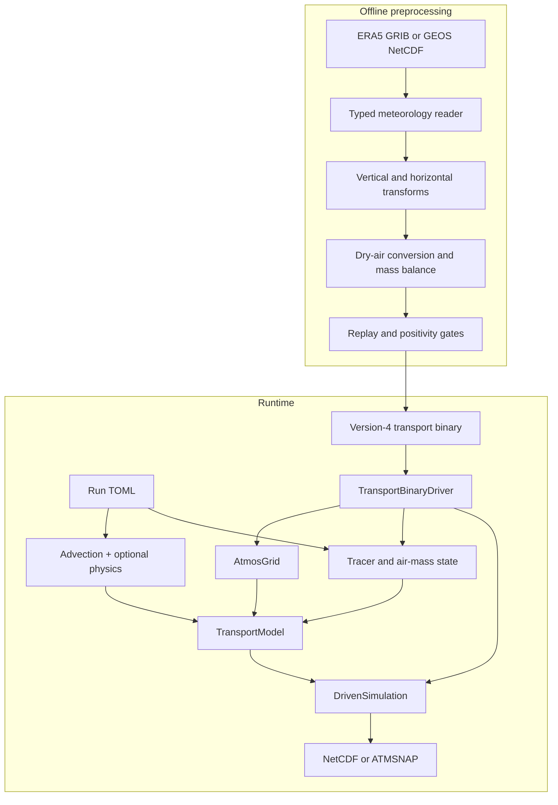

# [Architecture tour](@id Architecture-tour)

This page explains the shape of AtmosTransport before the detailed pages
introduce grids, state, operators, and binary fields. It is written for model
users first; source-code pointers are collected at the end.

## Two programs, one contract

AtmosTransport deliberately separates expensive meteorology preparation from
the repeated transport calculation:



The **transport binary** is the boundary between those programs. It is not a
generic data dump: its header declares topology, vertical coordinate, time
windows, mass basis, flux semantics, optional physics payloads, and the exact
substep schedule. The current reader accepts version 4 only.

This split keeps runtime I/O predictable and makes preprocessing assumptions
auditable. The cost is that a real-data run cannot start from raw wind files;
they must first be turned into a verified binary.

## The five runtime objects

| Object | Plain-language role | Usually created by |
|---|---|---|
| `TransportBinaryDriver` | Memory-maps forcing and loads one meteorological window at a time. | `run_driven_simulation` |
| `AtmosGrid` | Combines horizontal topology, hybrid-pressure levels, architecture, and planet constants. | Reconstructed from the binary header |
| `CellState` or `CubedSphereState` | Stores air mass and conservative `mixing ratio × carrier-air-mass` tracer fields. | Initial-condition builder |
| `TransportModel` | Bundles state, grid, face fluxes, operators, and reusable workspaces. | Runtime physics recipe |
| `DrivenSimulation` | Connects model and driver, refreshes forcing, and advances windows/substeps. | High-level runner |

For normal runs, you configure these objects indirectly through TOML and call:

```bash
julia --project=. scripts/run_transport.jl my_run.toml
```

For custom experiments, the same construction is available through
`run_driven_simulation(cfg)` or the lower-level public API.

## Configuration becomes types

A TOML file is intentionally untyped text:

```toml
[advection]
scheme = "slopes"

[diffusion]
kind = "none"
```

At the runtime boundary, AtmosTransport validates those strings and constructs
typed specifications and operators such as `SlopesScheme()` and
`NoDiffusion()`. Unsupported combinations fail before stepping—for example,
requesting TM5 convection against a binary without the four TM5 convection
fields.

Inside the model loop, Julia's multiple dispatch chooses methods from the
concrete operator, grid, state, numeric type, and architecture. The result is
one user-facing workflow without a chain of topology strings or backend
conditionals in every kernel.

## One transport window

At a high level, each meteorological window follows this sequence:

1. The driver loads air mass, face mass fluxes, timing, and optional physics
   fields.
2. The model applies the configured number of transport substeps.
3. Advection follows its symmetric directional palindrome; diffusion and
   surface fluxes occupy their declared placement; convection and chemistry
   run at their configured cadence.
4. Requested output times are captured without changing model state.
5. The next forcing window is loaded and checked against the same binary and
   model contracts.

During cubed-sphere startup, each tracer's initial dry VMR is converted directly
into its slot in the packed model state. This avoids retaining a second complete
set of tracer-mass arrays. Signed values and zero initial halos are preserved.
The current cubed-sphere runner requires dry-basis transport binaries.

Across input files, the runner retains the model's state and numerical
workspaces. A new `DrivenSimulation` refreshes forcing, diffusion layer
thickness, and convection caches for the next file. It carries the accumulated
simulation clock forward, so time-varying emissions continue at the correct
time. GPU prefetch is drained before the runner closes an input driver.

The detailed operator ordering is documented in [Operators](@ref Operator-concepts). The mass
invariant is derived in [Mass conservation](@ref).

## Where the source lives

The source tree mirrors the concepts above:

```text
src/
├── Grids/           horizontal meshes and hybrid-pressure coordinates
├── State/           air mass, conservative tracer storage, forcing fields, and accessors
├── Operators/       advection, diffusion, convection, surface flux, chemistry
├── MetDrivers/      version-4 binary reader, driver, and window carriers
├── Models/          typed model, runtime recipes, driven runner, initial conditions
├── Preprocessing/   source readers, transforms, balancing, verification, writers
├── Output/          snapshot capture and NetCDF/ATMSNAP persistence
├── Regridding/      conservative offline remapping
├── Adjoints/        reverse operators and objective seeding
├── Tape/            checkpoint schedules and tape storage
├── Footprint/       forward-record/reverse-loop footprint workflows
├── Inversion/       observations, covariance, cost functions, and optimizers
├── Downloads/       data-source protocols and acquisition helpers
└── Visualization/   topology-aware views and optional Makie integration
```

The top-level `src/AtmosTransport.jl` defines the package and curated exports.
Most major directories own a module; `Footprint/` and `Inversion/` are
assembled by `Adjoints`. Module-level READMEs provide implementation maps for
the core runtime directories.

## Public workflow versus extension points

The stable path for a model user is deliberately small:

```text
preprocess_transport_binary.jl -> version-4 binaries
run_transport.jl               -> configured forward run
inspect_transport_binary.jl    -> forcing diagnostics
```

The lower-level types are public because research workflows often need custom
state initialization, operator experiments, or adjoint objectives. New code
should extend the owning abstraction—such as an `AbstractConvection` method or
an `AbstractMetReader`—instead of adding a parallel runner.

## Continue through the user guide

1. [Grids](@ref) explains the three horizontal topologies and what the binary
   infers for you.
2. [State & basis](@ref) explains why tracers use conservative mass-like
   storage while users configure and read dry mixing ratios.
3. [Operators](@ref Operator-concepts) describes the selectable physics and their ordering.
4. [Binary format](@ref Binary-format) documents the preprocessing/runtime
   contract in detail.
