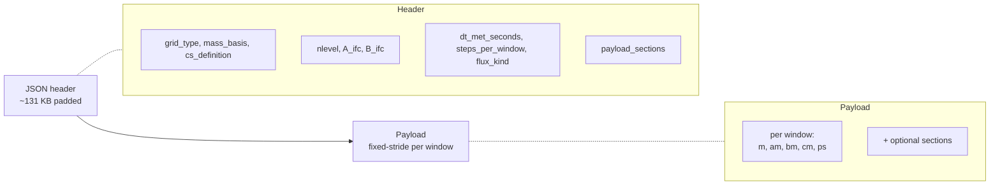

# Binary format

The transport binary is the I/O contract between **preprocessing** and
**runtime**. One file per day; the runtime memory-maps the payload and
streams it window-by-window. The format is self-describing — a JSON
header at the start tells the runtime everything it needs to construct
the correct grid, dispatch the correct operators, and validate the
contract via the replay gate.

This page covers what's in the file from a user's standpoint: what the
header tells you, what the payload sections mean, which optional
sections enable which runtime capabilities, and how the replay gate
catches binaries that don't satisfy the conservation contract.

## Schema overview



The on-disk layout is **flat**: header then a fixed number of bytes
per window (`bytes_per_window`), one window after another. Memory
mapping makes the per-window stride a simple offset; sub-window I/O
costs nothing on warm caches.

## The JSON header

Every binary opens with a JSON document (typically padded to ≈131 KB)
encoding a `TransportBinaryHeader` (or its CS analogue). The fields
the runtime actually dispatches on:

| Field | Type | Meaning |
|---|---|---|
| `grid_type` | `Symbol` | `:latlon`, `:reduced_gaussian`, or `:cubed_sphere` |
| `horizontal_topology` | `Symbol` | `:structureddirectional` (LL: `Nx × Ny`) or `:faceindexed` (RG: flat `ncells`) |
| `ncell` | `Int` | total horizontal cells |
| `nface_h` | `Int` | total horizontal faces |
| `nlevel` | `Int` | vertical levels (`k = 1` is TOA, `k = nlevel` is surface) |
| `A_ifc`, `B_ifc` | `Vector{Float64}` | hybrid-σ-pressure coefficients at `nlevel + 1` interfaces, in Pa and dimensionless |
| `mass_basis` | `Symbol` | `:dry` or `:moist` (see [Mass basis contract](#Mass-basis-contract) below) |
| `panel_convention` | `Symbol` | CS only — `:gnomonic` or `:geos_native` |
| `cs_definition` | `Symbol` | CS only — `:equiangular_gnomonic` or `:gmao_equal_distance` |
| `cs_coordinate_law` | `Symbol` | CS only — e.g. `:equiangular_gnomonic` or `:gmao_equal_distance_gnomonic` |
| `cs_center_law` | `Symbol` | CS only — `:angular_midpoint` or `:four_corner_normalized` |
| `longitude_offset_deg` | `Float64` | CS only — final longitude rotation, `-10.0` for GEOS native |
| `dt_met_seconds` | `Float64` | met-window cadence (typically 3600 s for hourly ERA5) |
| `steps_per_window` | `Int` | preprocessor sub-steps per window (used by the replay gate) |
| `flux_sampling` | `Symbol` | currently `:window_constant` (same flux at every substep) |
| `flux_kind` | `Symbol` | currently `:substep_mass_amount` (kg per substep, not integrated over window) |
| `float_type` (JSON key; struct field `on_disk_float_type`) | `Symbol` | `:Float32` or `:Float64` |
| `nwindow` | `Int` | windows per day (typically 24) |
| `payload_sections` | `Vector{Symbol}` | which arrays this binary actually contains |

`format_version`, `header_bytes`, and a few sampling-metadata fields
(`source_flux_sampling`, `air_mass_sampling`, `humidity_sampling`,
`delta_semantics`) round out the header. The full list lives in
`src/MetDrivers/TransportBinary.jl`.

## Payload sections

### Required for any v4 transport binary

- `:m` — air mass per cell, kg / m². Shape `(Nx, Ny, Nz)` for LL,
  `(ncells, Nz)` for RG, `NTuple{6, (Nc, Nc, Nz)}` for CS.
- **Horizontal mass fluxes**:
  - LL / CS: `:am`, `:bm` through x-faces and y-faces. Shapes have
    one extra cell along the staggered axis (`(Nx+1, Ny, Nz)` /
    `(Nx, Ny+1, Nz)`); on CS the v4 layout puts both the canonical
    and the halo face into the same array.
  - RG: a single face-indexed `:hflux` array of shape
    `(nface_h, Nz)` (the unstructured analogue — one entry per
    horizontal face under the LCM-segmented ring topology).
- `:cm` — vertical mass flux at level interfaces, shape extends `Nz`
  by 1 along the vertical axis.
- `:ps` — surface pressure per cell, in Pa.

### Optional sections (each enables a runtime capability)

| Section(s) | Capability unlocked |
|---|---|
| `:dm` (and `:dam`, `:dbm`, `:dcm` on the LL side) | Plan-39 explicit-`dm` flux deltas. Required for the strict load-time replay gate. |
| `:qv`, or `:qv_start`/`:qv_end` | Specific-humidity input for diagnostics or moist-conversion bookkeeping. |
| `:cmfmc` (+ optional `:dtrain`) | `CMFMCConvection` operator (GCHP-style). |
| `:entu`, `:detu`, `:entd`, `:detd` (all four) | `TM5Convection` operator (TM5 four-field). |

A time-varying `:Kz` payload (for stepwise vertical diffusion driven
straight from the binary) is on the roadmap; today, the
`ImplicitVerticalDiffusion` operator only consumes constant or
profile-shaped Kz from the runtime config, not from the binary.

A run config that asks for an operator the binary does not carry is
rejected at load time — the `inspect_binary` capability NamedTuple is
the single source of truth for what the runtime can wire up.

## The `inspect_binary` capability surface

```julia
using AtmosTransport
caps = AtmosTransport.inspect_binary("/path/to/transport.bin")
```

returns a `NamedTuple`:

| Field | Meaning |
|---|---|
| `advection :: Bool` | `true` iff `:m, :am, :bm, :cm` are all present |
| `replay_gate :: Bool` | `true` iff the flux-delta sections needed for plan-39 replay are present |
| `tm5_convection :: Bool` | `true` iff all four TM5 sections are present |
| `cmfmc_convection :: Bool` | `true` iff `:cmfmc` is present (CS only) |
| `surface_pressure :: Bool` | `true` iff `:ps` is present |
| `humidity :: Bool` | `true` iff `:qv` (or the start/end pair) is present |
| `mass_basis :: Symbol` | `:dry` or `:moist` (echoed from header) |
| `grid_type :: Symbol` | `:latlon` / `:reduced_gaussian` / `:cubed_sphere` |
| `payload_sections :: Vector{Symbol}` | the raw list, for advanced filtering |

The CLI tool `scripts/diagnostics/inspect_transport_binary.jl` is a
thin wrapper over `inspect_binary` that pretty-prints these rows. See
[Inspecting output](@ref) for example output.

## Mass-basis contract

The `mass_basis` header field encodes a hard contract over the
payload's water bookkeeping:

| `mass_basis` | What `:m` represents | What `:am`, `:bm`, `:cm`, `:dm` represent |
|---|---|---|
| `:dry` | Dry-air mass per cell (`DELP_dry / g · area` from `DELP_moist · (1 − qv)`) | Dry-air mass fluxes, dry-air mass deltas |
| `:moist` | Total (moist) air mass per cell | Total (moist) air mass fluxes and deltas |

The runtime constructs `state.air_mass` on the same basis as the
binary; mixing a `:moist` binary with the dry-basis runtime contract
is rejected when the `DrivenSimulation` is constructed (not at the
raw binary-open call) — but well before any windows actually step,
so it is a hard wiring error rather than a silent corruption.
Convection forcing operators (`CMFMCConvection`, `TM5Convection`)
are basis-polymorphic — they consume forcing arrays on whatever
basis `state.air_mass` carries.

By default the entire pipeline ships dry: ERA5 spectral preprocessing
applies the `(1 − qv)` correction and writes `mass_basis = :dry`; the
GEOS native CS path does the same via dry-basis `DELP` reconstruction
plus an FV3-style pressure-fixer cm. See [State & basis](@ref) for
how this propagates to runtime tracer semantics.

## Streaming writer entrypoints

Two writer entry points cover the topology axis. Users rarely call
either directly — the preprocessor's `process_day` orchestrators
wrap them — but the kwargs are useful to know when reading the source.

```julia
# Reduced Gaussian (face-indexed). LatLon goes through a separate
# write path inside the spectral preprocessor.
writer = open_streaming_transport_binary(
    path, grid, nwindow, sample_window;
    FT = Float64,
    dt_met_seconds        = 3600.0,
    steps_per_window      = 8,
    mass_basis            = :dry,
    flux_kind             = :substep_mass_amount,
    flux_sampling         = :window_constant,
    source_flux_sampling  = :window_constant,    # required kwarg, no default
    extra_header          = Dict(),
)

# Cubed-sphere
writer = open_streaming_cs_transport_binary(
    path, Nc, npanel, nlevel, nwindow, vc;
    FT = Float64,
    dt_met_seconds = 3600.0,
    steps_per_window = 8,
    include_flux_delta = true,    # writes :dm (and :dam/:dbm/:dcm in v5)
    include_cmfmc = false,         # writes :cmfmc when true
    include_dtrain = false,        # writes :dtrain when true
    panel_convention = :gnomonic,  # or :geos_native
    cs_definition = :equiangular_gnomonic,
    cs_coordinate_law = :equiangular_gnomonic,
    cs_center_law = :angular_midpoint,
    longitude_offset_deg = 0.0,
    extra_header = Dict(),
)
```

The `include_*` knobs control which optional sections land in the
binary; the CS reader's `binary_capabilities` then advertises whatever
you asked for. `source_flux_sampling` is a required kwarg on the
RG path — it has no default because the LL spectral path and the
GEOS-CS-source path use it differently.

## Replay gate

Mass conservation is enforced by a **two-stage replay gate**:

### Write-time gate (always on)

After every window write, the preprocessor evolves `m_n` forward one
window using the just-written flux fields and asserts:

```
‖m_evolved − m_stored_n+1‖ / ‖m_stored_n+1‖ ≤ tol
```

with `tol = replay_tolerance(FT)` from
`src/MetDrivers/ReplayContinuity.jl` — `1e-10` for Float64 and `1e-4`
for Float32. A binary that fails this gate is **rejected at write
time**; the preprocessor errors out rather than producing a
known-bad file.

### Load-time gate (opt-in)

The runtime can re-run the same replay check at binary open. Two
ways to enable:

```toml
[met_data]
validate_replay = true     # per-config kwarg
```

```bash
ATMOSTR_REPLAY_CHECK=1 julia --project=. scripts/run_transport.jl <cfg.toml>
```

(Conversely, `ATMOSTR_NO_REPLAY_CHECK=1` silences the check even if
`validate_replay = true`.) Failure throws an `ArgumentError` with the
worst-cell location and tolerance margin, pointing the user at the
plan-39 preprocessor fix or at the bypass env var for diagnostic
runs.

The load-time gate is **off by default** because it doubles binary
load time; it is the recommended sanity check for any new binary
configuration before running a long production simulation.

## What's next

- [Inspecting output](@ref) — programmatic and CLI access to both the
  binary and the snapshot NetCDF.
- *Theory & Verification* — full mass-conservation derivation,
  advection-scheme analysis, replay-gate proofs (Phase 6).
