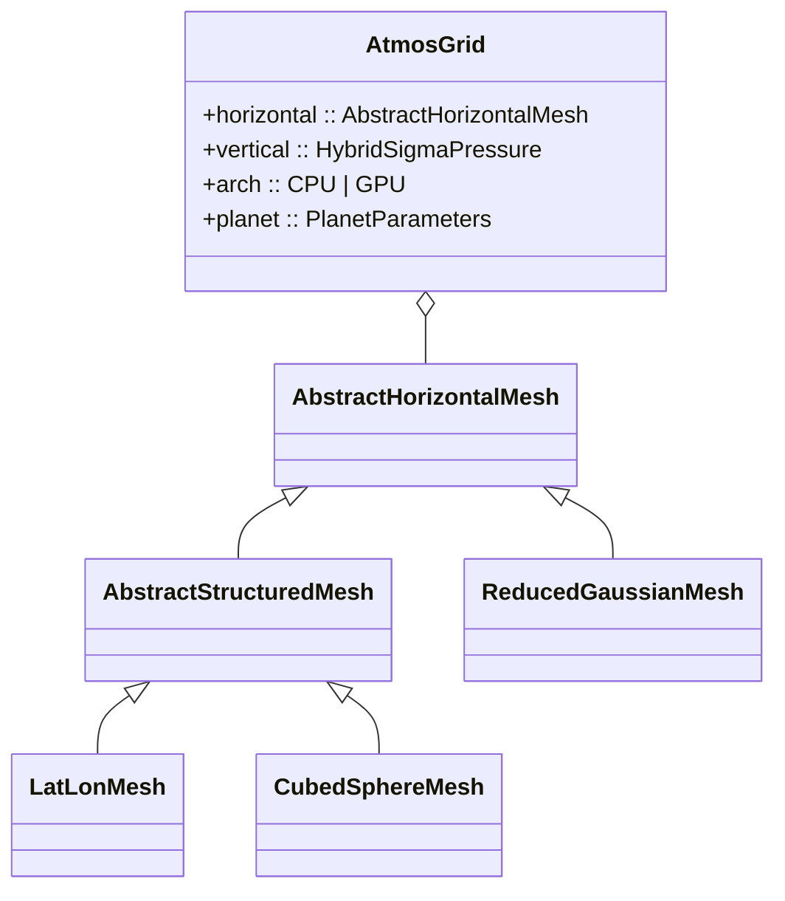
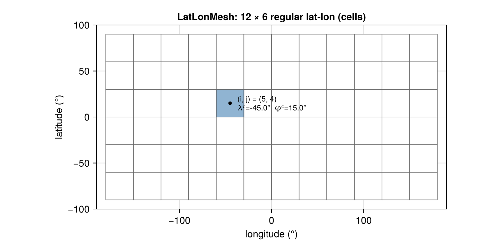
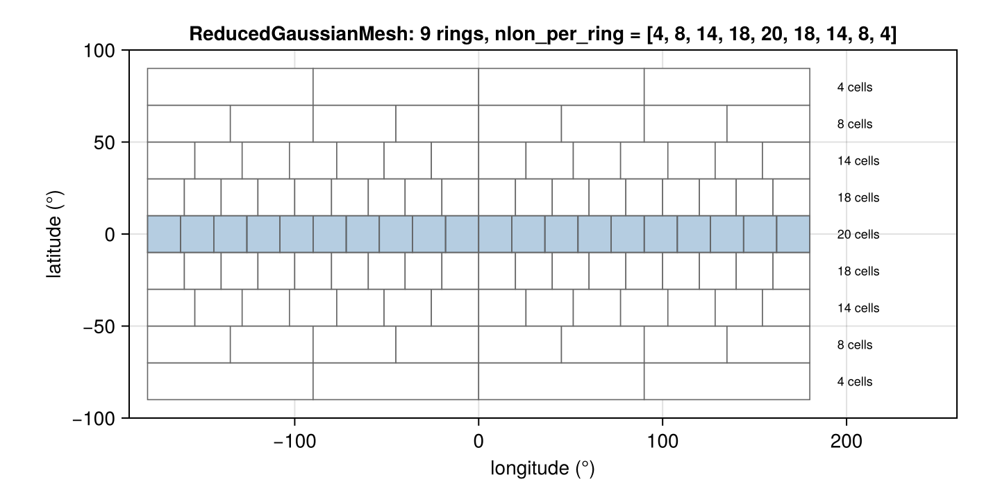
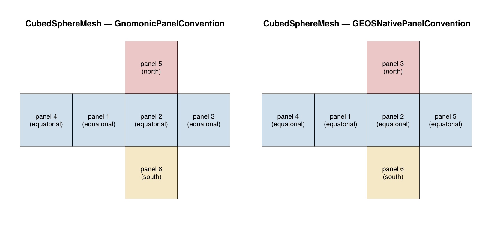

# Grids

AtmosTransport supports three horizontal grid topologies, all sharing the
same hybrid-σ-pressure vertical coordinate. From a user's perspective,
the grid is fixed by the **transport binary** (the preprocessor produces
one binary per grid configuration); the runtime reads the binary's
header and dispatches automatically. You usually do not need to declare
the grid in a run config — only in a preprocessing config.

## Topology overview

| Topology | Concrete mesh type | Index space | Typical use |
|---|---|---|---|
| Regular lat-lon | `LatLonMesh{FT}` | `(i, j)` ∈ `(1..Nx, 1..Ny)` | ERA5 spectral preprocess; coarse / mid-resolution comparison runs. |
| Reduced Gaussian | `ReducedGaussianMesh{FT}` | `(c)` ∈ `(1..ncells)`, with `nlon_per_ring[j]` cells in latitude ring `j` | ERA5 native grid (e.g. `O90`, `O160`, `N320`); finer at the equator without polar over-sampling. |
| Cubed-sphere | `CubedSphereMesh{FT, C, D}` | `(p, i, j)` per panel `p ∈ 1..6`, cell `(i, j) ∈ (1..Nc, 1..Nc)` | Synthetic equiangular CS, GEOS-IT C180, GEOS-FP C720. |

All three subtype `AbstractHorizontalMesh` and are wrapped in
`AtmosGrid{H, V, Arch, P, FT}` together with a vertical coordinate
(`HybridSigmaPressure{FT}`), an architecture (`CPU` / `GPU`), and a
planet (`PlanetParameters{FT}`, defaulting to `earth_parameters()` —
Earth radius, gravity, reference pressure).



## What you specify vs what is inferred

The transport binary's JSON header carries enough geometry to
reconstruct the grid at runtime, so a **run** config does **not** need
a `[grid]` block:

```toml
# config/runs/quickstart/ll72x37_advonly.toml
[input]
folder     = "~/data/.../era5_ll72x37_dec2021_f32/"
start_date = "2021-12-01"
end_date   = "2021-12-03"
# (no [grid] block needed — read from the binary header)
```

The runtime calls `inspect_binary` on the first file, reads the
`grid_type` field (`:latlon | :reduced_gaussian | :cubed_sphere`), and
constructs the correct mesh + driver.

!!! note "Legacy run configs"
    Some older `config/runs/*.toml` files still carry a `[grid]` block.
    The current runner ignores it for grid construction (the binary
    header wins), but be aware when reading examples — newer configs
    in `config/runs/quickstart/` and `config/runs/advresln/` follow the
    no-`[grid]` pattern.

A **preprocessing** config is where you declare the target grid, since
that's the act of choosing one:

```toml
# config/preprocessing/era5_ll72x37_advresln_dec2021_f32.toml
[grid]
type = "latlon"
nlon = 72
nlat = 37
echlevs = "ml137_tropo34"
```

```toml
# config/preprocessing/era5_cs_c90_transport_binary_f32.toml
[grid]
type = "cubed_sphere"
Nc   = 90
echlevs = "ml137_tropo34"
```

```toml
# config/preprocessing/era5_o090_transport_binary.toml
[grid]
type            = "synthetic_reduced_gaussian"
gaussian_number = 90              # ring count per hemisphere → O90
nlon_mode       = "octahedral"    # ECMWF O-grid (octahedral) ring distribution
```

## `LatLonMesh{FT}`

A regular `Nx × Ny` lat-lon mesh with periodic longitude and pole
truncation. Constructor:

```julia
mesh = LatLonMesh(; Nx, Ny,
                    longitude = (-180, 180),
                    latitude  = (-90, 90),
                    radius    = R_EARTH)
```

User-touched fields: `Nx`, `Ny`, `Δλ`, `Δφ`, `λᶜ` (cell-center
longitudes), `λᶠ` (face longitudes), `φᶜ`, `φᶠ`, `radius`. Cell-area
helpers: `cell_area(mesh, i, j)`, `cell_areas_by_latitude(mesh)`.

```@raw html
<figure>

<figcaption>A 12 × 6 LatLonMesh with cell (5, 4) highlighted. Real grids
go up to 720 × 361 (0.5°) and beyond.</figcaption>
</figure>
```

The face arrays follow the
**`λᶜ[1]`-aligned** convention — used by the spectral preprocessor's
`spectral_to_grid!` to set `lon_shift_rad = deg2rad(λᶜ[1])`. Mismatching
this shift was a real bug; the API codifies the convention so users
don't trip on it.

## `ReducedGaussianMesh{FT}`

A reduced-Gaussian grid is a sphere of latitude **rings** with a
variable number of cells per ring (more cells near the equator, fewer
near the poles). Cells are flattened ring-by-ring, south to north.

Two construction paths:

```julia
# Direct: known ring latitudes + per-ring longitude counts.
mesh = ReducedGaussianMesh(latitudes, nlon_per_ring; FT = Float32)

# From an ECMWF GRIB descriptor (the preprocessor's usual entry point).
mesh = read_era5_reduced_gaussian_mesh(path_to_grib; FT = Float32)
```

User-touched fields: `latitudes` (ring centers), `nlon_per_ring`,
`ring_offsets` (where each ring starts in the flat cell array),
`lat_faces`, `radius`.

```@raw html
<figure>

<figcaption>A small reduced-Gaussian grid with 9 latitude rings and
variable cells per ring (more cells near the equator). Real grids
look like O90 (~1.25° at the equator), O160, O320, …</figcaption>
</figure>
```

Per-ring meridional faces use a least-common-multiple segmentation
between adjacent rings — necessary so flux conservation holds across
ring boundaries with different `nlon`.

## `CubedSphereMesh{FT, C, D}`

A six-panel cubed-sphere mesh of resolution `Nc × Nc` per panel. The mesh
stores a full cubed-sphere **definition** rather than assuming that all CS
grids are the same geometry. Constructor:

```julia
mesh = CubedSphereMesh(; Nc,
                        FT         = Float64,
                        radius     = R_EARTH,
                        convention = GnomonicPanelConvention(),
                        definition = nothing)

geos_it = GEOSIT_C180()
geos_fp = GEOSFP_C720()
```

User-touched fields: `Nc` (cells per panel edge), `Hp` (halo width),
`radius`, `definition`, `convention`, `connectivity`, `cell_areas`, `Δx`,
`Δy`.

### Cubed-sphere definitions

The definition is the geometry contract:

| Component | Meaning | Main implementations |
|---|---|---|
| Coordinate law | Places logical face edges on the cube/gnomonic plane. | `EquiangularGnomonic`, `GMAOEqualDistanceGnomonic` |
| Center law | Computes `(lon, lat)` cell centers from the face geometry. | `AngularMidpointCenter`, `FourCornerNormalizedCenter` |
| Panel convention | Orders/orients the six panels in file/index space. | `GnomonicPanelConvention`, `GEOSNativePanelConvention` |
| Longitude offset | Final rigid rotation about the polar axis. | `0°` for synthetic, `-10°` for GEOS |

`EquiangularCubedSphereDefinition()` is the legacy synthetic target. It uses

```math
\xi_s = \tan\left(-\frac{\pi}{4} + (s-1)\frac{\pi}{2N_c}\right)
```

and evaluates centers at the logical midpoint `(i+1/2, j+1/2)`.

`GMAOCubedSphereDefinition()` is the native GEOS target used by GEOS-IT C180
and GEOS-FP C720. It uses the GMAO equal-distance gnomonic edge law

```math
r = 1/\sqrt{3}, \quad \alpha_0 = \sin^{-1}(r), \quad
\beta_s = -\frac{\alpha_0}{N_c}(N_c + 2 - 2s),
\quad \xi_s = \frac{\tan(\beta_s)\cos(\alpha_0)}{r}.
```

Cell centers use the GEOS/FV `cell_center2` rule:

```math
v_c = \frac{v_1 + v_2 + v_3 + v_4}
           {\lVert v_1 + v_2 + v_3 + v_4\rVert},
```

where `v₁..v₄` are the unit corner vectors of the cell. This is the rule that
reproduces GEOS-IT C180, panel 1, cell `(i=90, j=140)` at
`lat = 26.468021°` and the native 0.42°/0.55° meridional spacing pattern.

### Panel conventions

Two panel orderings ship today:

| Convention | Panel layout |
|---|---|
| `GnomonicPanelConvention()` | Panels 1–4 around the equator; panel 5 north pole; panel 6 south pole. |
| `GEOSNativePanelConvention()` | GEOS-FP / GEOS-IT native ordering: panels 1–2 + 4–5 around the equator; panel 3 north; panel 6 south. |

The convention is only the panel file order/orientation. Native GEOS geometry
also requires `GMAOEqualDistanceGnomonic`, `FourCornerNormalizedCenter`, and
the `-10°` longitude offset; use `GMAOCubedSphereDefinition()` or the
`GEOSIT_C180()` / `GEOSFP_C720()` constructors for those targets.

```@raw html
<figure>

<figcaption>Six-panel cross layout for the two supported panel
conventions. Picking the wrong convention silently produces panel-edge
artifacts; the binary header records which one was used so the
runtime can reconstruct the right connectivity.</figcaption>
</figure>
```

Pick whichever matches the data you are ingesting. The preprocessor
writes the convention into the binary header; the runtime reads it
back and constructs the right mesh + connectivity.

`panel_convention(mesh)` returns the convention struct;
`panel_connectivity_for(convention)` returns the matching
`PanelConnectivity` (panel-edge wiring used to rotate fluxes across
panel boundaries).

### Panel-cell helpers

| Helper | Returns |
|---|---|
| `panel_cell_center_lonlat(mesh, panel)` | `(lons, lats)` matrices, each `(Nc, Nc)`. |
| `panel_cell_corner_lonlat(mesh, panel)` | The four corner lat/lons per cell. |
| `panel_cell_local_tangent_basis(mesh, panel)` | `(x_east, x_north, y_east, y_north)` tangent-basis matrices in geographic frame. |

The tangent basis is what
`rotate_winds_to_panel_local!` and `rotate_panel_to_geographic!` (in
`Preprocessing/cs_transport_helpers.jl`) consume.

## `AtmosGrid{H, V, Arch, P, FT}`

The composite grid type that the runtime carries:

```
AtmosGrid
├── horizontal :: AbstractHorizontalMesh   # one of the three above
├── vertical   :: HybridSigmaPressure{FT}  # ΔA / ΔB at interfaces
├── arch       :: CPU | GPU
└── planet     :: PlanetParameters{FT}      # earth_parameters() default
```

The user rarely constructs `AtmosGrid` directly; it is built by the
runtime from the binary header in `BinaryPathExpander.jl` /
`DrivenRunner.jl`.

## Geometry helpers

The most useful per-topology helpers are:

| Mesh | Helper | Returns |
|---|---|---|
| `LatLonMesh` | `cell_area(mesh, i, j)` | Area of cell `(i, j)` in m². |
| `LatLonMesh` | `cell_areas_by_latitude(mesh)` | Per-latitude-band area distribution. |
| `ReducedGaussianMesh` | `cell_area(mesh, c)` | Area of flat-indexed cell `c` in m². |
| `ReducedGaussianMesh` | `face_length(mesh, f)` | Length of face `f` in m. |
| `CubedSphereMesh` | `mesh.cell_areas`, `mesh.Δx`, `mesh.Δy` | Per-panel area and edge-length matrices. |

A unified cross-topology API for area / face length is on the roadmap but
not yet implemented. Today, geometry-aware code dispatches on the mesh
type and reaches into the appropriate per-topology helper.

## What's next

- [State & basis](@ref) — how prognostic state is laid out on a grid.
- *Operators* and *Binary format* — covered in Phase 3B of the
  documentation overhaul; pages will land in a follow-up commit.
