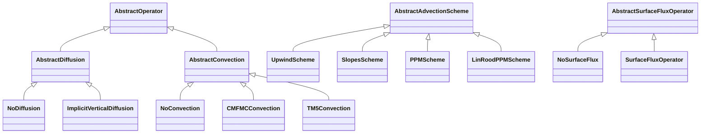

# Operators

Every physics process in AtmosTransport is implemented behind an
**abstract operator type** with a `No<Operator>` no-op default. The
runtime composes operators through a fixed Strang palindrome; users
swap implementations by changing one field in the TOML config (or by
implementing a new subtype and registering it).

## The four operator families



`AbstractAdvectionScheme` and `AbstractSurfaceFluxOperator` are
parallel roots that don't share `AbstractOperator`'s ancestry, but
they follow the same composition pattern (concrete subtype +
`No<Operator>` default + `apply!` method).

## The `apply!` contract

Each operator family's mutating entry point has a uniform shape, with
the second positional argument carrying whatever time-resolved data
that family needs:

| Family | Signature |
|---|---|
| Advection | `apply!(state, fluxes, grid, scheme, dt; workspace, cfl_limit, diffusion_op, emissions_op, meteo)` |
| Diffusion | `apply!(state, meteo, grid, op::AbstractDiffusion, dt; workspace)` |
| Convection | `apply!(state, forcing::ConvectionForcing, grid, op::AbstractConvection, dt; workspace)` |
| Surface flux | `apply!(state, meteo, grid, op::AbstractSurfaceFluxOperator, dt; workspace = nothing)` |

Every method mutates `state` in place and returns `state` (or
`nothing`); none allocates per call (workspaces hold scratch buffers).
The `No<Operator>` variant is a literal dead branch — calling it
costs nothing, so leaving an unused operator slot wired in is free.

Topology dispatch happens **inside** each `apply!` method, not on a
separate axis: an LL state and a CS state route through different
specialized kernels via Julia's multiple dispatch on the grid type.

## Advection

`AbstractAdvectionScheme` is the root; the concrete schemes live in
`src/Operators/Advection/schemes.jl`:

| Subtype | Order | Notes |
|---|---|---|
| `UpwindScheme` | 1 | Donor-cell; cheap, very diffusive. |
| `SlopesScheme{L}` | 2 | Russell-Lerner slopes, optionally with a limiter `L`. |
| `PPMScheme{L}` | — | Putman-Lin Piecewise Parabolic Method (fixed reconstruction; no `order` parameter). |
| `LinRoodPPMScheme` | 5 or 7 | PPM with cubed-sphere cross-term advection (CS only). Selectable `ppm_order ∈ {5, 7}`. |

Limiter parameter `L` ranges over `NoLimiter`, `MonotoneLimiter`,
`PositivityLimiter` — declared in the same file.

**TOML config** (one of the supported forms in `[advection]` or
`[run]` depending on recipe):

```toml
[run]
scheme = "slopes"     # or "upwind" / "ppm" / "linrood"

# Cubed-sphere only: pick the LinRoodPPM order (5 or 7).
# `ppm_order` is ignored — and rejected — for the plain "ppm" path.
# scheme    = "linrood"
# ppm_order = 7
```

Advection has **no `NoAdvection` operator** — it's always active. To
disable transport for a debug run, set `dt` very small or use the
identity binary (mass fluxes ≡ 0).

## Diffusion

`AbstractDiffusion` is the root; concrete subtypes:

| Subtype | Use |
|---|---|
| `NoDiffusion()` | Identity no-op; default when `[diffusion]` is absent or `kind = "none"`. |
| `ImplicitVerticalDiffusion{FT, KzF}` | Backward-Euler vertical diffusion driven by an `AbstractTimeVaryingField` Kz. |

The implicit solver runs a per-column Thomas tridiagonal solve; the
column kernel is exposed as `solve_tridiagonal!` for tests and
adjoint variants. The `(a, b, c)` tridiagonal coefficients are kept
as named locals (rather than fused into a pre-factored form) so a
future adjoint kernel can transpose them mechanically.

**TOML config** (`[diffusion]` block):

```toml
[diffusion]
kind  = "constant"
value = 1.0      # Kz [m²/s]; broadcast to all (i, j, k)
```

`kind = "none"` (or omitting the block entirely) selects `NoDiffusion`.
Profile / derived / precomputed Kz fields exist in
`src/State/Fields/` but are not yet TOML-selectable — see
[State & basis](@ref) for the full field-type list.

## Convection

`AbstractConvection` is the root; concrete subtypes:

| Subtype | Forcing carrier | Source |
|---|---|---|
| `NoConvection()` | — | Identity no-op; default. |
| `CMFMCConvection()` | `ConvectionForcing.{cmfmc, dtrain}` | GCHP-style RAS / Grell-Freitas mass flux + optional detrainment (used with GEOS sources). |
| `TM5Convection()` | `ConvectionForcing.tm5_fields.{entu, detu, entd, detd}` | TM5 Tiedtke-1989 four-field entrainment / detrainment (used with ERA5 sources). |

Both real subtypes consume a `ConvectionForcing` carrier (declared in
`src/MetDrivers/ConvectionForcing.jl`) — different physics, identical
plumbing. `_refresh_forcing!` populates `model.convection_forcing`
each substep by copying from the current met window; the operator
does not call `current_time` itself.

**TOML config** (`[convection]` block):

```toml
[convection]
kind = "cmfmc"     # or "tm5" / "none"
```

The runtime picks `:cmfmc` only against binaries whose header carries
the `:cmfmc` payload section (and `:dtrain` if requested); similarly
for `:tm5` requiring `:entu / :detu / :entd / :detd`. Asking for a
convection scheme the binary does not support is a **load-time
error**, not a silent fallback.

## Surface flux (sources)

`AbstractSurfaceFluxOperator` is the parallel root; concrete subtypes:

| Subtype | Use |
|---|---|
| `NoSurfaceFlux()` | Identity no-op; default. |
| `SurfaceFluxOperator{M}` | Applies a `PerTracerFluxMap` of `SurfaceFluxSource`s to the bottom-most layer (`k = Nz`). |

`SurfaceFluxOperator` is built **programmatically**, not from the
TOML, and is the path for emissions inventories (EDGAR, GFED,
GridFED, LMDz, …). The `[tracers.<name>.emission]` block in run
configs drives this construction; see the worked CATRINE configs
(`config/runs/catrine_*.toml`) for examples.

## Strang palindrome

The transport step is composed as a **time-symmetric Strang
palindrome**:

```text
forward:   X → Y → Z   (each direction CFL-subcycled)
center:    V(dt/2) → S(dt) → V(dt/2)   (only when surface flux is on)
           [otherwise the center is a single V(dt) — and a NoDiffusion
            V is a literal dead branch]
reverse:   Z → Y → X   (same subcycle counts)
post:      apply!(convection)   (convection is outside the palindrome)
           apply!(chemistry)    (chemistry is outside the palindrome)
```

`V` is `apply_vertical_diffusion!` and `S` is `apply_surface_flux!`.
Splitting surface emissions across the diffusion half-steps (rather
than emitting before or after the palindrome) is necessary to keep
the operator second-order accurate and to allow the bottom-layer
mass increment to diffuse upward symmetrically.

Convection and chemistry sit **outside** the palindrome for the same
reason: they are not commutative with advection at the per-substep
level, and their natural cadence is the met window rather than the
advection sub-step.

## Adding a new operator

The same recipe applies in every family:

1. Subtype the abstract root: `struct MyConvection <: AbstractConvection; … end`.
2. Provide a `No<Operator>` peer if one doesn't already cover your slot — usually it does.
3. Implement `apply!(state, …, op::MyConvection, dt; workspace)` for whichever grid types you support. Multiple dispatch on the grid type handles topology specialization.
4. Wire selection from TOML in the appropriate recipe (`src/Models/CSPhysicsRecipe.jl` for cubed-sphere; analogous for LL/RG).
5. Test that the `No<Operator>` path is bit-exact to the explicit no-op — this is the contract that lets future code skip the slot for free.

## What's next

- [Binary format](@ref) — what the operator's input data looks like
  on disk, and how the runtime validates it.
