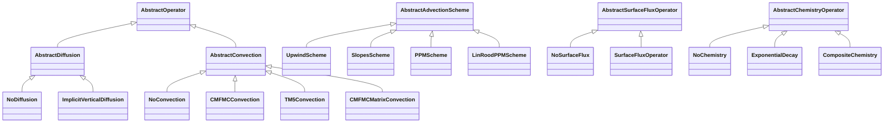

# Operators

Every physics process in AtmosTransport is implemented behind an
**abstract operator type** with a `No<Operator>` no-op default. The
runtime composes a transport block with separate physics blocks; users
swap implementations by changing one field in the TOML config (or by
implementing a new subtype and registering it).

## The five operator families


```mermaid
classDiagram
    class AbstractOperator
    class AbstractAdvectionScheme
    class AbstractDiffusion
    class AbstractConvection
    class AbstractSurfaceFluxOperator
    class AbstractChemistryOperator
    class UpwindScheme
    class SlopesScheme
    class PPMScheme
    class LinRoodPPMScheme
    class NoDiffusion
    class ImplicitVerticalDiffusion
    class NoConvection
    class CMFMCConvection
    class TM5Convection
    class CMFMCMatrixConvection
    class NoSurfaceFlux
    class SurfaceFluxOperator
    class NoChemistry
    class ExponentialDecay
    class CompositeChemistry

    AbstractOperator <|-- AbstractDiffusion
    AbstractOperator <|-- AbstractConvection
    AbstractAdvectionScheme <|-- UpwindScheme
    AbstractAdvectionScheme <|-- SlopesScheme
    AbstractAdvectionScheme <|-- PPMScheme
    AbstractAdvectionScheme <|-- LinRoodPPMScheme
    AbstractDiffusion <|-- NoDiffusion
    AbstractDiffusion <|-- ImplicitVerticalDiffusion
    AbstractConvection <|-- NoConvection
    AbstractConvection <|-- CMFMCConvection
    AbstractConvection <|-- TM5Convection
    AbstractConvection <|-- CMFMCMatrixConvection
    AbstractSurfaceFluxOperator <|-- NoSurfaceFlux
    AbstractSurfaceFluxOperator <|-- SurfaceFluxOperator
    AbstractChemistryOperator <|-- NoChemistry
    AbstractChemistryOperator <|-- ExponentialDecay
    AbstractChemistryOperator <|-- CompositeChemistry
```

`AbstractAdvectionScheme`, `AbstractSurfaceFluxOperator`, and `AbstractChemistryOperator` are
parallel roots that don't share `AbstractOperator`'s ancestry, but
they follow the same composition pattern (concrete subtype +
`No<Operator>` default + `apply!` method).

## The `apply!` contract

Each operator family's mutating entry point has a uniform shape, with
the second positional argument carrying whatever time-resolved data
that family needs:

| Family | Signature |
|---|---|
| Advection | `apply!(state, fluxes, grid, scheme, dt; workspace, cfl_limit, diffusion_op, emissions_op, meteo)` |
| Diffusion | `apply!(state, meteo, grid, op::AbstractDiffusion, dt; workspace)` |
| Convection | `apply!(state, forcing::ConvectionForcing, grid, op::AbstractConvection, dt; workspace)` |
| Surface flux | `apply!(state, meteo, grid, op::AbstractSurfaceFluxOperator, dt; workspace = nothing)` |
| Chemistry | `apply!(state, meteo, grid, op::AbstractChemistryOperator, dt; workspace)` |

Every method mutates `state` in place and returns `state` (or
`nothing`). Workspaces retain numerical scratch buffers across calls;
allocation measurements should distinguish setup from warmed stepping.
The `No<Operator>` variant is a literal dead branch — calling it
costs nothing, so leaving an unused operator slot wired in is free.

Topology dispatch happens **inside** each `apply!` method, not on a
separate axis: an LL state and a CS state route through different
specialized kernels via Julia's multiple dispatch on the grid type.

## Advection

`AbstractAdvectionScheme` is the root; the concrete schemes live in
`src/Operators/Advection/schemes.jl`:

| Subtype | Order | Notes |
| --- | --- | --- |
| `UpwindScheme` | 1 | Donor-cell; cheap, very diffusive. |
| `SlopesScheme{L}` | 2 | Russell-Lerner slopes (TM5 `sl_advection` port). Limiter parameter `L`. |
| `PPMScheme{L}` | 3 in smooth regions | Putman-Lin Piecewise Parabolic. Limiter parameter `L`. Multi-tracer fused on LL/CS split-sweep; RG is unsupported. |
| `LinRoodPPMScheme` | 5 or 7 | FV3 Lin-Rood PPM with cross-term advection (CS only); ORD=7 adds a panel-boundary correction. Selectable `ppm_order ∈ {5, 7}`. |

Limiter parameter `L` ranges over `NoLimiter`, `MonotoneLimiter`,
`PositivityLimiter` — declared in the same file. `PPMScheme()` with
no limiter defaults to `NoLimiter()`.

**TOML config** (preferred form):

```toml
[advection]
scheme = "slopes"     # "upwind" | "slopes" | "ppm" | "linrood"

# Cubed-sphere only: pick the LinRoodPPM order (5 or 7).
# Only valid with scheme = "linrood"; setting ppm_order with
# scheme = "ppm" errors at config-parse time.
# scheme    = "linrood"
# ppm_order = 7
```

`[run].scheme` is the legacy alias; if `[advection]` is present,
`[run].scheme` is rejected.

A `NoAdvection` identity operator is available for isolating other
operators (e.g. convection-only timing, regression). Select with
`[advection] scheme = "none"`. Diffusion still runs using its own column
workspace, including on reduced-Gaussian and cubed-sphere grids. Surface
emissions with `NoAdvection` remain unsupported and raise an error.

## Diffusion

`AbstractDiffusion` is the root; concrete subtypes:

| Subtype | Use |
|---|---|
| `NoDiffusion()` | Identity no-op; default when `[diffusion]` is absent or `kind = "none"`. |
| `ImplicitVerticalDiffusion{FT, KzF, SFC}` | Backward-Euler vertical diffusion driven by an `AbstractTimeVaryingField` Kz. `SFC` chooses legacy split surface flux placement or lower-boundary flux placement. |

The implicit solver runs a per-column Thomas tridiagonal solve; the
column kernel is exposed as `solve_tridiagonal!` for tests and
adjoint variants. The `(a, b, c)` tridiagonal coefficients are kept
as named locals (rather than fused into a pre-factored form) so a
future adjoint kernel can transpose them mechanically.

**TOML config** (`[diffusion]` block):

```toml
[diffusion]
kind  = "constant"
value = 1.0      # Kz [m²/s]; broadcast to all (i, j, k)
```

`kind = "none"` (or omitting the block entirely) selects `NoDiffusion`.
Cubed-sphere binaries carrying PBL surface sections can use
`kind = "tm5_beljaars_viterbo_local_kz"` (`"pbl"` remains a legacy alias).
`surface_flux_boundary = true` places configured surface fluxes at the lower
boundary of the implicit vertical solve (`S(dt) -> V(dt)`) instead of the
legacy midpoint split (`V(dt/2) -> S(dt) -> V(dt/2)`).
Profile / derived / precomputed Kz fields exist in `src/State/Fields/` — see
[State & basis](@ref) for the full field-type list.

## Convection

`AbstractConvection` is the root; concrete subtypes:

| Subtype | Forcing carrier | Source |
| --- | --- | --- |
| `NoConvection()` | — | Identity no-op; default. |
| `CMFMCConvection()` | `ConvectionForcing.{cmfmc, dtrain}` | GCHP-style upwind moist convection; mass flux + optional detrainment. |
| `TM5Convection{FT}()` | `ConvectionForcing.tm5_fields.{entu, detu, entd, detd}` | TM5 Tiedtke-1989 four-field entrainment / detrainment with an implicit column solve. Parametric on `FT`. |
| `CMFMCMatrixConvection()` | `ConvectionForcing.{cmfmc, dtrain}` | Derives updraft exchange rates from GEOS fields and applies the conservative TM5 matrix solve. |

All three active schemes consume a `ConvectionForcing` carrier (declared in
`src/MetDrivers/ConvectionForcing.jl`) — different physics, identical
plumbing. `_refresh_forcing!` populates `model.convection_forcing`
each substep by copying from the current met window; the operator
does not call `current_time` itself.

**TOML config** (`[convection]` block):

```toml
[convection]
kind = "cmfmc_matrix"     # or "cmfmc" / "tm5" / "none"
```

The runtime picks `:cmfmc` only against binaries whose header carries
the `:cmfmc` payload section (and `:dtrain` if requested); similarly
for `:tm5` requiring `:entu / :detu / :entd / :detd`. Asking for a
convection scheme the binary does not support is a **load-time
error**, not a silent fallback.

`CMFMCMatrixConvection` requires both CMFMC and DTRAIN. It uses GEOS-derived
rates with TM5 transport numerics; it does not reproduce the GCHP RAS update.
`CMFMCConvection` retains the separate two-pass cloud/environment treatment.
Its standalone conservation behavior differs from the matrix formulation.
Changing between these schemes is a scientific choice, not a performance flag.

For both matrix schemes, the column update solves
`(I - dt D) s_new = s_old`, where `s = m*q` is tracer storage and the exchange
operator `D` has units s⁻¹. Column sums of `I - dt D` equal one for closed
exchange, preserving the column sum of `s` to floating-point precision. The
matrix is factored once and reused for every tracer in that column.

`use_collab_lu = true` selects shared-memory matrix kernels on Float32 GPUs.
They process tracers in internal batches of six; six is not a total-tracer
limit. The effective matrix depth must fit 1–85 levels. CPU and Float64 runs
use the serial column solver. Explicit `lmax_conv` truncation and `n_merge`
aggregation change the represented vertical exchange and require a justified
choice based on the forcing. They are not needed to support more tracers.

CMFMC matrix columns have no downdrafts and admit quadratic Hessenberg LU.
TM5 columns without diagnosed downdrafts use the same factorization; columns
with downdrafts retain general LU. Partial pivoting is retained in both.

## Surface flux (sources)

`AbstractSurfaceFluxOperator` is the parallel root; concrete subtypes:

| Subtype | Use |
|---|---|
| `NoSurfaceFlux()` | Identity no-op; default. |
| `SurfaceFluxOperator{M}` | Applies a `PerTracerFluxMap` of `SurfaceFluxSource`s to the bottom-most layer (`k = Nz`). |

The runner builds `SurfaceFluxOperator` from the
`[tracers.<name>.emission]` blocks for emissions inventories (EDGAR, GFED,
GridFED, LMDz, …). Programmatic runs may also construct it directly.
See the worked CATRINE configs
(`config/runs/catrine_*.toml`) for examples.

## Scientific quantities and layouts

Let `q` be dry volume mixing ratio, `m` dry-air mass in kg, and `s = m*q`
the stored tracer quantity. `s` is not physical species mass: converting to
kg species also requires the species/air molecular-weight ratio.
Cell fields use `(Nx, Ny, Nz)` on LL, `(Ncell, Nz)` on RG, and six
`(Nc + 2H, Nc + 2H, Nz)` panels on CS. The vertical index runs from the
top of atmosphere (`k = 1`) to the surface (`k = Nz`); vertical face fields
have `Nz + 1` interfaces.

| Process | Scientific update and units | Execution |
| --- | --- | --- |
| Advection | Conservative face-flux divergence updates `m` and `s`; face air-mass transfers are integrated over the transport interval, in kg. Reconstruction estimates face `q`. | Directional sweeps and CFL subcycles inside the transport block. |
| Diffusion | Vertical mixing represents `∂q/∂t = (1/ρ) ∂z(ρ Kz ∂z q)`, with `Kz` in m²/s, using an implicit column solve. | At the transport palindrome center; with its own workspace even when advection is off. |
| Convection | Column exchange transports `q` using the supplied mass fluxes and entrainment/detrainment. TM5 four-field input uses kg/m²/s. | A separate physics block, refreshed from the current meteorological window. |
| Surface flux | A species flux in kg/m²/s is converted using cell area and molecular weights into a bottom-layer increment of `s`. | Between diffusion half-steps, or at the configured implicit lower boundary. |
| Chemistry | Local sources and sinks modify tracer storage; for example, `dq/dt = -λq` uses a decay rate `λ` in s⁻¹. | After convection in the separate chemistry block. |

All convection mass fluxes are expressed in kg/m²/s on the same air-mass
basis as the state. CMFMC is stored on interfaces; DTRAIN and the four TM5
entrainment/detrainment fields are stored at layer centers. Surface-source
operators receive already area-integrated, molecular-weight-converted
storage rates per cell per second; the kernel must not multiply by area again.

Chemistry uses `AbstractChemistryOperator` and `chemistry_block!`; the
executable `examples/custom_loss.jl` demonstrates its mutating `apply!`
interface and analytic decay check. Driven runs schedule the separate
physics blocks at met-window cadence for binary-scheduled runs; a direct
`step!(model, dt)` executes them once for the supplied interval. The diagnostic
override `ATMOSTR_FORCE_PER_SUBSTEP_PHYSICS=1` changes this cadence and should
be recorded when comparing experiments.

## Strang palindrome

For structured and split-sweep cubed-sphere advection, the transport block
uses a **time-symmetric Strang palindrome**:

```text
forward:   X → Y → Z   (each direction CFL-subcycled)
center:    V(dt/2) → S(dt) → V(dt/2)   (only when surface flux is on)
           [otherwise the center is a single V(dt) — and a NoDiffusion
            V is a literal dead branch]
reverse:   Z → Y → X   (same subcycle counts)
```

`V` is `apply_vertical_diffusion!` and `S` is `apply_surface_flux!`.
Splitting surface emissions across the diffusion half-steps (rather
than emitting before or after the palindrome) is necessary to keep
the operator second-order accurate and to allow the bottom-layer
mass increment to diffuse upward symmetrically.

The alternative configured lower-boundary treatment uses `S(dt) → V(dt)`.
Reduced-Gaussian advection uses its face-indexed sweep, and Lin–Rood uses
its own horizontal update; their dispatches still provide the diffusion/source
midpoint hooks.

Convection followed by chemistry runs **outside** this transport palindrome.
In a binary-scheduled driven run, it executes once after the final transport
substep of each meteorological window. The symmetric transport split does not
by itself make this complete transport–convection–chemistry composition
second-order accurate in time.

## Adding a new operator

The same recipe applies in every family:

1. Subtype the abstract root: `struct MyConvection <: AbstractConvection; … end`.
2. Provide a `No<Operator>` peer if one doesn't already cover your slot — usually it does.
3. Implement `apply!(state, …, op::MyConvection, dt; workspace)` for whichever grid types you support. Multiple dispatch on the grid type handles topology specialization.
4. Wire selection from TOML in the appropriate recipe (`src/Models/CSPhysicsRecipe.jl` for cubed-sphere; analogous for LL/RG).
5. Test that the `No<Operator>` path is bit-exact to the explicit no-op — this is the contract that lets future code skip the slot for free.

## What's next

- [Binary format](@ref) — what the operator's input data looks like
  on disk, and how the runtime validates it.
