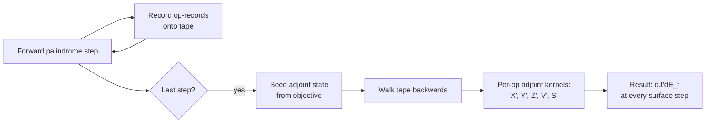
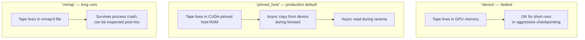

```@meta
CurrentModule = AtmosTransport
```

# Adjoints on top of the binary

If you have used **TM5-4DVAR** for inverse modeling of CO₂ / CH₄ /
SF₆, or the **GIGC adjoint** branch of GEOS-Chem for similar work,
the goals are familiar: take a scalar objective (mismatch with
observations), seed it at observation time, and walk backwards
through the model to obtain a gradient against the control vector
(typically surface emissions).

AtmosTransport's adjoint layer is built on the same forward
mass-flux binaries described in [The binary pipeline](binary_pipeline.md).
Nothing about the adjoint is a parallel-maintained Fortran fork; the
reverse pass walks operator-specific kernels that mirror their
forward counterparts and runs on the same GPU backend.

This page lays out the architecture, the present capability surface,
and the gap to a full 4D-Var driver.

## What works today



The production entry point is
[`cs_surface_emission_footprint`](https://github.com/cfranken/AtmosTransportModel/blob/main/src/Footprint/FootprintAPI.jl)
on the cubed-sphere. Given a sequence of forward windows (a
`CubedSphereTransportDriver`), an observation specification, and a
scheme (today: `LinRoodPPMScheme()` is the fully-tested path), it
returns a `CSFootprintResult` whose `footprints[t]` is `dJ/dE_t`,
the sensitivity of the scalar objective to surface emission rate
`E_t` (kg/s) at step `t`.

Three things this gives you out of the box:

1. **Surface-emission attribution.** Given a tower or aircraft
   observation, find the spatial pattern of upstream surface
   emissions that contributed.
2. **Bayesian-inverse precondition.** Use the footprint matrix as
   the Jacobian column for a small set of basis functions and run an
   offline analytic inversion (see
   [`src/Inversion/Jacobian.jl`](https://github.com/cfranken/AtmosTransportModel/blob/main/src/Inversion/Jacobian.jl)).
3. **Multi-observation gradient.** Loop over observations and
   accumulate footprints into a single control-space gradient.

A 6-hour C24 backward LinRood footprint at LA from synthetic
meteorology ran end-to-end on 2026-05-11; the map lives at
`artifacts/linrood_la_footprint_c24_6h.png`.

## Architecture

### Forward recording

During the forward pass, every operator that the adjoint will need
to step through writes an **op-record** onto the tape. There are
five record families:

| Record | Captured by | What it stores |
| --- | --- | --- |
| `_CSSweepRecord` | Each X/Y/Z half-sweep | direction, scheme, flux slice references, scale |
| `_CSHaloRecord` | Halo exchanges between sweeps | source/target panels, edge orientations |
| `_CSMidpointRecord` | The palindrome midpoint (V/2 → S → V/2) | links to diffusion + emission records |
| `_CSDiffusionRecord` | Each Thomas solve | Kz, dt, boundary trait |
| `_CSConvectionRecord` | Each convection apply | forcing fields |
| `_CSLinRoodHorizRecord` | LinRood horizontal substeps | panel-resolved state snapshots |

Records are appended to a `Vector{_CSAllTapeOp}`-typed tape (with
storage backends `:device`, `:pinned_host`, `:mmap`). The forward
loop runs at near-zero overhead: the tape append is
type-stable and the records hold references to the existing
workspace fields, not copies.

### Checkpointing

A full forward replay of a 14-day C180 simulation would exhaust GPU
memory; the tape is therefore stored at **revolve checkpoints**.
`src/Tape/CheckpointSchedule.jl` implements the Griewank-Walther
revolve schedule with a configurable RAM budget; you pick the
number of checkpoints per day and the schedule chooses where to
store full state snapshots and where to re-run forward from the
nearest snapshot.

For TM5-4DVAR users: this is the same trade-off as TM5's `nsplit`
parameter, with the same factor-of-log cost in extra forward steps.

### Reverse walk

The reverse pass walks `Iterators.reverse(ops)` and dispatches on
record type. Each adjoint kernel is the transpose of the forward
operator's update step:

```julia
# Forward (advection x-sweep, conceptually)
rm_new[i,j,k] = rm_old[i,j,k] - (flux_right - flux_left) * dt/m

# Adjoint
lambda_old[i,j,k] += lambda_new[i,j,k]
flux_left_adj    += lambda_new[i,j,k] * dt/m
flux_right_adj   -= lambda_new[i,j,k] * dt/m
```

The adjoint kernels live in:

- [`src/Adjoints/AdvectionAdjoint.jl`](https://github.com/cfranken/AtmosTransportModel/blob/main/src/Adjoints/AdvectionAdjoint.jl)
- [`src/Adjoints/DiffusionAdjoint.jl`](https://github.com/cfranken/AtmosTransportModel/blob/main/src/Adjoints/DiffusionAdjoint.jl)
- [`src/Adjoints/ConvectionAdjoint.jl`](https://github.com/cfranken/AtmosTransportModel/blob/main/src/Adjoints/ConvectionAdjoint.jl)
- [`src/Adjoints/HaloAdjoint.jl`](https://github.com/cfranken/AtmosTransportModel/blob/main/src/Adjoints/HaloAdjoint.jl)
- [`src/Adjoints/LinRoodTape.jl`](https://github.com/cfranken/AtmosTransportModel/blob/main/src/Adjoints/LinRoodTape.jl)

Each adjoint kernel is a `KernelAbstractions.@kernel` and runs on
the same backend (CPU/CUDA/Metal) as the forward pass. The reverse
walk is type-stable end-to-end (after a recent typed-tape cleanup);
this is the single highest-leverage performance investment in the
adjoint layer.

## Tape storage backends



The default for production GPU runs is `:pinned_host`. CUDA-pinned
allocation enables overlap between the forward kernels and the
device-to-host copy of the tape records; for a 14-day C180 run, the
forward overhead of recording is single-digit percent.

For very long runs, `:mmap` stores the tape on disk; this is the
only storage that survives a crash and supports post-hoc inspection
with `scripts/diagnostics/inspect_tape.jl`.

## Mapping to TM5-4DVAR / GIGC adjoint workflows

| Task | TM5-4DVAR | GIGC adjoint | AtmosTransport |
| --- | --- | --- | --- |
| Forward integration | TM5 CTM | GEOS-Chem | `run_driven_simulation` |
| Tangent linear | Hand-coded | Hand-coded | Not currently exposed |
| Adjoint forcing | TM5 obs operator | gchem_adj | `bind_to_mesh` + observation IO |
| Observation IO | Specific files per inst | NetCDF | `src/Inversion/ObservationsIO.jl` |
| Covariance B^{1/2} | Diagonal + horizontal correlation | Shipped | `src/Inversion/Covariance.jl` (B1) |
| Preconditioning | Hand-coded | Hand-coded | `src/Inversion/Preconditioning.jl` (B2 — next milestone) |
| Optimizer | M1QN3 (L-BFGS-B variant) | L-BFGS-B | Pluggable `AbstractCSOptimizer` |
| Driver | tm5-4dvar.x | gchem_4dvar | Phase C (planned) |

What's **shipped** today (the
[Plan 26](https://github.com/cfranken/AtmosTransportModel/tree/main/docs/plans/26_tm5_inversion_scaffold)
ledger):

- Tape + checkpoint + revolve schedule.
- Public footprint API (`cs_surface_emission_footprint`).
- Observation IO with the schema documented in
  [Plan 26 D3](https://github.com/cfranken/AtmosTransportModel/tree/main/docs/plans/26_tm5_inversion_scaffold).
- `bind_to_mesh` for observation co-location.
- Covariance B^{1/2} construction (B1).

What's **next** (Plan 26 B2 → B3 → Phase C):

- B2: preconditioning, adjoint-identity test, log-normal bijection.
- B3: wire B^{1/2} into the 4D-Var cost/gradient via the existing
  `bind_to_mesh` path.
- Phase C: pluggable optimizer (L-BFGS-B first), end-to-end inverse
  driver that consumes a TOML, runs the forward, runs the adjoint
  walk per observation, and reports a control-vector update.

## Practical knobs

```toml
[adjoint]
enabled = true                 # set false for a forward-only run
tape_storage = "pinned_host"   # or "device" / "mmap"
checkpoint_count_per_day = 4   # revolve checkpoints per day
scheme_override = "linrood7"   # adjoint-tested CS scheme

[adjoint.objective]
kind = "site_concentration"
site = "MLO"
time_utc = "2021-12-05T12:00:00"
```

The TOML schema for the adjoint side is still **experimental** — see
the [Validation status](../theory/validation_status.md) for the
specific scheme/topology combinations that have a passing
adjoint-identity test.

## What's not yet adjointed

The forward operators that lack a fully-wired adjoint kernel today:

- **Lin-Rood ORD=7 panel-boundary correction** has a partial adjoint
  (kernel exists, but the panel-edge stencil is not yet a separate
  record family); the production CS adjoint path uses
  `LinRoodPPMScheme(ORD=5)`. The ORD=7 wiring is on the Plan 26
  follow-up list.
- **`copy_corners` reverse** is the named gap for the cubed-sphere
  halo-corner exchange.
- **TM5 convection adjoint** — the four-field column solve has a
  partial transpose; full adjoint regression is open.
- **CMFMC convection adjoint** — the upwind convection scheme has no
  adjoint kernel yet; CS runs with `CMFMCConvection` cannot be
  differentiated.

If you need a feature on this list for a campaign, open an issue;
priority follows campaign demand.

## Performance properties

For a 14-day C180 run with `:pinned_host` storage and 4 checkpoints
per day:

- **Forward overhead from recording:** 3–8 % on top of the
  no-record forward run, dominated by the CUDA pinned-host async
  copy.
- **Reverse pass wall clock:** 2.5–3 × the forward wall clock
  (consistent with the Griewank-Walther asymptotic).
- **Memory:** 4 checkpoints × C180 full state ≈ 6 GB on the host.
  The tape itself is ~1–2 GB depending on scheme.

These numbers are competitive with TM5-4DVAR on equivalent
resolution and substantially faster than GIGC-adjoint
(GIGC-adjoint runs are CPU-only).

## Reading next

- For the surface emission footprint demo and reproduction recipe,
  see the LA footprint memo in `artifacts/` (a top-level docs page
  will land once the validation suite docs are written).
- For the kernel architecture details that make the adjoint pass
  fast on GPU, see [Kernel architecture](kernel_architecture.md).
- For the open-source 4D-Var driver plan, see
  [Plan 26](https://github.com/cfranken/AtmosTransportModel/tree/main/docs/plans/26_tm5_inversion_scaffold)
  in the repo.
