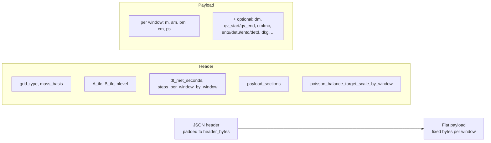
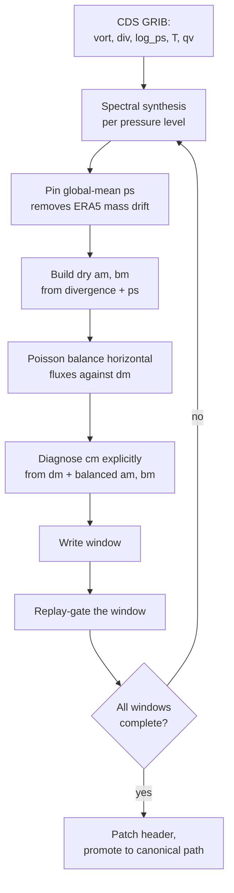
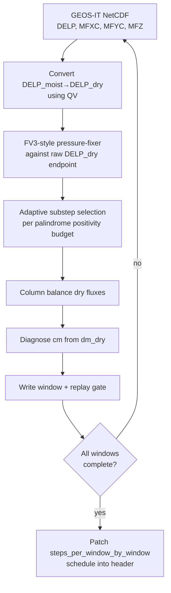
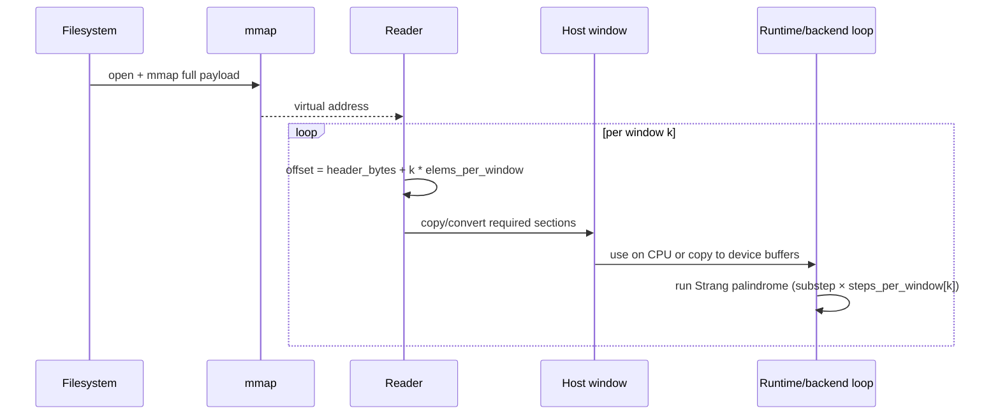

```@meta
CurrentModule = AtmosTransport
```

# The binary pipeline

The transport binary is the **I/O contract** between preprocessing and
runtime. Everything else in AtmosTransport is downstream of this file.
This page describes how a daily binary is built, what guarantees it
carries, and why we trade disk space for an I/O model that bypasses
NetCDF entirely.

## What a daily transport binary actually is



Preprocessing normally writes one file per day. JSON metadata comes first,
padded to the declared `header_bytes`; after that, every meteorological window
has the same section order and element stride. The reader memory-maps the flat
payload and computes `window_offset + k * elems_per_window`. Use
`inspect_binary(path)` or `scripts/diagnostics/inspect_transport_binary.jl`
instead of parsing padded header bytes by hand.

File size depends directly on grid resolution, vertical levels, precision,
window count, and optional sections. Inspect `payload_sections` before
comparing two products; a full-physics binary is intentionally much larger
than an advection-only binary.

## Why "one daily binary" instead of NetCDF

TM5's boundary archive and GCHP's MAPL ExtData layer are flexible interfaces
to collections of meteorological variables. AtmosTransport instead performs
that interpretation once during preprocessing. Runtime then sees one header,
one fixed section order, and one numerical schedule. The flat payload also
avoids chunk decompression during model stepping; it stores raw `Float32` or
`Float64` values.

The trade-off is **disk**. The transport payload is uncompressed so its
sections have fixed offsets and can be copied directly from the memory map.
Actual read time depends on filesystem, cache state, payload size, precision
conversion, and—on accelerators—the host-to-device copy. The runtime reports
those stages separately when `ATMOSTR_TIMERS=1`.

!!! tip "If disk is tight"
    Binaries may be compressed *at rest* with a general-purpose tool such as
    `zstd` and decompressed before a run. Compression ratio and decompression
    time vary with the fields and precision. The runtime itself requires the
    uncompressed version-4 file.

## The mass-conservation contract

Every binary that the runtime is willing to read satisfies the structural
version-4 contract. The unified preprocessor additionally runs numerical
positivity and replay checks before publishing a file. Runtime replay checking
is optional because it redoes work already performed by that writer; enable it
for imported, copied, or otherwise suspect files.

### Dry-basis cm closure

The vertical mass flux `cm[i,j,Nz+1]` is **explicitly** diagnosed from
the explicit `dm` (per-substep mass delta) field via
`recompute_cm_from_dm_target!` *after* the horizontal Poisson balance
runs. The fall-out invariant is

```
m[t+1] = m[t] + dm = m[t] + Δt · (∂xa + ∂yb + ∂zc)
```

with `dm` written to disk and `cm` reconstructed from it. This means the
runtime uses the preprocessor's explicit mass target rather than diagnosing a
new target from horizontal divergence at run time.

For GEOS-native cubed-sphere sources we additionally use the raw GEOS
`DELP_dry` endpoint as the mass target. The pressure-fixer's implied
endpoint can go negative in thin upper layers; the raw endpoint is
robust, the header records `"geos_mass_endpoint" => "raw_dry_endpoint"`,
and the column balance and `cm` diagnosis both target it.

### Write-time replay gate

For every written window, the preprocessor evolves `m_n` forward with the
stored flux fields and asserts

```
‖m_evolved - m_stored[n+1]‖ / ‖m_stored[n+1]‖  ≤  tol
```

with `tol = 1e-4` (Float32) or `1e-10` (Float64). Output is staged under a
temporary name; a failed product is removed instead of being promoted to its
canonical path.

### Per-window adaptive substeps

The header carries `steps_per_window_by_window :: Vector{Int}` and the
runtime reads it to set per-window substep counts. GEOS-native CS
preprocessing chooses each window's count adaptively from the
palindrome positivity budget — see
[Operators on top of the binary](operators_on_binaries.md#adaptive-substeps).
The v4 reader requires this schedule. Older formats are unsupported and must
be regenerated; loading does not repeat the write-time conservation check.

## How the two preprocessing paths build the binary

There are two production paths today: **ERA5 spectral** (mostly LL,
RG; CS via subsequent regrid), and **GEOS native** (CS only). Both
land in the same v4 binary schema.

### Path A — ERA5 spectral

ERA5 ships log-PS, vorticity, divergence, temperature, and humidity as
spectral coefficients on a Gaussian grid via the CDS API. The
spectral path turns those into mass-flux fields.



Three checkpoints in this pipeline are load-bearing for TM5 users:

- **`pin_global_mean_ps!`** aligns each ERA5 window with the configured
  global dry-pressure target before mass fluxes are built. The JSON header
  records `ps_offsets_pa_per_window` for traceability.
- **Poisson balance.** Horizontal fluxes from spectral divergence have
  a non-zero divergence residual at the discrete grid level; we solve
  one Poisson equation per layer per window to balance them against
  the explicit mass-tendency. This is the same step TM5's
  `mass_correction` routine performs.
- **`recompute_cm_from_dm_target!`** runs *after* balance, not before.
  Initializing `cm` from `divergence(am, bm)` before balance is the
  wrong dependency order because balance changes the horizontal divergence;
  post-balance closure is the required invariant.

### Path B — GEOS native CS

GEOS-IT (and eventually GEOS-FP) write hourly native cubed-sphere
NetCDF files with the dynamics-step-integrated mass fluxes (`MFXC`,
`MFYC`, `MFZ`) on the `mass_flux_dt = 450 s` substep. The native
path consumes those directly.



Two GCHP-relevant facts:

- **Adaptive substeps** are chosen by `_geos_select_steps_for_window!`
  using the palindrome positivity budget (see next page). The chosen
  count goes into `steps_per_window_by_window[k]`; the scalar
  `steps_per_window` is `maximum(schedule)`. The runtime reads the
  per-window vector, not the scalar.
- **Endpoint convention.** We use the raw GEOS dry-endpoint, not the
  pressure-fixer endpoint, as the mass target. This is documented as
  `"geos_mass_endpoint" => "raw_dry_endpoint"` in the header.

## Optional sections and their capabilities

A binary advertises its capabilities through `payload_sections`. The
runtime refuses to wire an operator that depends on a section that
isn't present.

| Section(s) | Operator unlocked |
| --- | --- |
| `:dm` plus topology-specific flux deltas | Endpoint interpolation and opt-in load-time replay checks |
| `:qv_start`/`:qv_end` | Specific-humidity endpoints for interpolation and moist-bookkeeping helpers |
| `:cmfmc` (+ optional `:dtrain`) | `CMFMCConvection` (GCHP-style) |
| `:entu`, `:detu`, `:entd`, `:detd` (all four) | `TM5Convection` (TM5 four-field updraft/downdraft) |
| `:pblh`, `:ustar`, `:pbl_hflux`, `:t2m` | Cubed-sphere PBL-derived diffusion fields |
| `:vdiff_u`, `:vdiff_v`, `:vdiff_t`, `:vdiff_qv` | `LocalHoltslagBovilleKzField` when the PBL surface fields are also present |
| `:dkg` | `PrecomputedCSDkgField` interface exchange |

The capability surface is queryable from Julia:

```julia
using AtmosTransport
caps = inspect_binary("/path/to/transport.bin")
# (advection = true, replay_gate = true, tm5_convection = false,
#  cmfmc_convection = true, surface_pressure = true, humidity = true,
#  mass_basis = :dry, grid_type = :cubed_sphere, ...)
```

The CLI `scripts/diagnostics/inspect_transport_binary.jl` pretty-prints
the same information and is the recommended first stop when a binary
behaves unexpectedly.

## How the runtime reads it back



Four details matter:

- **The mmap is CPU-side storage.** Window loaders copy required sections into
  typed host arrays. That copy also converts precision when the configured
  runtime `FT` differs from the on-disk float type.
- **Per-window stride is constant.** `elems_per_window` is computed
  from the header at construction time. Walking from window `k` to
  window `k+1` is a single addition, regardless of which optional
  sections are present.
- **Cubed-sphere loading adds halos.** On-disk panels are unpadded;
  `load_transport_window` constructs the halo-padded runtime fields.
- **GPU runs perform an explicit backend copy.** Persistent device-side window
  buffers are refreshed from the host load. With multiple Julia threads, the
  next host window can be prefetched while the current window is computed.

The runtime side of the contract lives in:

- `src/MetDrivers/TransportBinary.jl`
  (header schema and section-aware reader)
- `src/MetDrivers/transport_binary/cubed_sphere_reader.jl`
  (cubed-sphere geometry specializations)
- `src/MetDrivers/transport_binary/driver.jl`
  (window loop + replay-gate)

## Comparison with the TM5 and GCHP I/O models

| Concern | TM5 tm5-meteo archive | GCHP MAPL ExtData | AtmosTransport binary |
| --- | --- | --- | --- |
| Runtime input grouping | Boundary archive | ExtData collections | Normally one v4 file per day |
| Schema | Archive conventions | NetCDF attributes and connectors | Padded JSON header + fixed payload |
| Per-window operation | Archive reads | NetCDF/ExtData reads | Offset lookup + typed host copy |
| Mass-balance gate | TM5 mass_correction (write-time) | Per-operator at run time | Write-time + opt-in load-time |
| Compression | gzip (per-variable) | NetCDF DEFLATE | None at rest, optional zstd at rest |
| Accelerator transfer | Runtime-specific | Runtime-specific | Host window → persistent backend buffer |

The binary is the smallest possible commitment to "the runtime should
not have to think about I/O." Once you accept that one-line tenet, the
rest of the contract — dry basis, explicit `dm`, replay gate, per-window
schedule — follows.

## What to read next

- For the operator-side consequences of having `m`, `am`, `bm`, `cm`,
  `dm` on hand at every step, jump to
  [Operators on top of the binary](operators_on_binaries.md).
- For runtime data movement, prefetch, and profiling, see
  [Kernel architecture](kernel_architecture.md).
- For the on-disk schema details (every field, the JSON layout, the
  CS-specific extras), see [Binary format](../concepts/binary_format.md).
