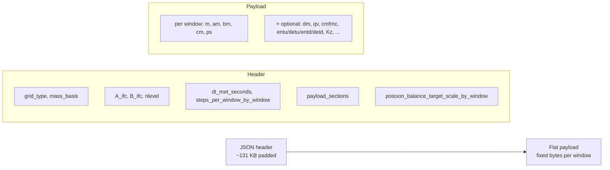
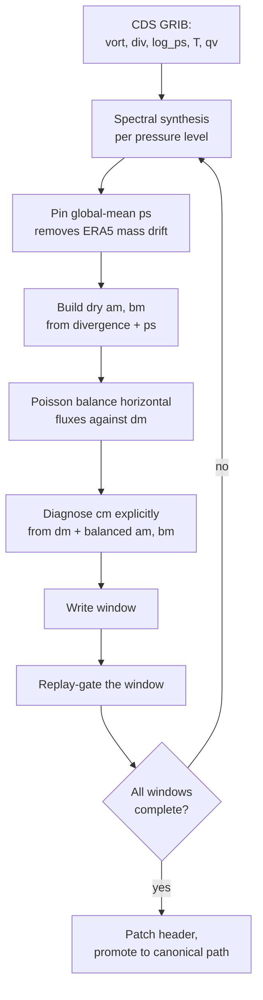
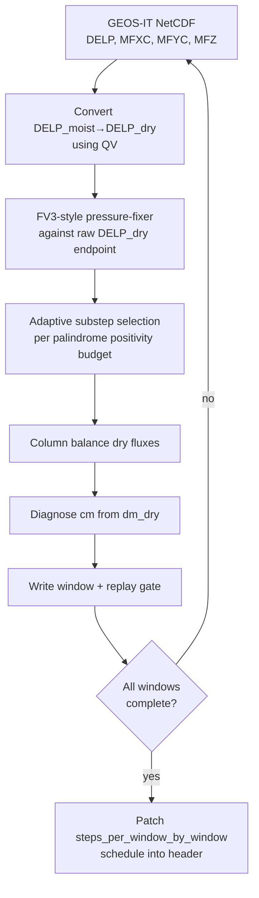
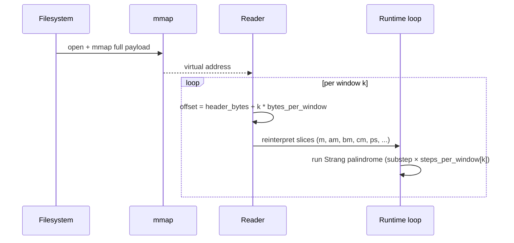

```@meta
CurrentModule = AtmosTransport
```

# The binary pipeline

The transport binary is the **I/O contract** between preprocessing and
runtime. Everything else in AtmosTransport is downstream of this file.
This page describes how a daily binary is built, what guarantees it
carries, and why we trade disk space for an I/O model that bypasses
NetCDF entirely.

## What a daily transport binary actually is



One file per day. JSON metadata up front (pretty-printable with `head
-c 131072 file.bin | python -m json.tool`). After the header, the
payload is a fixed number of bytes per met window, identical stride
for every window, identical layout for every day. **The runtime's
read pattern is `mmap → window_offset + k * bytes_per_window`** —
there is no per-window directory, no compression, no schema
indirection.

Concrete sizes: a 137-level Float32 lat-lon 0.5° daily binary with the
optional TM5 convection sections is ~7 GB; a C180 cubed-sphere daily
binary with `cmfmc` + `dtrain` is ~3 GB. ERA5 GEOS-IT C180 binaries
land around 4 GB once flux deltas are included.

## Why "one daily binary" instead of NetCDF

TM5's boundary archive is split across many files per day. GCHP reads
NetCDF through MAPL ExtData. Both designs share two costs that the
binary avoids:

1. **Per-read parsing.** NetCDF needs to interpret the schema (dim
   maps, variable indices, type codes) on every read; the binary
   needs only an offset arithmetic step.
2. **Decompression on the hot path.** NetCDF compressed chunks need
   per-read inflate; the binary stores raw `Float32` (or `Float64` on
   research configs), with no compression.

The trade-off is **disk**. A compressed NetCDF day might be
1.5–2× smaller than the equivalent binary. We pay that cost because
the runtime read pattern is then dominated by *page-cache hits* on a
file that is already laid out in the exact order the runtime walks.
On warm caches the binary's per-window read is below 100 µs even at
C180.

!!! tip "If disk is tight"
    Compress the binaries *at rest* with `zstd` (typical 2× reduction
    on Float32 mass-flux payloads, ~5 s/day on a modern CPU) and
    decompress to local NVMe before a campaign run. The runtime then
    operates on uncompressed files and pays no per-read cost.
    `zstd --long=27 transport_binary_2021-12-01.bin` works well; the
    JSON header compresses to a few KB, the payload to about half its
    raw size.

## The mass-conservation contract

Every binary that the runtime is willing to read satisfies a written
contract. The contract is enforced at write time in the preprocessor,
re-checked optionally at load time in the runtime, and the JSON header
carries the metadata that lets either side verify it.

### Dry-basis cm closure

The vertical mass flux `cm[i,j,Nz+1]` is **explicitly** diagnosed from
the explicit `dm` (per-substep mass delta) field via
`recompute_cm_from_dm_target!` *after* the horizontal Poisson balance
runs. The fall-out invariant is

```
m[t+1] = m[t] + dm = m[t] + Δt · (∂xa + ∂yb + ∂zc)
```

with `dm` written to disk and `cm` reconstructed from it. This means
the runtime is replaying *exactly* the mass field the preprocessor
wrote — no rounding from "compute cm from divergence of am/bm at run
time" leaks in.

For GEOS-native cubed-sphere sources we additionally use the raw GEOS
`DELP_dry` endpoint as the mass target. The pressure-fixer's implied
endpoint can go negative in thin upper layers; the raw endpoint is
robust, the header records `"geos_mass_endpoint" => "raw_dry_endpoint"`,
and the column balance and `cm` diagnosis both target it.

### Write-time replay gate

After every window write, the preprocessor evolves `m_n` one window
forward with the just-written flux fields and asserts

```
‖m_evolved - m_stored[n+1]‖ / ‖m_stored[n+1]‖  ≤  tol
```

with `tol = 1e-4` (Float32) or `1e-10` (Float64). Output is staged
under a temporary name; on failure the staged file is removed, while
on success it is promoted to the canonical path. A binary that fails
the gate is therefore never visible to the runtime under its canonical
name.

### Per-window adaptive substeps

The header carries `steps_per_window_by_window :: Vector{Int}` and the
runtime reads it to set per-window substep counts. GEOS-native CS
preprocessing chooses each window's count adaptively from the
palindrome positivity budget — see
[Operators on top of the binary](operators_on_binaries.md#adaptive-substeps).
The v4 reader requires this schedule. Older formats are unsupported and must
be regenerated; loading does not repeat the write-time conservation check.

## How the two preprocessing paths build the binary

There are two production paths today: **ERA5 spectral** (mostly LL,
RG; CS via subsequent regrid), and **GEOS native** (CS only). Both
land in the same v4 binary schema.

### Path A — ERA5 spectral

ERA5 ships log-PS, vorticity, divergence, temperature, and humidity as
spectral coefficients on a Gaussian grid via the CDS API. The
spectral path turns those into mass-flux fields.



Three checkpoints in this pipeline are load-bearing for TM5 users:

- **`pin_global_mean_ps!`** removes the few-Pa global-mean drift that
  raw ERA5 analyses carry. Without it the long-run mass budget walks
  off by a few percent per year. TM5's tm5-meteo applies an
  equivalent fix; the JSON header records
  `ps_offsets_pa_per_window` for traceability.
- **Poisson balance.** Horizontal fluxes from spectral divergence have
  a non-zero divergence residual at the discrete grid level; we solve
  one Poisson equation per layer per window to balance them against
  the explicit mass-tendency. This is the same step TM5's
  `mass_correction` routine performs.
- **`recompute_cm_from_dm_target!`** runs *after* balance, not before.
  Initializing `cm` from `divergence(am, bm)` before balance is the
  Plan-39 bug we used to ship; the post-balance order is the corrected
  invariant.

### Path B — GEOS native CS

GEOS-IT (and eventually GEOS-FP) write hourly native cubed-sphere
NetCDF files with the dynamics-step-integrated mass fluxes (`MFXC`,
`MFYC`, `MFZ`) on the `mass_flux_dt = 450 s` substep. The native
path consumes those directly.



Two GCHP-relevant facts:

- **Adaptive substeps** are chosen by `_geos_select_steps_for_window!`
  using the palindrome positivity budget (see next page). The chosen
  count goes into `steps_per_window_by_window[k]`; the scalar
  `steps_per_window` is `maximum(schedule)`. The runtime reads the
  per-window vector, not the scalar.
- **Endpoint convention.** We use the raw GEOS dry-endpoint, not the
  pressure-fixer endpoint, as the mass target. This is documented as
  `"geos_mass_endpoint" => "raw_dry_endpoint"` in the header.

## Optional sections and their capabilities

A binary advertises its capabilities through `payload_sections`. The
runtime refuses to wire an operator that depends on a section that
isn't present.

| Section(s) | Operator unlocked |
| --- | --- |
| `:dm` (and `:dam`, `:dbm`, `:dcm`) | Plan-39 explicit-`dm` flux deltas → load-time replay gate |
| `:qv` or `:qv_start`/`:qv_end` | Specific humidity for diagnostics, moist-bookkeeping helpers |
| `:cmfmc` (+ optional `:dtrain`) | `CMFMCConvection` (GCHP-style) |
| `:entu`, `:detu`, `:entd`, `:detd` (all four) | `TM5Convection` (TM5 four-field updraft/downdraft) |

The capability surface is queryable from Julia:

```julia
using AtmosTransport
caps = inspect_binary("/path/to/transport.bin")
# (advection = true, replay_gate = true, tm5_convection = false,
#  cmfmc_convection = true, surface_pressure = true, humidity = true,
#  mass_basis = :dry, grid_type = :cubed_sphere, ...)
```

The CLI `scripts/diagnostics/inspect_transport_binary.jl` pretty-prints
the same information and is the recommended first stop when a binary
behaves unexpectedly.

## How the runtime reads it back



Three details matter:

- **`reinterpret`, not copy.** The reader returns array views over the
  mmap'd region. Float32 LL slices of shape `(Nx, Ny, Nz)` come out as
  `reinterpret(Float32, view(payload, off:off+nbytes))` reshaped to
  the right dimensions. No allocation on the hot path.
- **Per-window stride is constant.** `bytes_per_window` is computed
  from the header at construction time. Walking from window `k` to
  window `k+1` is a single addition, regardless of which optional
  sections are present.
- **Page cache does the rest.** The OS pages in the relevant slice on
  demand; on a warm cache the per-window cost is below the kernel
  launch latency.

The runtime side of the contract lives in:

- [`MetDrivers/TransportBinary.jl`](https://github.com/cfranken/AtmosTransportModel/blob/main/src/MetDrivers/TransportBinary.jl)
  (header schema and section-aware reader)
- [`MetDrivers/transport_binary/cubed_sphere_reader.jl`](https://github.com/cfranken/AtmosTransportModel/blob/main/src/MetDrivers/transport_binary/cubed_sphere_reader.jl)
  (cubed-sphere geometry specializations)
- [`MetDrivers/TransportBinaryDriver.jl`](https://github.com/cfranken/AtmosTransportModel/blob/main/src/MetDrivers/TransportBinaryDriver.jl)
  (window loop + replay-gate)

## Comparison with the TM5 and GCHP I/O models

| Concern | TM5 tm5-meteo archive | GCHP MAPL ExtData | AtmosTransport binary |
| --- | --- | --- | --- |
| File count per day | ~30–60 small files | ~10–20 NetCDF files | 1 |
| Schema | Implicit (folder + filename) | NetCDF attributes | JSON header (~131 KB) |
| Read cost per window | NetCDF parse + decompress | NetCDF parse + ExtData interp | Offset arithmetic |
| Mass-balance gate | TM5 mass_correction (write-time) | Per-operator at run time | Write-time + opt-in load-time |
| Compression | gzip (per-variable) | NetCDF DEFLATE | None at rest, optional zstd at rest |
| GPU readiness | Read-then-copy | Read-then-copy | mmap → kernel-ready slice |

The binary is the smallest possible commitment to "the runtime should
not have to think about I/O." Once you accept that one-line tenet, the
rest of the contract — dry basis, explicit `dm`, replay gate, per-window
schedule — follows.

## What to read next

- For the operator-side consequences of having `m`, `am`, `bm`, `cm`,
  `dm` on hand at every step, jump to
  [Operators on top of the binary](operators_on_binaries.md).
- For the I/O performance details (mmap, page cache, kernel-ready
  slices), see [Kernel architecture](kernel_architecture.md).
- For the on-disk schema details (every field, the JSON layout, the
  CS-specific extras), see [Binary format](../concepts/binary_format.md).
