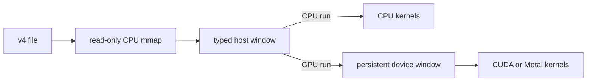

```@meta
CurrentModule = AtmosTransport
```

# Kernel architecture and runtime data movement

AtmosTransport separates three concerns: the transport binary is a CPU-side
storage format, `Adapt.jl` moves model data to the chosen backend, and
`KernelAbstractions.jl` provides the CPU/CUDA/Metal implementations of hot
loops. Understanding those boundaries is more useful than memorizing a
benchmark from one machine.

## Select a backend in the run config

```toml
[architecture]
use_gpu = true
backend = "cuda"   # "cpu", "cuda", "metal", or "auto"
```

`"auto"` tries CUDA and then Metal. `"metal"` supports `Float32`; CPU and
CUDA support both configured precisions subject to the hardware. Start with
the CPU quickstart, then change the backend without changing the physics
configuration.

The resolved `CPU()` or `GPU(:cuda|:metal)` value is stored on the grid. Model
construction adapts state, workspaces, surface sources, and forcing buffers to
that backend. The runner verifies that a requested GPU run actually owns GPU
arrays instead of silently falling back to CPU storage.

## One kernel definition, specialized by types

Hot loops use `KernelAbstractions.@kernel`. A simplified sweep looks like:

```julia
@kernel function sweep!(new_mass, @Const(old_mass), @Const(face_flux))
    i, j, k = @index(Global, NTuple)
    @inbounds new_mass[i, j, k] =
        old_mass[i, j, k] + face_flux[i, j, k] - face_flux[i + 1, j, k]
end
```

The same Julia method is compiled for the concrete array backend at the call
site. Scheme, limiter, mesh, precision, and operator choices are concrete
types, so dispatch happens outside the cell loop. Backend-specific setup and
synchronization live in the architecture layer rather than in separate copies
of each physics algorithm.

## Workspaces own reusable scratch arrays

Operators prepare reusable scratch storage during model construction. For
example, the split-sweep advection workspaces contain typed ping-pong arrays;
the cubed-sphere workspace owns halo-padded arrays and six-panel tuples.
`Adapt.adapt` preserves the workspace structure while replacing `Array`
storage with `CuArray` or `MtlArray` storage. Cubed-sphere advection workspace
arrays are constructed directly on the state backend, avoiding a temporary
host copy. The matrix-convection fallback defers its large global scratch
allocation until that fallback is used.

During cubed-sphere initialization, the runner fills one tracer's final packed
slot at a time and reuses one private tuple of interior VMR buffers for analytic
initial conditions. The public `build_initial_mixing_ratio` still returns fresh
arrays; file/native initializers may replace the private buffer. On a C90 L66
32-tracer pressure-layer setup, this reduces cumulative initialization allocation
from 890.2 to 492.5 MB with the same packed values. These figures include final
state allocation and do not measure peak RAM.

This design has two practical consequences:

- operator application does not rebuild large scratch arrays every step;
- the array type remains visible to Julia's compiler throughout the call.

If you add a field to a workspace, also add it to that type's
`Adapt.adapt_structure` method and extend the operator's preflight shape
checks.

## Packed multi-tracer transport

`CellState` stores tracer mass in the final array dimension,
`(horizontal..., level, tracer)`. `CubedSphereState` uses six halo-padded
`(i, j, level, tracer)` panels. The structured and cubed-sphere split-sweep
paths process that tracer dimension inside each directional kernel. Air-mass
updates and stencil indexing are therefore shared by all tracers in the
launch.

Each of the six directional legs of an advection palindrome processes all
packed tracers together. The transport kernel launches once per structured
sweep or once per cubed-sphere panel, before any CFL subcycling.
Runtime still grows with tracer count because each tracer requires flux
calculations and memory traffic. Lin-Rood has its own horizontal implementation
and should be profiled separately from the
split-sweep schemes.


For cubed-sphere CUDA runs with Float32 PPM, packed sweeps use 32×2 thread
blocks. This covers a C90 panel with much less padding than a 256×1 block:
about 94% of launched threads address interior cells, compared with 35%.
Each thread still performs the same air-mass update and tracer loop; the
reconstruction and limiter formulas are unchanged. CPU, Metal, Float64, and
other schemes retain their existing launch defaults. This choice was measured
on a V100; performance on other NVIDIA architectures has not been measured.

## Precomputed diffusion and many tracers

Precomputed cubed-sphere Dkg uses the
[conservative mass-space solve](../theory/mass_conservation.md#Implicit-diffusion-and-roundoff).
On CUDA, a 32×2 kernel first factors each atmospheric column. For packed states
with multiple tracers, a second kernel assigns each column/tracer pair to its
own thread, using a 32×1×2 block. Each warp reads contiguous `i` cells, and the
two warps process different tracers. All tracers read the same factor buffer;
no per-tracer factor storage or additional persistent workspace is needed.
A single tracer uses the fused factor-and-solve kernel. CPU and Metal retain
the fused column loop.

Only the launch decomposition changes: weak transfers, compensated sums,
background handling, and the adjoint equation retain their existing arithmetic.
V100 launch checks compare all stored values against the serial kernel in both
precisions, including halos and partial blocks through 65 tracers.

## Matrix convection and many tracers

TM5 and CMFMC-matrix convection use the same backward-Euler solve after their
forcing is prepared. In the collaborative GPU path, one workgroup
builds and factors a column's matrix in shared memory. It retains the factors
while loading, solving, and storing successive batches of six tracers.
Additional tracers require more solves and memory traffic, but no larger shared
matrix or tracer buffer. The final batch can be partially filled.
The six-tracer batch is a workgroup's temporary shared-memory buffer, not a
limit on the number of species in the model state. Float32 supports effective
matrix depths through 85; Float64 CUDA supports unmerged depths through 73,
using Float64 throughout. Deeper or merged Float64 requests retain the legacy
solver. These limits reflect shared-memory capacity, not tracer count.

The solver uses the matrix's upper-Hessenberg structure for columns without
downdrafts and retains the general pivoted path when downdrafts are present.
An unpivoted factorization also admits a specialized forward solve. These
optimizations preserve the chosen vertical grid; `lmax_conv` truncation and
`n_merge` layer aggregation are separate scientific approximations.

Legacy global matrix scratch is allocated lazily when a fallback needs it.
Collaborative runs therefore avoid reserving an otherwise unused column tile.
The V100 tests cover positive and signed tracers through 65 species, comparing
against dense CPU LU and independent tracer batches. Kernel timings are
hardware- and forcing-dependent; use the section timers below for your run.

## What mmap does—and does not do

`TransportBinaryReader` memory-maps the version-4 payload as a read-only CPU
vector. The map avoids repeated file-open/schema parsing and lets the operating
system page in only the accessed bytes. It is not a zero-copy GPU data source.

When a window is requested, the loader:

1. computes section offsets from the parsed header;
2. copies required sections from the mmap into typed host arrays, converting
   precision when `FT` differs from the on-disk type;
3. adds cubed-sphere halos where required;
4. for a GPU run, copies the window into persistent backend buffers.

With multiple Julia threads, GPU runs can prefetch the next host window while
the current one is being computed. Set `ATMOSTR_DISABLE_PREFETCH=1` to disable
that overlap when debugging. Linux runs can release already-used mmap pages
between files through the driver's `release_payload!` path.



This distinction matters when diagnosing a regression: `window_load_host`,
`window_backend_copy`, and the physics kernels are separate costs.

## Measure your own run

Enable built-in section timers without changing the config:

```bash
ATMOSTR_TIMERS=1 julia --project=. scripts/run_transport.jl my_run.toml
```

The runner prints a timing breakdown and writes a sibling
`*.timings.csv` when an output NetCDF path is configured. Useful sections
include window loading, backend copying, forcing refresh, advection,
diffusion, convection, and output. Allocation sampling can be added with
`ATMOSTR_ALLOC_TIMERS=1`.

Read these measurements with their scope in mind:

- Sections can nest, and background input loading overlaps transport. Adding
  all section times does not recover elapsed run time.
- GPU launches are asynchronous. A host section that synchronizes the device
  can include waiting for earlier launches; a large halo-section time alone
  does not establish that halo copies are slow.
- Host allocation counters report cumulative allocated bytes, not peak RAM
  or device memory. With allocation sampling disabled, CSV allocation zeroes
  mean unmeasured.
- Warm compilation and a cached input file answer a different question from
  first startup or cold filesystem throughput. Record which case you measured.

To separate cubed-sphere split-sweep launch time from device completion, enable
the more intrusive diagnostic:

```bash
ATMOSTR_TIMERS=1 ATMOSTR_PROFILE_GPU=1 \
julia --project=. scripts/run_transport.jl my_run.toml
```

This adds a synchronization after each sweep kernel and records
`cs_kernel_launch_*` and `cs_kernel_sync_*` sections. The synchronization time
includes device execution and any earlier queued work. Use it to locate costs,
then disable `ATMOSTR_PROFILE_GPU` for normal end-to-end comparisons because
the added waits alter execution overlap. It is separate from CUDA trace capture
below.

For CUDA tracing, `scripts/run_transport.jl` also supports:

```bash
ATMOSTR_PROFILE_MODE=full julia --project=. scripts/run_transport.jl my_run.toml
```

Use `ATMOSTR_PROFILE_MODE=window` with
`ATMOSTR_PROFILE_WARMUP_SEC` and `ATMOSTR_PROFILE_DUR_SEC` for a bounded
capture. Compare runs with the same binary, precision, backend, Julia thread
count, and warmed compilation state; otherwise startup, disk, and compilation
effects can dominate the result.

## Source map

| Concern | Primary source |
| --- | --- |
| Backend selection and adaptation | `src/Architectures.jl` |
| Runtime window copies and prefetch | `src/Models/DrivenSimulation.jl` |
| Section timing | `src/Diagnostics/SectionTimer.jl` |
| Structured packed sweeps | `src/Operators/Advection/multitracer_kernels.jl` |
| Cubed-sphere packed sweeps | `src/Operators/Advection/CubedSphereStrang.jl` |
| Memory-mapped binary reader | `src/MetDrivers/transport_binary/reader.jl` |

Continue with [Operators on top of the binary](operators_on_binaries.md) for
the physics interfaces or [The binary pipeline](binary_pipeline.md) for the
on-disk contract.
