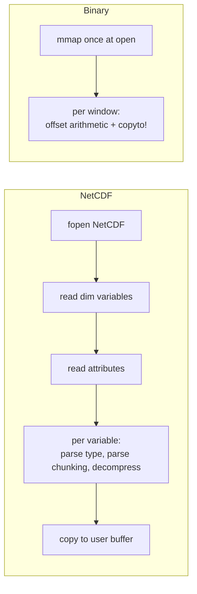
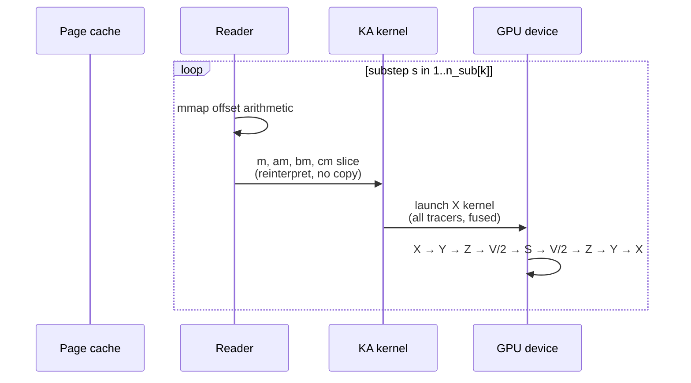

```@meta
CurrentModule = AtmosTransport
```

# Kernel architecture & I/O

This page explains why the runtime is fast. There are two big wins:
**KernelAbstractions** gives us one kernel that retargets across CPU,
CUDA, and Metal without source duplication; **mmap I/O** keeps the
hot path entirely out of the NetCDF schema-parse / decompression
loop that dominates TM5 and GCHP runtime cost on warm caches.

## The kernel side

### One source, three backends

Every hot loop is a `KernelAbstractions.@kernel` function. The same
function definition compiles for CPU, CUDA, and Metal; the backend
is chosen by the `[architecture].backend` line in the TOML.

```julia
@kernel function _cs_xsweep_mt_kernel!(rm_new, m_new,
                                       @Const(rm_old), @Const(m_old),
                                       @Const(flux_x),
                                       dt, ::Val{Nt}) where {Nt}
    i, j, k = @index(Global, NTuple)
    # ... update rm_new, m_new for all Nt tracers at (i,j,k) ...
end

# Backend selection:
backend = KA.get_backend(rm_new)
kernel  = _cs_xsweep_mt_kernel!(backend, 256)
kernel(rm_new, m_new, rm_old, m_old, flux_x, dt, Val(Nt);
       ndrange = size(rm_new)[1:3])
```

No `#ifdef`, no `if backend == :cuda`, no maintained-by-hand
"GPU version" alongside the "CPU version". The kernel is the same
Julia function; CUDA.jl / Metal.jl / KA.CPU specialize it for the
target.

### Workspace structs are parametric on the array type

The `CSAdvectionWorkspace` struct holds scratch buffers as
parametric fields:

```julia
struct CSAdvectionWorkspace{FT, A3}
    rm_A::NTuple{6, A3}   # six panels, each (Nc+2H, Nc+2H, Nz)
    m_A ::NTuple{6, A3}
    rm_B::NTuple{6, A3}
    m_B ::NTuple{6, A3}
    # ...
end
```

On CPU `A3 == Array{Float32, 3}`; on CUDA `A3 == CuArray{Float32, 3}`;
on Metal `A3 == MtlArray{Float32, 3}`. The same struct, the same
field accesses, the same kernel calls. The struct is constructed
once at simulation construction and lives for the entire run.

### Multi-tracer fusion: 6 launches per palindrome

The default cost of multi-tracer transport on TM5 / GCHP is roughly
linear in tracer count. The split-sweep paths in AtmosTransport
pack all tracers into one kernel per leg:

```mermaid
flowchart LR
    subgraph PerTracer[Per-tracer-loop pattern]
        T1[for n in 1..Nt:]
        T1 --> X[X kernel for tracer n]
        T1 --> Y[Y kernel for tracer n]
        T1 --> Z[Z kernel for tracer n]
    end
    subgraph FusedPattern[Multi-tracer fused pattern]
        K1[X kernel: <br/>NTuple{Nt, Array}]
        K2[Y kernel: <br/>NTuple{Nt, Array}]
        K3[Z kernel: <br/>NTuple{Nt, Array}]
    end
```

The fused kernel takes the tracer count as a `Val{Nt}` type
parameter. Julia's compiler unrolls the inner tracer loop at
specialization time; the GPU sees a single kernel with `Nt`
independent stores per thread. Memory bandwidth is much better
utilized than launching `Nt` separate kernels because:

- The `m_old`, `m_new`, and flux fields are loaded **once** per
  spatial point regardless of `Nt`.
- The kernel launch overhead (a few µs on CUDA) is amortized across
  all tracers.
- GPU occupancy stays high — a wavefront does useful work on every
  tracer in the same point rather than spinning on a small per-tracer
  problem.

For a `Nt = 50` C180 run the speedup over the per-tracer pattern is
typically 8–20× depending on Kz / convection / scheme details.

### Type stability is the second performance pillar

If you have profiled a Julia code with `@code_warntype` you know
that any `::Any` field, any `Vector{AbstractFoo}`, any `Ref{Any}` is
a runtime dispatch in every read of that value. Across the
operators and adjoint paths, type stability is enforced by
construction: the typed contracts in
[`src/Preprocessing/transport_binary/window_contracts.jl`](https://github.com/cfranken/AtmosTransportModel/blob/main/src/Preprocessing/transport_binary/window_contracts.jl),
the `_CSTapeOp` union (`src/Tape/TapeRecords.jl`), parametric
workspaces, and abstract-type subtype parameters on structs all
exist to keep the compiled code free of dynamic dispatch in inner
loops.

This is not free — the codebase requires care to maintain. The
internal review notes (see [docs/memos/](https://github.com/cfranken/AtmosTransportModel/tree/main/docs/memos))
track every known type-instability site.

## The I/O side

### Why mmap is the right primitive

NetCDF was designed for *scientific exchange*: the file is
self-describing, portable, compressed, with arbitrary subsetting
patterns. Those properties cost CPU on every read. For a runtime
that reads the **same fields in the same order** every window for
weeks at a time, those costs are wasted.

mmap is the opposite: a single `mmap` call returns a virtual
address, and from then on the OS page cache serves the data with
zero syscalls. The runtime's window-read loop:

```julia
function read_window!(reader::TransportBinaryReader, k::Int;
                     m::AbstractArray{FT, 3} = ...,
                     am::AbstractArray{FT, 3} = ...,
                     ...) where FT
    off = reader.header_bytes + (k - 1) * reader.bytes_per_window
    copyto!(m,  reinterpret(FT, view(reader.payload, off:off+m_nbytes-1)) )
    off += m_nbytes
    copyto!(am, reinterpret(FT, view(reader.payload, off:off+am_nbytes-1)))
    # ... etc ...
end
```

The `copyto!` is the *only* memory traffic per window read; there is
no schema parse, no decompression, no allocation. On a warm page
cache the cost is bandwidth-limited (a few hundred µs at C180 for
all fields combined).

### Bypassing NetCDF entirely



For a C180 day with `cmfmc`+`dtrain`+`qv`+all flux deltas, the
NetCDF equivalent of the binary loads in ~150–300 ms per window
under good page cache; the binary loads in <1 ms.

For 24 windows × 14 days × 50 tracers, that 150 ms-per-window
difference compounds to **2–4 hours of saved wall time per
campaign**. Effectively, the runtime spends 95 %+ of its time inside
physics kernels.

### What about disk space?

The binary is uncompressed. Float32 LL 0.5° daily binaries with
optional moist physics land around 7 GB; C180 binaries around 3–4
GB. For a multi-year campaign this is real disk. Three mitigations:

1. **Compress at rest with `zstd`.** Typical 2× reduction; ~5 s per
   day to decompress to local NVMe. Bash-friendly:

    ```bash
    zstd --long=27 transport_binary_2021-12-01.bin
    # later, before a run:
    zstd -d transport_binary_2021-12-01.bin.zst -o /scratch/run/
    ```

2. **Run smaller resolutions for exploration.** C24 / C48 / 2°
   binaries are 50 MB / 250 MB / 800 MB per day respectively.
3. **Drop optional sections you do not need.** A binary with just
   `:m`, `:am`, `:bm`, `:cm`, `:ps` is half the size of a binary
   with `:dm`, `:qv`, `:cmfmc`, `:dtrain`.

The runtime always operates on uncompressed files; the
mass-conservation contract is the same regardless of compression
choice at rest.

### Page cache and replay determinism

Because the binary is read-only and mmap'd, two consecutive runs of
the same configuration read **identical bytes** from the kernel
page cache. Combined with bit-reproducible CPU kernels (and
near-bit-reproducible GPU kernels — modulo reduction order), the
runtime is reproducible to within float-precision across runs on
the same hardware. This is a meaningful property for validation
campaigns and for adjoint regressions.

## Putting the two halves together

The runtime's per-window inner loop:



There is no boundary at which "I/O time" and "compute time" trade
off. The reader returns kernel-ready slices; the kernels run on the
same backend the slices live on; the workspace persists across
substeps. The mmap'd binary is in effect a portion of GPU memory
once the first window's pages have been pulled in by `copyto!`.

## Comparison summary

| Property | TM5 | GCHP | AtmosTransport |
| --- | --- | --- | --- |
| Source code targeting GPU | None | Limited (recent FV3 efforts) | One kernel per loop, all backends |
| Multi-tracer kernel | Per-tracer outer loop | Per-tracer inside FV step | Fused (6 launches / palindrome) |
| Met-data I/O | tm5-meteo flat files | NetCDF via MAPL ExtData | mmap'd daily binary |
| Per-window read cost | ms range (parse+decompress) | ms range (parse+decompress) | µs range (offset+copyto!) |
| Compile-time scheme dispatch | Compile-time flags | Compile-time flags | Julia type dispatch |
| Bit reproducibility | Yes (single-thread CPU) | Limited | Yes on CPU, reduction-order on GPU |
| Cold start | 20–60 s | 60–180 s (MPI + MAPL) | 2–4 s |

## What slows things down (and how to spot it)

The remaining performance hazards in the runtime are localized:

- **Symbol leaks at operator boundaries.** Any `if op_kind ==
  :foo` ladder in a hot path will break compile-time dispatch.
  The internal review notes track each remaining site.
- **`Ref{Any}` cache fields** (e.g., the Kz field area cache). These
  show up in profiles as dynamic dispatch and are slated for typed
  cleanup.
- **Per-tracer LinRood path.** The Lin-Rood scheme on CS does not
  fuse across tracers; this is the single largest known
  per-tracer-cost hotspot.
- **Halo exchange asymmetry** in the CS palindrome (one extra
  exchange per leg on `n_sub > 1` runs). Small but real.
- **Unfused HB Kz launches.** Six sequential 2D kernels per panel
  per substep instead of one 3D kernel over `(Nc, Nc, 6)`. Slated
  for a single-launch refactor.

Profile any run with `JULIA_NUM_THREADS=N julia --project --track-allocation=user`
or the GPU profiler of choice; if you find a hotspot the
[development docs](https://github.com/cfranken/AtmosTransportModel/blob/main/CLAUDE.md)
have the conventional file structure to fix it.

## Reading next

- For the full operator surface and the per-operator dispatch
  details, see [Operators on top of the binary](operators_on_binaries.md).
- For the adjoint pipeline's tape + checkpoint architecture, see
  [Adjoints on top of the binary](adjoints.md).
- For the runtime entry point and TOML schema, see
  [TOML schema](../config/toml_schema.md).
