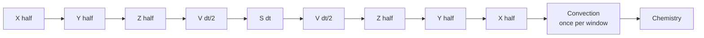
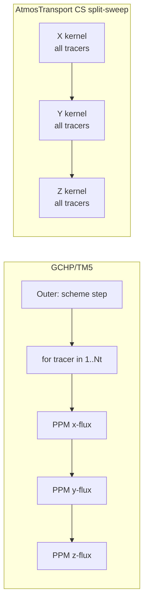

```@meta
CurrentModule = AtmosTransport
```

# Operators on top of the binary

With the daily binary mmap'd and a typed `state.air_mass` on the same
basis, every physics operator becomes a small `apply!(state, ...,
op, dt)` call. This page maps the four operator families
(advection, diffusion, convection, surface flux) onto the vocabulary
TM5 and GCHP users already have.

If you have only read the [Binary pipeline](binary_pipeline.md) page,
the relevant takeaway is that at *every* substep the runtime has on
hand:

- `m` — air mass per cell on the binary's basis (dry by default),
- `am`, `bm` — horizontal mass fluxes through x- and y-faces (or
  `hflux` on RG),
- `cm` — vertical mass flux at level interfaces (closed against
  `dm` at write time),
- `ps` — surface pressure per cell,
- optionally `qv`, `cmfmc`/`dtrain`, the four TM5 fields.

Operators consume these directly; no operator builds a flux field
from raw winds at run time.

## The Strang palindrome

Each `step!(model, dt)` runs a fixed palindrome composing transport,
diffusion, surface flux, convection, and chemistry:

```
transport:  X → Y → Z → V(dt/2) → S(dt) → V(dt/2) → Z → Y → X
convection: apply!(state, convection_forcing, grid, convection, dt)
chemistry:  apply!(state, meteo, grid, chemistry, dt)
```

Where:

- `X`, `Y`, `Z` are half-step directional sweeps,
- `V` is vertical diffusion (the Thomas implicit solve),
- `S` is the surface flux deposition,
- the palindrome symmetry makes the composition second-order accurate
  in time.

For binary-scheduled drivers the full `step!` is bypassed; the
runtime calls `transport_step!` per substep and
`convection_chemistry_step!` once per window. This is the GCHP-style
"convection and chemistry after the dynamics step" placement, and is
*different from TM5's `xyzvvzyx` interleaving* — TM5 runs convection
inside the vertical-only legs. See the philosophy page for the
rationale.



## Advection

### Scheme selection by type

`AbstractAdvectionScheme` has four production subtypes:

| Scheme | What TM5/GCHP user it maps to | Grids | Multi-tracer fusion |
| --- | --- | --- | --- |
| `UpwindScheme` | First-order upwind (debugging only) | LL, RG, CS | yes |
| `SlopesScheme` | Russell-Lerner slopes / "TM5 sl_advection" | LL, RG, CS | yes |
| `PPMScheme` | PPM with Colella-Woodward monotonicity (GCHP PPM-NV5) | LL, RG, CS split-sweep | yes |
| `LinRoodPPMScheme{ORD}` (ORD ∈ {5,7}) | FV3 Lin-Rood PPM (GCHP dynamics) | CS only | **no** (per-tracer loop) |

The TOML `[advection].scheme` key parses to a Julia type at config
time; the runtime sees the typed value and dispatches at compile
time. *There is no runtime branch on the scheme name.* Subtyping is
the extension mechanism.

### Cubed-sphere palindrome and the positivity budget

The CS Strang split is a six-leg palindrome: `X → Y → Z → Z → Y → X`.
Each leg may be **subcycled** by an integer count `n_x`, `n_y`, `n_z`
chosen to keep tracer mass positive. The subcycle count comes from a
*palindrome positivity budget* tighter than per-direction CFL:

```
ratio = 2 · (out_x + out_y + out_z) / m_start
n_sub = ceil(ratio / safety_factor)
```

with `out_d = max(0,-a_lo) + max(0,a_hi)` (the Lin-Rood 1996
refinement, not `max(|a_lo|, |a_hi|)`). The factor of 2 is because
the palindrome traverses each direction twice. For binaries written
with adaptive substeps, the count per window is already baked into
`steps_per_window_by_window[k]`; the runtime uses the binary's value
as the floor and may refine upward if cell-by-cell mass would go
negative.

This is the analogue of TM5's CFL-driven substep, hardened against
the palindrome's specific stacking pattern.

### Multi-tracer fusion

For `SlopesScheme` and `PPMScheme` on the CS split-sweep path, each
direction's sweep packs **all tracers into a single kernel** —
`_cs_xsweep_mt_kernel!`, `_cs_ysweep_mt_kernel!`,
`_cs_zsweep_mt_kernel!`. The palindrome launches six kernels total
regardless of tracer count (one per leg of `X → Y → Z → Z → Y → X`).
On GCHP / TM5 the tracer loop is *inside* the PPM call; you launch
`6 · Nt` kernels per palindrome. For `Nt = 50` this is the
difference between 6 and 300 launches per palindrome.



The `LinRoodPPMScheme` path on CS does *not* fuse and runs the
per-tracer loop. This is a known asymmetry — the Lin-Rood
horizontal step is structurally per-tracer and the multi-tracer
fusion would require restructuring `fv_tp_2d_cs!` to loop tracers
inside the update kernel.

### Adaptive substeps

```mermaid
flowchart TD
    A[Window k starts] --> B[Read binary substep count<br/>steps_per_window_by_window[k]]
    B --> C[Run palindrome substep]
    C --> D{Positivity check<br/>2·out/min(m_start,m_end) < safety?}
    D -->|yes| E[advance substep counter]
    E --> F{All substeps done?}
    F -->|no| C
    F -->|yes| G[Window k complete]
    D -->|no| H[Refine: bump n_sub for this leg]
    H --> C
```

The runtime positivity check is a second line of defense: the
preprocessor already chose the substep count so the worst window
hits a healthy budget. The runtime check exists for floating-point
edge cases and for binaries that did not run with adaptive substeps
enabled.

## Diffusion

`ImplicitVerticalDiffusion` is the production diffusion operator. It
runs the standard tri-diagonal Thomas solve column-by-column. The
diffusivity profile is supplied by an `AbstractKzField`:

| Kz field | Source | Status |
| --- | --- | --- |
| `PreComputedKzField` | Direct from binary (`:Kz` payload section) | Planned |
| `ProfileKzField` | Static profile from TOML | Production |
| `DerivedKzField` | Beljaars–Viterbo local Kz from `(ps, u, v, T, q, z0)` | Production |
| `WindowPBLKzField` | PBL-aware variant of Beljaars–Viterbo | Production |
| `LocalHoltslagBovilleKzField` | GEOS/VDIFF local Holtslag–Boville Kz | Preview |

For TM5 users: `DerivedKzField` is the closest analogue to the
Holtslag–Boville-with-Beljaars-correction profile TM5 ships with.
For GCHP users: `LocalHoltslagBovilleKzField` follows the local GCHP/VDIFF
formulation almost line-for-line, with the same `(R_dry, cp_dry,
karman)` parameters and the same non-local counter-gradient term.

### Surface-flux as a Dirichlet (current) vs Neumann (target)

The diffusion operator pairs with a surface flux operator through a
boundary-condition trait:

- `NoSurfaceFluxBoundary` — no coupling.
- `DiffusiveSurfaceFluxBoundary` — surface flux is added to the
  bottom cell mass **before** the Thomas solve, then the solve runs
  with a zero-flux lower boundary.

The current `DiffusiveSurfaceFluxBoundary` is an approximation of
GCHP's VDIFF lower-boundary treatment. GCHP modifies the bottom row
of the Thomas tridiagonal directly (`b[Nz]`, `d[Nz]`) to inject the
flux as a Neumann condition. The two are equivalent only for
`Kz · dt / dz² ≪ 1`. The roadmap is to switch to the Thomas-RHS
formulation; until then, the approximation is documented at
`Operators/Diffusion/operators.jl`.

## Convection

Two production operators today:

### `TM5Convection`

Consumes the four TM5 fields from the binary (`:entu`, `:detu`,
`:entd`, `:detd`) and runs the TM5 column solve via a four-band
implicit operator. This is the path for ERA5-driven runs. The
algorithm follows `tm5/levitation.F90` closely; the column solve is
in `src/Operators/Convection/tm5_column_solve.jl` and the kernels
in `tm5_kernels.jl`.

### `CMFMCConvection`

Consumes `:cmfmc` (and optionally `:dtrain`) from the binary and
runs the GCHP-style upwind moist convection scheme. This is the
path for GEOS-driven runs. The CFL substep is chosen at met-window
start from the maximum cell-relative mass flux.

### Placement note (important for TM5 users)

We place convection **after** the FV transport block — once per met
window, between the palindrome's last `X` sweep and chemistry. TM5
interleaves convection inside the palindrome's vertical legs
(`xyzvvzyx` → convection inside the `vv`). The GCHP placement is
faithful to the GCHP CTM code (`gchp_chunk_mod.F90:1164-1174`); the
TM5 placement is faithful to TM5-4DVAR's documented order.

For research questions where convective tracer transport in the
column matters (`222Rn` profiles, deep-convective venting), the
placement matters; we have a follow-up plan to support both
placements via a `[run].convection_placement` setting.

## Surface flux

`SurfaceFluxOperator` carries a `PerTracerFluxMap` — a typed mapping
from tracer name to an `AbstractSurfaceFluxSource`. Each source
supplies its surface flux as **kg/s per cell, already
area-integrated**.

For TM5/GCHP users this means:

- EDGAR/GFED/HEMCO `kg/m²/s` raster needs an explicit
  multiplication by cell area at TOML-build time. This is the
  preprocessor's job, not the runtime's.
- The runtime adds the flux mass to the bottom cell (`k = Nz`) at
  the surface step. With `DiffusiveSurfaceFluxBoundary` the
  diffusion solve then redistributes that mass upward.

```@example
# Conceptual layout of the per-tracer flux map (do not actually run)
# Each source struct knows how to read its data and inject into
# the appropriate tracer at apply! time.
```

## Composition rules and apply! contract

Every operator has the same `apply!` shape:

| Family | Signature |
| --- | --- |
| Advection | `apply!(state, fluxes, grid, scheme, dt; workspace, cfl_limit, diffusion_op, emissions_op, meteo)` |
| Diffusion | `apply!(state, meteo, grid, op::AbstractDiffusion, dt; workspace)` |
| Convection | `apply!(state, forcing::ConvectionForcing, grid, op::AbstractConvection, dt; workspace)` |
| SurfaceFlux | `apply!(state, sources::PerTracerFluxMap, grid, op::AbstractSurfaceFluxOperator, dt; workspace)` |

The second positional argument carries the time-resolved data the
operator needs from the binary. Workspaces are pre-allocated
parametric structs that own the scratch buffers and the per-backend
kernel objects.

## What's not yet a typed operator

A small list of known gaps you may run into if you are porting a TM5
or GCHP workflow:

- **Wet deposition** is not yet an operator family. Aerosol /
  scavenging users will need to add an `AbstractWetDeposition`.
- **Dry deposition** lives inside the surface flux operator today;
  it does not have its own resistance-based abstraction. GCHP-style
  deposition users will want a separate `AbstractDryDeposition`.
- **Photolysis / fast chemistry** is out of scope. Only first-order
  decay (`ExponentialDecay`) is shipped; this is enough for
  `222Rn → 222Pb` and similar half-life tracers.

The roadmap explicitly tracks each of these gaps; see
[Validation status](../theory/validation_status.md).

## Reading next

- For the sensitivity side (adjoint of every operator above), see
  [Adjoints on top of the binary](adjoints.md).
- For how the multi-tracer kernels actually launch on CPU, CUDA, and
  Metal from a single source, see
  [Kernel architecture](kernel_architecture.md).
- For the deep-physics treatment (palindrome derivation,
  monotonicity, fillz repair), see
  [Advection schemes](../theory/advection_schemes.md).
