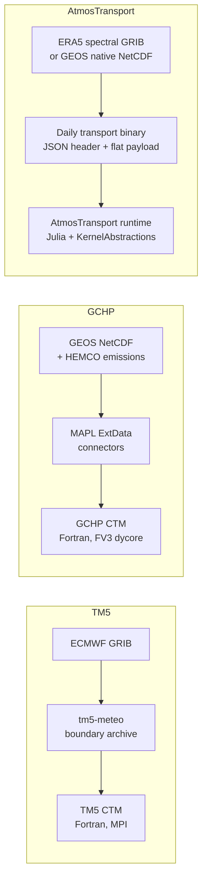
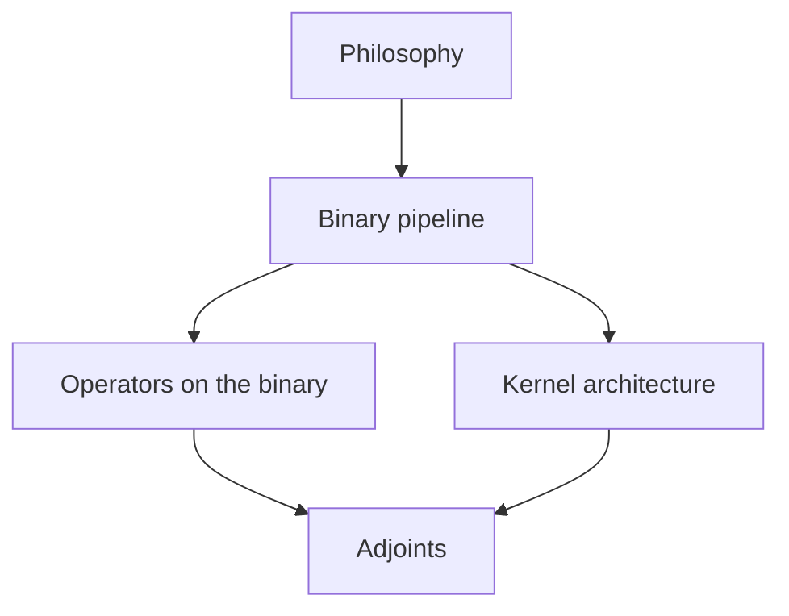

```@meta
CurrentModule = AtmosTransport
```

# Philosophy

AtmosTransport sits in the same family as **TM5-4DVAR** and the
**GEOS-Chem High Performance / GCHP CTM** lineage: an *offline*
tracer transport model driven by pre-computed meteorology. If you are
fluent in either of those codes, most of the physics terms map across
unchanged. What differs is the *engineering shape* — the contract
between preprocessing and runtime, how operators dispatch, and how the
work spreads across CPU / CUDA / Metal from a single source tree.

This page lays out the design choices so you can carry your mental
model in. The next pages drill into how that model is realized for
binaries, operators, adjoints, and the kernel architecture.

## The one-line summary

> Pre-compute mass-conserving daily binaries off-line; memory-map them
> at runtime; dispatch every physics operator through Julia's type
> system; write one kernel per loop and let `KernelAbstractions.jl`
> retarget it to CPU, CUDA, or Metal.

Everything in the docs is a consequence of that line.

## Where we sit relative to TM5 and GCHP



| Concern | TM5-4DVAR | GCHP CTM | AtmosTransport |
| --- | --- | --- | --- |
| Source language | Fortran 90 + MPI | Fortran 90 + MAPL + ESMF | Julia + KernelAbstractions |
| Native grid | Reduced Gaussian (TM5) or LL | Cubed-sphere (FV3) | Lat-Lon, Reduced Gaussian, Cubed-sphere |
| Met-data ingestion | tm5-meteo boundary archive | MAPL ExtData NetCDF connectors | One daily binary per day |
| Advection core | Russell-Lerner slopes + Strang split | PPM (Lin-Rood) with FV substepping | Slopes / PPM / Lin-Rood (CS) via type dispatch |
| Convection | Tiedtke/SiBJK two-side updraft/downdraft | RAS / SHOC / GMAO depending on collection | TM5 four-field *or* GCHP-style CMFMC |
| Vertical diffusion | Holtslag–Boville non-local | GCHP/VDIFF local Beljaars–Viterbo | Beljaars–Viterbo + Holtslag–Boville (preview) |
| Mass basis | Moist (with explicit qv bookkeeping) | Moist + dry conversions per-operator | **Dry by default**, basis is a *type parameter* |
| Multi-tracer | Tracer loop *inside* each operator | Tracer loop *inside* FV step (PPM × Nt) | Single multi-tracer fused kernel (6 launches / palindrome on LL & CS split-sweep) |
| Adjoint | TM5-4DVAR (hand-coded) | GIGC adjoint (separate fork) | Tape + checkpoint + replay; surface-emission footprints today, 4D-Var on the roadmap |
| Hardware | CPU clusters | CPU clusters (some GPU effort upstream) | Single-node multi-GPU (CUDA / Metal) and CPU; one source tree |

The differences are deliberate; the similarities are deliberate too.
We deviate where Julia + KA pays off, and converge where the physics
community has settled (operator naming, basis conventions, mass-flux
sign conventions).

## Design tenets

### 1. The binary is the contract

Off-line preprocessing produces a single binary per day. That binary
fully specifies every field the runtime needs: air mass, horizontal
and vertical mass fluxes, surface pressure, optional moist physics
fields. A JSON header in the first ~131 KB declares topology, basis,
vertical coordinate, substep schedule, and which optional sections are
present. The runtime's job is to memory-map the file and stream over
windows; nothing about the model is configured by reading raw met
files at run time.

TM5 users will recognize this as a hardened version of the *boundary
archive*. GCHP users will recognize it as the moral equivalent of the
MAPL ExtData connector layer collapsed into a single deterministic
file with a typed schema. Both communities have lost weeks to
sample-timing bugs or import-order issues; the binary removes that
class of bug by design.

See [The binary pipeline](binary_pipeline.md) for what's inside, what
the gate checks, and why the trade-offs work.

### 2. Type dispatch, not configuration strings

Every operator is an abstract type with a `No<Operator>` default. The
runtime's job is to call `apply!(state, ..., op, dt)`; Julia picks the
method at compile time based on the type of `op`. There is no
`if scheme == "ppm"` ladder anywhere in the inner loop. Adding a new
advection scheme is a matter of subtyping `AbstractAdvectionScheme`
and writing the kernels — no central registry to edit, no
configuration-parser changes required after the TOML parse-time
mapping.

This is the single biggest difference from TM5 / GCHP. Both codes
carry years of `if (USE_FOO)` branches that have to be threaded down
to the kernel call sites; the cost is paid every step. In Julia those
branches dissolve at compile time and the kernel that runs is exactly
the kernel for the configured operator.

See [Operators on top of the binary](operators_on_binaries.md).

### 3. One kernel, three backends

Every hot loop is written once as a `KernelAbstractions.@kernel`. The
same function targets CPU, NVIDIA CUDA, and Apple Silicon Metal,
selected by the `[architecture].backend` line in the TOML. There is no
"GPU version" of any operator that is separately maintained from the
"CPU version". Workspace structures are parametric on the array type
so the same struct holds `Array{Float32}` on CPU and `CuArray{Float32}`
on CUDA without duplication.

See [Kernel architecture](kernel_architecture.md).

### 4. Multi-tracer kernels by default

When you run 50 tracers, GCHP and TM5 pay roughly 50× the per-tracer
cost of one tracer (the tracer loop sits inside the FV step or inside
the operator). AtmosTransport's split-sweep paths run **6 launches per
Strang palindrome regardless of the tracer count**: the X, Y, Z half
sweeps each pack all tracers into one kernel. This means doubling the
tracer count is closer to a 10–20 % runtime hit than a 100 % hit on
the GPU. The Lin-Rood (PPM, ORD=5/7) path still loops per-tracer
externally; that is a known asymmetry called out in
[Operators on top of the binary](operators_on_binaries.md).

### 5. Mass conservation is type-level

Dry-basis vs moist-basis is a Julia type parameter
(`State{DryBasis}` vs `State{MoistBasis}`); a binary advertises its
basis in the header; the runtime refuses to load a mismatched binary
at construction time. The `cm` (vertical mass flux) field in every
binary is closed against the explicit `dm` (per-substep mass delta)
field at write time, with a write-time replay gate that evolves the
mass forward one window and checks bit-level closure. A runtime that
opens a binary whose write-time gate failed will refuse to step.

See [Mass conservation theory](../theory/mass_conservation.md) and the
[Binary format reference](../concepts/binary_format.md).

### 6. Adjoints are a layer, not a fork

Tape recording and reverse replay live in `src/Tape/`,
`src/Adjoints/`, and `src/Footprint/`. The forward integrator records
op-records onto a tape during normal stepping; the reverse pass walks
the tape backwards with operator-specific adjoint kernels. There is no
separate adjoint executable, no maintained-by-hand "forward and
backward parallel codebase" as in GIGC adjoint or in TM5-4DVAR's
legacy split. Today the main consumer of the adjoint is
*surface-emission footprints*; a full 4D-Var driver is the next
milestone.

See [Adjoints on top of the binary](adjoints.md).

## What you give up

To make the binary-as-contract pattern work, three things go away:

- **Online dynamics.** AtmosTransport cannot run a free-running GCM;
  it requires precomputed mass fluxes. If you need radiation,
  convection-resolving cloud microphysics, or an interactive surface
  scheme, this is the wrong tool.
- **Per-step preprocessing.** Reading raw ERA5 spectral coefficients
  or raw GEOS NetCDF *at every met step* is not supported. We commit
  to preprocessing the entire day up-front.
- **Stateful in-memory data services.** No MAPL, no FMS-style
  registries. Everything the runtime needs is on disk in the binary.

In return, you get a runtime that:

- starts in 2–3 seconds (no MPI bootstrap, no MAPL warmup),
- spends ~90 % of its wall clock in physics kernels rather than I/O,
- runs the same source code on a laptop CPU and an A100 / H100 / L40S,
- has a single deterministic file you can `scp` to another machine and
  reproduce the run bit-for-bit.

## Reading order from here



If you have a TM5 background, the next page that moves the needle
fastest is usually [The binary pipeline](binary_pipeline.md) — your
mental model of "the boundary archive" maps almost directly.

If you have a GCHP background, jump to
[Operators on top of the binary](operators_on_binaries.md) first; the
PPM / palindrome / FV vocabulary will already be familiar, and the
section spells out the small but important differences from
Lin-Rood-as-implemented-in-FV3.

Either way, finish with [Kernel architecture](kernel_architecture.md)
to understand why the runtime can sustain GPU peak throughput while
keeping a single source tree.
