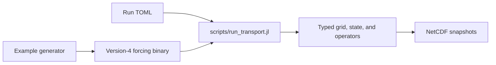

# [Quickstart](@id Quickstart)

This is the shortest path to a complete AtmosTransport run. It creates a tiny
version-4 forcing file locally, transports a Gaussian CO₂ anomaly for four
hours on the CPU, and writes five NetCDF snapshots. No download, account, GPU,
or external data tool is required.

!!! note "Before you start"
    Complete [Installation](@ref Installation), then run every command from the
    repository root. If `--project=.` is unfamiliar, read
    [Julia orientation](@ref Julia-orientation).

## 1. Generate synthetic meteorology

```bash
julia --project=. examples/generate_synthetic_quickstart.jl
```

Expected final lines:

```text
Wrote current transport binary: .../data/quickstart/synthetic_latlon_v4.bin
Next: julia --project=. scripts/run_transport.jl config/examples/minimal_template.toml
```

The generated file contains a 36 × 18 × 3 latitude-longitude grid, four hourly
forcing windows, constant eastward mass flux, and zero mass divergence. It is a
small teaching fixture, but it uses the same version-4 header, reader, runtime
driver, state, and advection operators as a preprocessed ERA5 or GEOS run.

You can inspect it before running:

```bash
julia --project=. scripts/diagnostics/inspect_transport_binary.jl \
    data/quickstart/synthetic_latlon_v4.bin
```

Look for `basis: dry`, `windows: 4`, and check marks beside advection and the
replay gate.

## 2. Run the model

```bash
julia --project=. scripts/run_transport.jl config/examples/minimal_template.toml
```

The first invocation may pause for compilation. A successful run ends with
messages like:

```text
[ Info: Saved snapshots: data/quickstart/synthetic_output.nc (5 frame(s), 36×18 LatLonMesh{Float32}, mass_basis=dry)
[ Info: Final air-mass change vs initial state:  0.000e+00
[ Info: Final tracer-storage drift for co2_bl:   0.000e+00
```

The two zero-drift lines are the important result: the run preserved the air
mass and conservative tracer-storage budgets for this closed synthetic case.

## 3. Inspect the result in Julia

This command opens the NetCDF file and prints the dimensions and value range of
the column-mean CO₂ field:

```bash
julia --project=. -e '
using NCDatasets
NCDataset("data/quickstart/synthetic_output.nc") do ds
    co2 = ds["co2_bl_column_mean"][:, :, :]
    println("shape = ", size(co2))
    println("range = ", extrema(co2))
end'
```

Expected shape and approximate range:

```text
shape = (36, 18, 5)
range = (0.0004f0, 0.000479...f0)
```

The first two dimensions are longitude and latitude; the third contains the
five output times (0–4 hours). Mixing ratios are mol/mol, so `0.0004` is
400 ppm.

## 4. Read the configuration

The run is controlled by `config/examples/minimal_template.toml`. Its essential
shape is:

```toml
[input]
binary_paths = ["data/quickstart/synthetic_latlon_v4.bin"]

[architecture]
use_gpu = false
backend = "cpu"

[numerics]
float_type = "Float32"

[advection]
scheme = "slopes"

[diffusion]
kind = "none"

[convection]
kind = "none"

[tracers.co2_bl.init]
kind = "gaussian_blob"
background = 4.0e-4
amplitude = 8.0e-5
lon0_deg = -80.0
lat0_deg = 35.0
sigma_lon_deg = 35.0
sigma_lat_deg = 18.0

[output]
hours = [0, 1, 2, 3, 4]
path = "data/quickstart/synthetic_output.nc"
```

Notice what is *not* configured: the grid. A runtime run reads topology,
coordinates, vertical levels, timing, mass basis, and available physics fields
from the transport-binary header. The TOML selects how to use that forcing.

## 5. Change one thing

Try one edit at a time, then rerun the same command:

| Experiment | TOML edit |
|---|---|
| More diffusive first-order transport | Set `[advection] scheme = "upwind"`. |
| Putman–Lin PPM | Set `[advection] scheme = "ppm"`. |
| A weaker initial anomaly | Set `amplitude = 2.0e-5` (20 ppm). |
| Fewer snapshots | Set `hours = [0, 2, 4]`. |
| Double precision on CPU | Set `[numerics] float_type = "Float64"`. |

The output file is replaced on each run.

## What this example teaches



- Meteorology and its numerical contracts live in the binary.
- Experiment choices live in TOML.
- The runner constructs concrete Julia types and dispatches on topology and
  physics.
- State stores the conservative quantity `mixing ratio × carrier-air-mass`
  internally and reports dry volume mixing ratio at the output boundary. This
  is mass-like model storage, not physical kilograms of tracer species.

The generator itself is intentionally separate from the runtime. In a real
workflow, [meteorology preprocessing](@ref Preprocessing-overview) replaces the
synthetic generator; the runner and TOML pattern remain the same.

## Where to go next

- [Architecture tour](@ref Architecture-tour) — understand the objects that
  just ran without diving into implementation details.
- [Run with real meteorology](@ref Run-with-real-meteorology) — point the same
  runtime at current ERA5 or GEOS transport binaries.
- [Inspecting output](@ref) — variable names, dimensions, and visualization
  options.
- [Tutorial: synthetic lat-lon end-to-end](@ref) — assemble the driver, state,
  model, and simulation directly through the Julia API.
