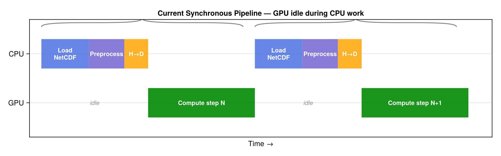
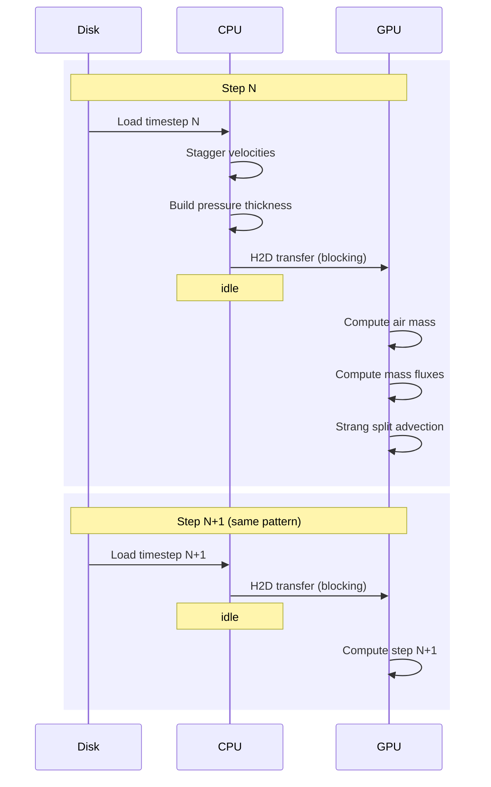
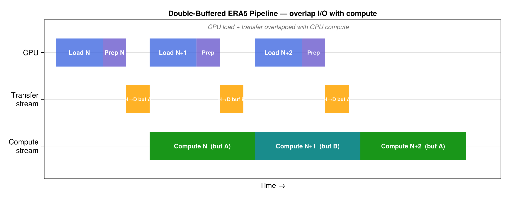
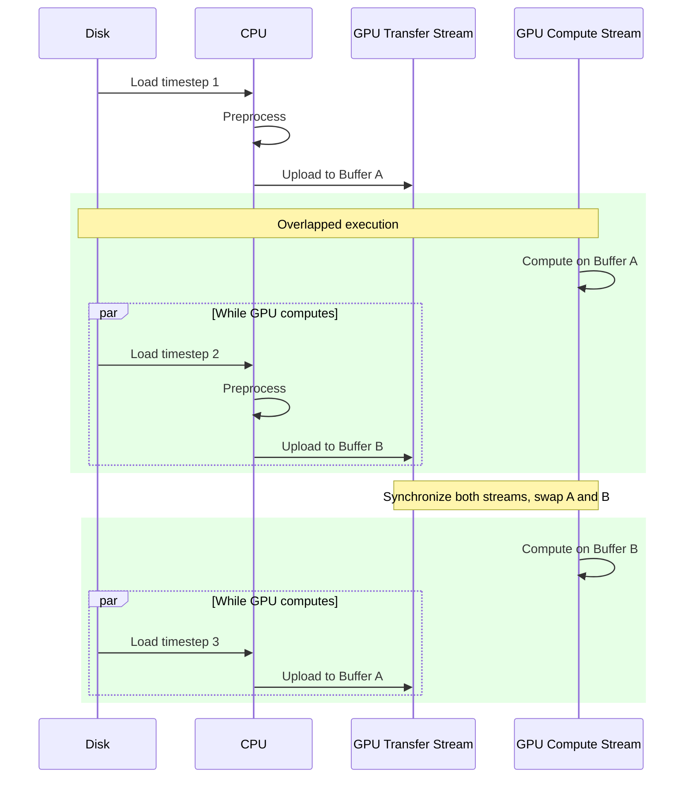
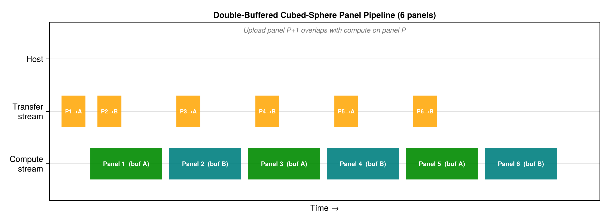
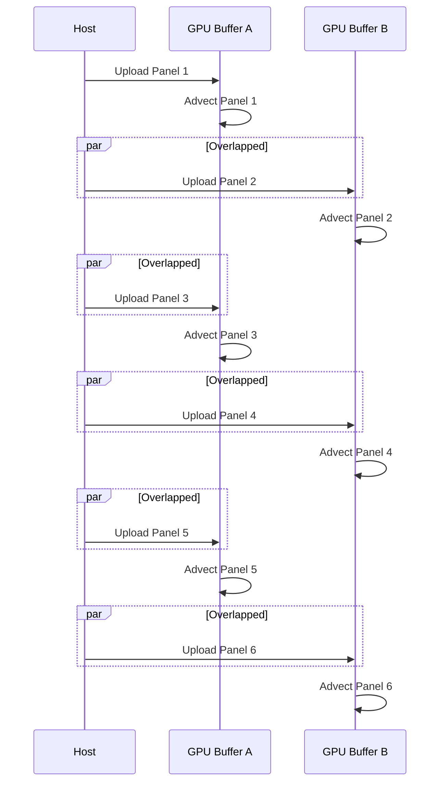

# GPU Double Buffering (Ping-Pong Strategy)

This page describes a key GPU optimization for overlapping data transfer with
computation. The technique applies to both the **ERA5 timestep pipeline** and
the **cubed-sphere panel pipeline**, and can roughly double GPU utilization
when I/O transfer time is comparable to compute time.

## The Problem: Synchronous Pipeline

In the current forward simulation loop (see `scripts/run_forward_hybrid.jl`),
every timestep follows a strictly sequential pattern:

```julia
for step in 1:Nt
    # --- CPU work (GPU idle) ---
    u, v, ω, Δp, ps = load_timestep(datafile, step, ...)   # NetCDF read
    met = stagger_winds!(u, v, ω, ...)                        # CPU compute
    _build_Δz_3d!(Δp_cpu, grid, ps)                          # CPU compute
    copyto!(Δp_dev, Δp_cpu)                                  # H→D transfer
    copyto!(u_dev, met.u)                                    # H→D transfer
    copyto!(v_dev, met.v)                                    # H→D transfer

    # --- GPU work ---
    compute_air_mass!(m_dev, Δp_dev, gc)
    compute_mass_fluxes!(am_dev, bm_dev, cm_dev, ...)
    strang_split_massflux!(tracers, m_dev, am_dev, bm_dev, cm_dev, ...)
end
```

The GPU sits idle during ~6 sequential CPU operations (disk read, velocity
staggering, pressure thickness computation, and three `copyto!` transfers)
before it gets any work:





The idle fraction grows as the computation becomes faster (e.g., with Float32,
fewer vertical levels, or a smaller grid), making data movement the bottleneck.

## Solution: Double-Buffered Ping-Pong

The idea is simple: **pre-allocate two sets of GPU buffers** (A and B) and use
**two CUDA streams** (one for compute, one for async data transfer) so that
loading the next timestep overlaps with processing the current one.

The pipeline becomes:

1. Upload timestep N to buffer A (blocking, first iteration only)
2. Launch compute on buffer A (compute stream)
3. While GPU computes on A, CPU loads and preprocesses timestep N+1, then
   async-copies it to buffer B (transfer stream)
4. Wait for both streams; swap A ↔ B; repeat





### Implementation Sketch

```julia
using CUDA

# Pre-allocate two buffer slots
buf = ntuple(_ -> (
    Δp = CuArray{FT}(undef, Nx, Ny, Nz),
    u  = CuArray{FT}(undef, Nx+1, Ny, Nz),
    v  = CuArray{FT}(undef, Nx, Ny+1, Nz),
), 2)

compute_stream  = CuStream()
transfer_stream = CuStream()

# Initial load into buffer 1
upload!(buf[1], load_and_preprocess(1), transfer_stream)
CUDA.synchronize(transfer_stream)

curr, next = 1, 2
for step in 1:Nt
    # Launch compute on current buffer (compute stream)
    @cuda stream=compute_stream compute_step!(tracers, buf[curr]...)

    if step < Nt
        # Overlap: CPU loads next step, then async-upload to `next` buffer
        cpu_data = load_and_preprocess(step + 1)          # CPU work
        upload!(buf[next], cpu_data, transfer_stream)      # async H→D
    end

    CUDA.synchronize(compute_stream)
    CUDA.synchronize(transfer_stream)
    curr, next = next, curr   # swap buffers
end
```

The key CUDA.jl primitives are:
- **`CuStream()`** — create an independent execution stream
- **`copyto!(dst, src; stream=s)`** — async copy on stream `s`
- **`@cuda stream=s kernel!(...)`** — launch kernel on stream `s`
- **`CUDA.synchronize(s)`** — block until stream `s` completes

With KernelAbstractions.jl, use `synchronize(backend)` after each kernel
group, scoped to the appropriate stream.

## Application 1: ERA5 Timestep Pipeline

For the ERA5 mass-flux advection run, each timestep loads three 3D arrays
(`Δp`, `u`, `v`) from disk. At 1° × 1° × 137 levels in Float32, this is
roughly:

| Array | Shape | Size |
|:------|:------|:-----|
| Δp | 360 × 180 × 137 | ~34 MB |
| u | 361 × 180 × 137 | ~34 MB |
| v | 360 × 181 × 137 | ~34 MB |
| **Total per step** | | **~100 MB** |

On PCIe Gen4 x16 (~25 GB/s), transfer takes ~4 ms. On PCIe Gen3, ~8 ms.
If GPU compute per step is 20-50 ms, the overlap saves 4-8 ms per step
(10-40% of total step time). Over thousands of steps, this adds up.

The double-buffer option would be exposed as:

```julia
ws = allocate_massflux_workspace(m, am, bm, cm; double_buffer=true)
```

## Application 2: Cubed-Sphere Panel Pipeline

For the cubed-sphere grid, the model processes 6 panels sequentially.
Each panel's data (MFXC, MFYC, DELP, tracer) must be on the GPU before
advection kernels can run. With double buffering, while the GPU advects
panel P on buffer A, we upload panel P+1's data to buffer B:





This is particularly effective because:

- Each C720 panel is 720 × 720 × 72 — substantial transfer volume (~280 MB in Float32)
- The 6-panel sequential loop provides a natural pipeline with clear chunk boundaries
- Panel computations are independent (modulo halos, which are small)

The same `curr/next` buffer-swapping pattern applies, with the loop
iterating over panels 1–6 instead of timesteps.

## Expected Speedup

The theoretical speedup from double buffering is:

```
Speedup = T_sequential / T_overlapped
        = (T_cpu + T_transfer + T_compute) / max(T_compute, T_cpu + T_transfer)
```

| Regime | T\_compute vs T\_transfer | Speedup |
|:-------|:--------------------------|:--------|
| Compute-bound | T\_compute >> T\_transfer | ~1× (no benefit) |
| Balanced | T\_compute ≈ T\_transfer | ~2× |
| Transfer-bound | T\_compute << T\_transfer | ~1× (limited by transfer) |

The sweet spot is when compute and transfer times are comparable, which is
often the case for moderate-resolution grids on consumer GPUs. For very
large grids (C720), the compute time dominates and the benefit is smaller
per step but the absolute time saved is still significant over many steps.

## Configuration

The double-buffer strategy is an **optional optimization** controlled by a
flag. When disabled, the model uses the simpler synchronous pipeline (easier
to debug, deterministic timing). When enabled, the model pre-allocates
2× the met-data GPU memory in exchange for overlapped execution.

```julia
# Synchronous (default, simpler)
ws = allocate_massflux_workspace(m, am, bm, cm)

# Double-buffered (faster when I/O is significant)
ws = allocate_massflux_workspace(m, am, bm, cm; double_buffer=true)
```
