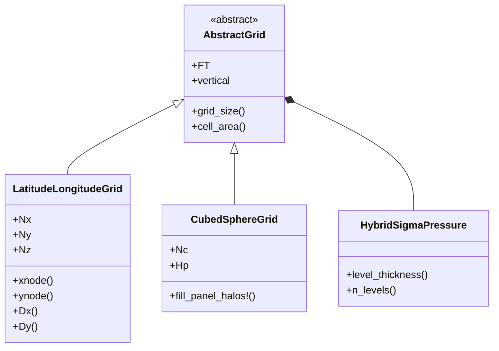
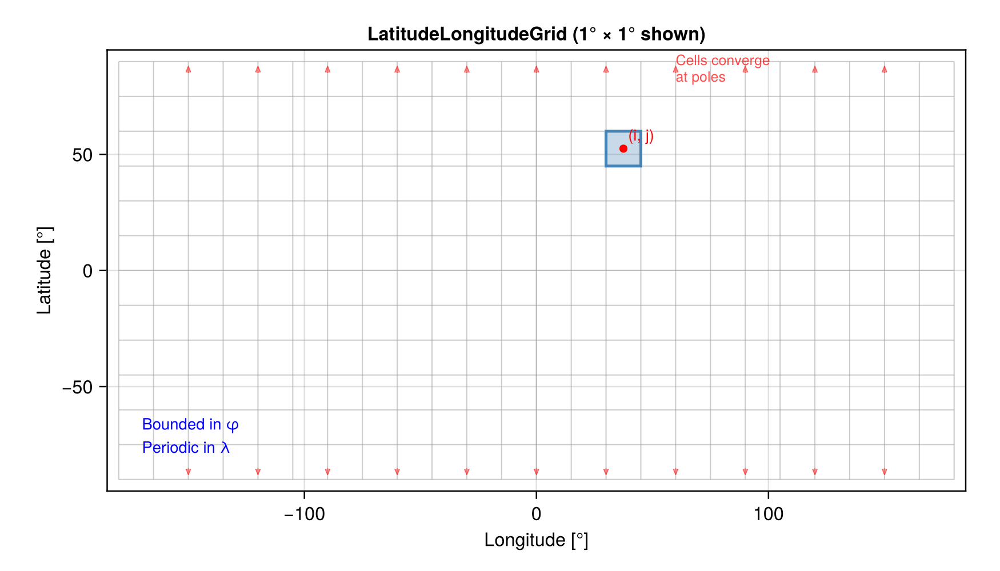
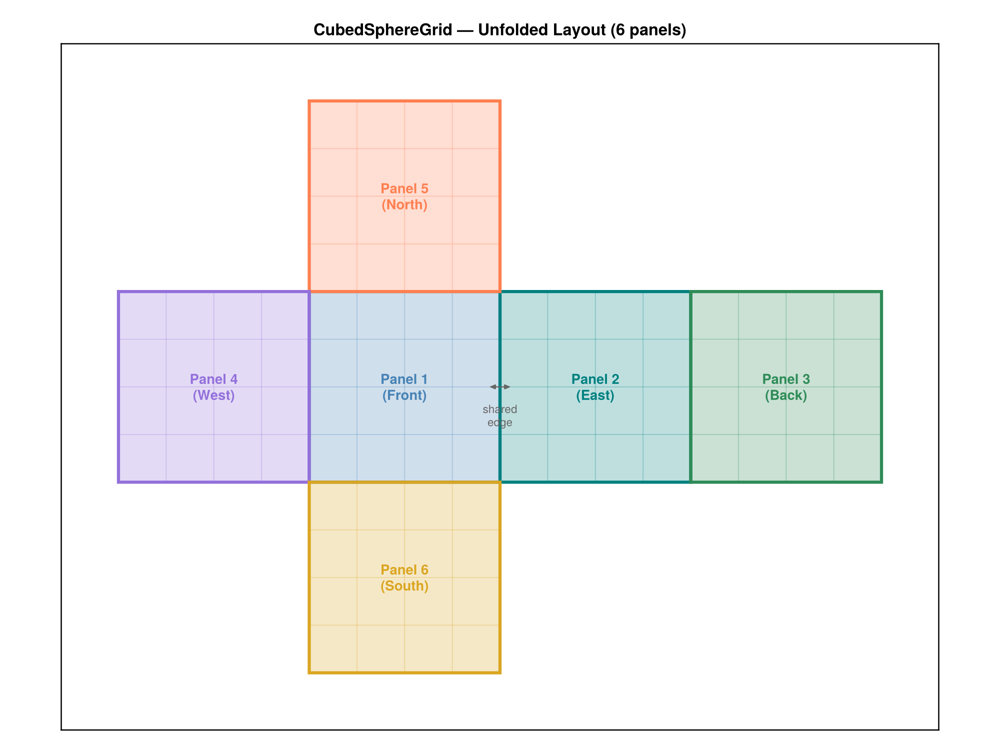
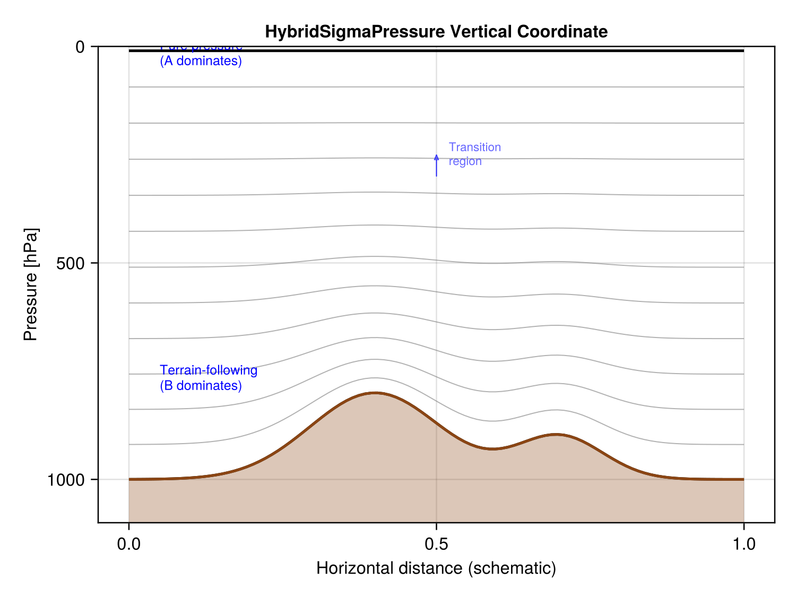
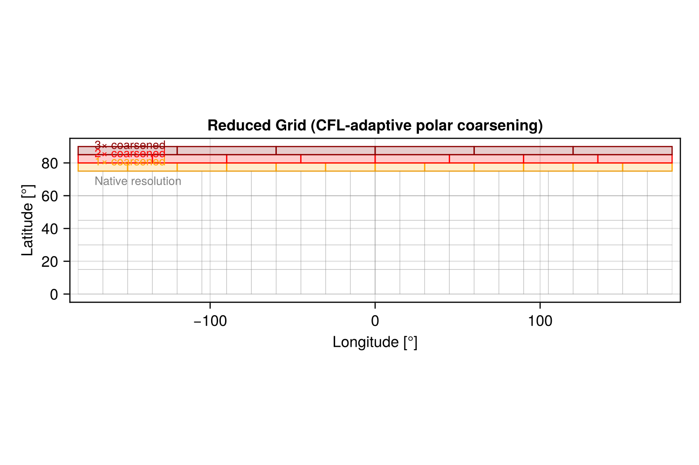
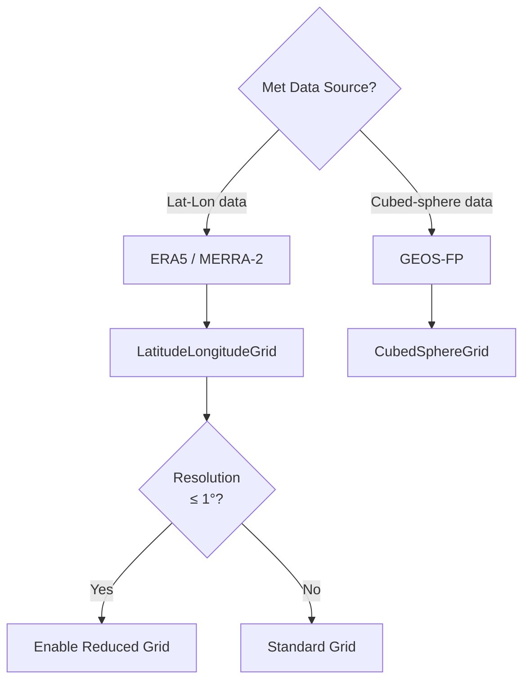

# Grid Types

AtmosTransport supports multiple horizontal grid types, all sharing a
common vertical coordinate. This page describes each grid type, when to use
it, and how it is represented internally.

## Grid Type Hierarchy



## LatitudeLongitudeGrid

The workhorse grid for ERA5-driven simulations. Cells are defined by
uniform spacing in longitude (λ) and latitude (φ), producing a regular
grid that maps directly to standard NetCDF data layouts.



### Properties

- **Topology**: Periodic in longitude, bounded in latitude
- **Cell area**: `A(j) = R² Δλ |sin(φ_{j+½}) − sin(φ_{j−½})|`, varies with latitude only
- **Pole convergence**: Cell widths shrink as `cos(φ)` near the poles, requiring
  CFL subcycling or a reduced grid (see below)
- **Typical sizes**: 360×180 (1°), 720×360 (0.5°), 1152×721 (0.25°)

### Construction

```julia
using AtmosTransport.Grids
using AtmosTransport.IO: default_met_config, build_vertical_coordinate

config = default_met_config("era5")
vert = build_vertical_coordinate(config; FT=Float64)

grid = LatitudeLongitudeGrid(CPU();
    FT   = Float64,
    size = (360, 180, n_levels(vert)),
    longitude = (-180, 180),
    latitude  = (-90, 90),
    vertical  = vert)
```

### Accessors

| Function | Returns |
|:---------|:--------|
| `xnode(i, j, grid, Center())` | Cell-center longitude [°] |
| `ynode(i, j, grid, Center())` | Cell-center latitude [°] |
| `Δx(i, j, grid)` | Zonal cell width [m] |
| `Δy(i, j, grid)` | Meridional cell height [m] |
| `cell_area(i, j, grid)` | Horizontal cell area [m²] |
| `grid_size(grid)` | `(Nx=..., Ny=..., Nz=...)` |

---

## CubedSphereGrid

A gnomonic cubed-sphere grid where the sphere is projected onto 6 cube faces.
Each face (panel) is a uniform Cartesian grid in gnomonic coordinates, connected
at shared edges with orientation-dependent halo exchange.



### Properties

- **Topology**: 6 connected panels, no pole singularity
- **Cell area**: Varies smoothly across each panel (2D array per panel)
- **Resolution naming**: C*N* means *N* cells per panel edge
  (e.g., C720 = 720×720×6 = 3,110,400 columns)
- **Equivalent resolution**: C720 ≈ 12.5 km, C360 ≈ 25 km, C90 ≈ 100 km
- **Panel connectivity**: Stored in `PanelConnectivity`, describing neighbor
  panel and orientation (0°/90°/180°/270° rotation) for each edge

### Construction

```julia
grid = CubedSphereGrid(CPU();
    FT = Float64,
    Nc = 90,           # cells per panel edge (C90)
    vertical = vert)   # Nz inferred from vertical coordinate
```

### Data Layout

All 3D fields are stored as `NTuple{6, Array{FT, 3}}`, one array per panel.
Each panel array has dimensions `(Nc + 2Hp) × (Nc + 2Hp) × Nz`, where
`Hp` is the halo width (default 3). The interior is at indices
`[Hp+1:Hp+Nc, Hp+1:Hp+Nc, :]`.

### Halo Exchange

Before each advection sweep, `fill_panel_halos!` copies interior edge data
from neighboring panels into halo regions, respecting the panel orientation:

```julia
fill_panel_halos!(tracer_panels, grid)
```

This is handled automatically inside `strang_split_massflux!` for cubed-sphere grids.

---

## HybridSigmaPressure (Vertical Coordinate)

Both grid types share the same vertical coordinate: hybrid sigma-pressure levels
defined by A and B coefficients at level interfaces.



### Definition

Pressure at level interface *k* is:

```
p(k) = A(k) + B(k) × pₛ
```

where `pₛ` is surface pressure. The A/B coefficients are loaded from TOML files
in `config/` for each met source:

| Met Source | Levels | Coefficient File |
|:-----------|:-------|:-----------------|
| ERA5 | 137 | `config/era5_L137_coefficients.toml` |
| GEOS-FP | 72 | `config/geos_L72_coefficients.toml` |
| MERRA-2 | 72 | `config/geos_L72_coefficients.toml` |

### Behavior by Altitude

- **Near the surface** (large B): levels follow terrain (sigma coordinate)
- **Upper atmosphere** (B → 0): levels are pure pressure surfaces
- **Transition region**: smooth blend controlled by the A/B ratio

### Level Thickness

The pressure thickness of level *k* is:

```
Δp(k) = [A(k+1) − A(k)] + [B(k+1) − B(k)] × pₛ
```

This is computed by `level_thickness(vert, k, ps)` and used to derive air mass:

```
m(i, j, k) = Δp(i, j, k) × area(i, j) / g
```

### Construction

```julia
# From a met source config (recommended)
config = default_met_config("era5")
vert = build_vertical_coordinate(config; FT=Float64)

# With a level subset
vert_subset = build_vertical_coordinate(config; FT=Float64, level_range=50:137)

# Manual construction from A/B vectors
vert = HybridSigmaPressure(A_interfaces, B_interfaces)
```

---

## Reduced Grid

An optimization for the `LatitudeLongitudeGrid` that clusters (coarsens) cells
in the zonal direction near the poles. This prevents the CFL condition from
requiring excessive subcycling at high latitudes, where cells become very narrow.



### How It Works

At each latitude band, cells are grouped into clusters. Within a cluster, tracer
concentrations are averaged before advection, effectively treating the cluster as
a single wider cell. After advection, values are uniformly redistributed.

The cluster size at latitude `φ` is approximately `⌈1 / cos(φ)⌉`, meaning:

| Latitude | Cluster Size | Effective Δλ (at 1°) |
|:---------|:-------------|:---------------------|
| 0° – 60° | 1 (no reduction) | 1° |
| 75° | ~4 | ~4° |
| 85° | ~11 | ~11° |
| 89° | ~57 | ~57° |

### Enabling

The reduced grid is enabled automatically when `Δλ ≤ 1°`:

```julia
grid = LatitudeLongitudeGrid(CPU();
    size = (360, 180, 88),
    vertical = vert,
    use_reduced_grid = :auto)   # default — enabled for fine grids
```

Override with `use_reduced_grid = true` (always on) or `false` (always off).

### Performance Impact

Without the reduced grid at 1° resolution, X-advection near the poles requires
up to 57 subcycles per step. With the reduced grid, the maximum subcycle count
drops to ~4, giving a ~10–15× speedup in the X-advection phase.

---

## Grid Selection Logic



## Grid Comparison

| Feature | LatitudeLongitudeGrid | CubedSphereGrid |
|:--------|:---------------------|:----------------|
| Pole singularity | Yes (cells converge) | No |
| Data layout | 3D array (Nx×Ny×Nz) | NTuple{6, Array} |
| Cell area | 1D (varies with lat only) | 2D (per panel) |
| Boundary conditions | Periodic λ, bounded φ | Panel halo exchange |
| Native met data | ERA5, MERRA-2 (lat-lon) | GEOS-FP (cubed-sphere) |
| Reduced grid | Available | Not needed |
| GPU support | Full | Full |
