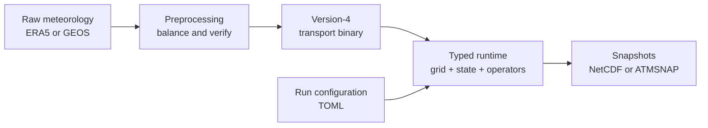

```@meta
CurrentModule = AtmosTransport
```

```@raw html
---
layout: home

hero:
  name: "AtmosTransport.jl"
  tagline: "Mass-conserving offline atmospheric tracer transport on CPUs and GPUs."
  image:
    src: /assets/brand/AtmosTransport_card.png
    alt: AtmosTransport
  actions:
    - theme: brand
      text: Get started
      link: /getting_started/installation
    - theme: alt
      text: Run the quickstart
      link: /getting_started/quickstart
    - theme: alt
      text: View on GitHub
      link: https://github.com/RemoteSensingTools/AtmosTransport.jl
---
```

AtmosTransport transports atmospheric trace gases through prescribed
meteorology. It supports regular latitude-longitude, reduced-Gaussian, and
cubed-sphere grids; ERA5 and GEOS meteorology; and the same typed model on a
CPU, NVIDIA GPU, or Apple GPU.

The package is under active development. It is a good fit for research and
method development when you want the mass budget, preprocessing assumptions,
and operator ordering to be explicit. It is not an online weather or climate
model: winds and air-mass fluxes are prepared before the transport run.

## Your first successful run

You do not need meteorological credentials, a GPU, or prior Julia experience.
After [installing the repository](@ref Installation), two commands create a
small current-format forcing file and run a four-hour CPU simulation:

```bash
julia --project=. examples/generate_synthetic_quickstart.jl
julia --project=. scripts/run_transport.jl config/examples/minimal_template.toml
```

The result is `data/quickstart/synthetic_output.nc`. The
[Quickstart](@ref Quickstart) explains every step and the
[Julia orientation](@ref Julia-orientation) explains what `julia`,
`--project=.`, and `using AtmosTransport` mean.

## The model in one picture



Preprocessing owns data conversion, grid transforms, dry-air bookkeeping, and
continuity checks. The runtime memory-maps the resulting binary, constructs the
correct grid and operators from its header plus a TOML file, and advances one
meteorological window at a time. See [Architecture tour](@ref Architecture-tour)
for the objects and source directories behind this flow.

## Choose a path

| If you want to… | Start with… |
|---|---|
| Try the model on any laptop | [Installation](@ref Installation) → [Quickstart](@ref Quickstart) |
| Learn just enough Julia to follow examples | [Julia orientation](@ref Julia-orientation) |
| Run with your own ERA5 or GEOS data | [Run with real meteorology](@ref Run-with-real-meteorology) → [Preprocessing overview](@ref) |
| Understand mass, grids, and physics choices | [Architecture tour](@ref Architecture-tour) → [State & basis](@ref) → [Operators](@ref Operator-concepts) |
| Map familiar TM5/GCHP concepts onto this code | [Design philosophy](@ref Design-philosophy) |
| Extend or call the library directly | [Curated public API](@ref) and the generated API pages |

## Core capabilities

- **Mass-conserving transport.** Air mass and conservative tracer storage
  follow the same discrete fluxes, with write-time replay and positivity gates.
- **Several horizontal topologies.** Lat-lon, reduced Gaussian, and
  cubed-sphere use one public driver and model interface.
- **Composable physics.** Advection, vertical diffusion, convection, surface
  fluxes, and simple chemistry are typed operators selected at configuration
  time.
- **Portable execution.** CPU is the simplest starting point; CUDA and Metal
  are optional backends. Metal uses `Float32`.
- **Explicit provenance.** Only transport-binary format version 4 is accepted;
  incompatible forcing fails at load time rather than being guessed.

## Where things live

| Repository path | Purpose |
|---|---|
| `examples/` | Small runnable examples that need no external data. |
| `config/examples/` | Canonical, copyable TOML run templates. |
| `scripts/run_transport.jl` | One command-line entry point for simulations. |
| `scripts/preprocessing/preprocess_transport_binary.jl` | One command-line entry point for meteorology preprocessing. |
| `src/` | Package implementation, organized by grids, state, operators, drivers, models, preprocessing, and output. |
| `test/core/` | Synthetic regression tests that do not require private datasets. |

The top-level repository `README.md` carries the current capability status.
These pages provide the learning path, workflows, theory, and generated API.
