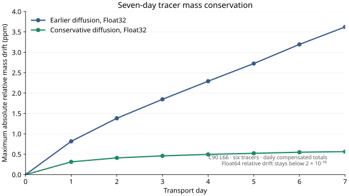

# Mass conservation

This page derives the discrete conservation contract that holds end-to-end
across the AtmosTransport pipeline (preprocessor → binary → runtime →
snapshot output) and quantifies the floating-point tolerances at which it
holds.

## The contract

For every cell `c` and every CFL-safe advection sub-step:

```math
m^{n+1}_c \;=\; m^n_c \;+\; \sum_f \sigma_{c,f}\,F^n_f
```

where `F^n_f` is the per-substep mass-amount through face `f` (units: kg per
substep, the binary's `flux_kind = :substep_mass_amount`) and `σ_{c,f} ∈
{+1, -1}` is the inflow / outflow sign convention for face `f` at cell `c`.
The same identity holds for every tracer mass `μ^n_{c, t}`:

```math
\mu^{n+1}_{c,t} \;=\; \mu^n_{c,t} \;+\; \sum_f \sigma_{c,f}\,\Phi^n_{f,t}
```

with `Φ^n_{f, t}` the tracer-mass flux through face `f`. Because `m` and
the tracer-mass slice live on the same staggering and use the same `F`,
`Φ` triple-pairing, the **mixing ratio `χ = μ / m` of a passive tracer
that starts uniform stays uniform exactly** under advection — modulo
floating-point.

## Telescoping divergence — why advection conserves total mass

For a closed periodic domain (lat-lon with periodic longitude) summing the
update over all cells gives:

```math
\sum_c m^{n+1}_c \;=\; \sum_c m^n_c \;+\; \sum_c \sum_f \sigma_{c,f} F^n_f
```

Each interior face appears in the sum twice — once with `+F` (the cell on
the inflow side) and once with `−F` (the cell on the outflow side) — so
the double-sum collapses to **boundary fluxes only**:

```math
\sum_c \sum_f \sigma_{c,f} F^n_f \;=\; \sum_{f \in \partial \Omega} F^n_f
```

For a closed sphere there is no boundary, so the right-hand side
identically vanishes mathematically — and to floating-point in the
implementation, provided both cells use the same face flux at the same
update stage. Writing each panel's update in flux form is insufficient
if neighboring panels reconstruct different tracer fluxes. The structured
X / Y / Z kernels in `src/Operators/Advection/structured_kernels.jl` use
shared face values. The telescoping argument does NOT hold
for schemes written in advective form (e.g. `χ ∂_t = -u ∂_x χ`),
which is why every advection scheme in this repository is flux-form.

The same telescoping argument extends to:

- Cubed-sphere Lin–Rood via shared final panel-edge tracer fluxes
  (`src/Operators/Advection/LinRoodSeams.jl`) and mirrored air-mass fluxes.
  The q-space Lin–Rood path requires CFL-safe inputs: its existing cell-local
  emergency flux scaling breaks conservation when activated.
- Cubed-sphere Upwind, Slopes, and PPM via one cached physical seam transfer
  applied to both neighbors in the same directional group
  (`src/Operators/Advection/CubedSphereSeams.jl`). This also pairs rotated X/Y
  contacts. Halo exchange alone is insufficient; see
  [Panel-edge halo treatment (cubed sphere)](@ref).
- The reduced-Gaussian grid via the LCM-based ring-boundary face
  segmentation in `_boundary_counts(nlon_per_ring)` in
  `src/Grids/ReducedGaussianMesh.jl`. Each ring-pair boundary is split
  into `lcm(nlon[j], nlon[j+1])` segments so the outflow from ring `j`
  exactly equals the inflow to ring `j+1`.

## Vertical closure

The discrete continuity equation for the vertical mass flux `cm` is:

```math
m^{n+1}_c \;=\; m^n_c \;-\; 2\,\text{steps}\,(am_{e} - am_{w} \;+\; bm_{n} - bm_{s} \;+\; cm_{k+1} - cm_{k})
```

with the surface boundary `cm` at `k = N_z + 1` pinned to zero (no mass
flux through the ground). All three production preprocessing paths
produce `cm` via the **same diagnostic**:

1. **LL spectral preprocessor.** Runs FFT-based Poisson balance over
   the periodic-longitude grid, then calls
   `recompute_cm_from_dm_target!` to diagnose `cm` from the explicit
   `(am, bm, dm)` field.
2. **RG spectral preprocessor.** Runs ring-aware Poisson balance via
   the compressed Laplacian, then calls the same
   `recompute_cm_from_dm_target!` diagnostic.
3. **GEOS native CS preprocessor.** Column-balances horizontal mass
   fluxes against the raw next-hour dry endpoint
   (`balance_cs_column_mass_fluxes!`), then calls `diagnose_cs_cm!`
   (the cubed-sphere analogue of `recompute_cm_from_dm_target!`).

In every case the binary lands with a `cm` field that closes the
explicit-`dm` continuity equation to floating-point tolerance — the
**write-time replay gate** then verifies it before the binary file is
committed to disk.

The production GEOS-CS path does not use the separate FV3-style pressure-fixer
`cm` diagnostic; it closes against the raw dry endpoint described above.

## Replay-gate tolerance

Conservation in floating-point is verified per-window via:

```math
\frac{\|m_{\text{evolved}} - m_{\text{stored}, n+1}\|}{\|m_{\text{stored}, n+1}\|} \;\le\; \tau(\text{FT})
```

`replay_tolerance(FT)` is defined in
`src/MetDrivers/ReplayContinuity.jl`:

| FT | `τ(FT)` |
|---|---|
| `Float64` | `1e-10` |
| `Float32` | `1e-4`  |

The Float32 tolerance reflects the noise floor of single-precision
arithmetic at production resolutions (Float32's 23-bit mantissa,
giving ~7 decimal digits of precision per operation, accumulates to
roughly `1e-5` per substep on a 720×361 grid; the per-window gate is
relaxed to `1e-4` to absorb the per-window accumulation).

These replay gates check carrier-air continuity. They do not bound tracer
drift or establish consistency of reconstructed tracer fluxes at panel seams;
tracer conservation needs its own tests.

The gate fires twice in the lifecycle of a binary:

1. **Write-time** (on by default, in the preprocessor). A binary that fails
   is rejected at write time — the preprocessor errors out rather than
   producing a known-bad file. `ATMOSTR_NO_WRITE_REPLAY_CHECK=1` is an explicit
   diagnostic escape hatch; do not use it for production binaries.
2. **Load-time** (opt-in, in the runtime). Set
   `ATMOSTR_REPLAY_CHECK=1` in the environment (no TOML key today;
   the load-time gate is a driver kwarg or env-var setting). Off by
   default because it doubles binary load time; recommended for any
   new binary configuration before a long production simulation.

## Implicit diffusion and roundoff

The precomputed cubed-sphere Dkg path solves backward Euler directly for
tracer mass. For exchange rate `D[k]` between layers `k` and `k+1`, define
`u[k] = dt*D[k]/m[k]` and `d[k] = dt*D[k]/m[k+1]`. The mass-space matrix has
diagonal `1 + u[k] + d[k-1]`, lower diagonal `-u[k-1]`, and upper diagonal
`-d[k]`. Its columns sum to one: a closed diffusion column conserves mass.

Ordinary Float32 Thomas elimination in VMR space can lose that cancellation
through coefficient rounding and mass/VMR conversion. The state-mass entry
point instead uses two column-conservative bidiagonal factors. Their inverses
are directed retention/transfer passes. Starting with `v[0] = 0`, their ratios
are

```math
r_k = \frac{u_k}{1+v_{k-1}}, \qquad
v_k = \frac{d_k}{1+r_k}.
```

The downward pass retains fraction `1/(1+r[k])`; the upward pass retains
`1/(1+v[k-1])`. Each passes the complementary mass to the adjacent layer.
This is a factorization of the same backward-Euler equation, not a correction
or rescaling of the tracer total. Factors are shared across all tracers.

The implementation computes the smaller partition directly, because subtracting
a rounded retention from one can erase a weak exchange into an empty layer.
Compensated incoming sums reduce loss of small layer contributions in stiff
columns. A removable constant background is chosen from the concentration
range's endpoint closest to zero; profiles spanning zero use zero. Layers
with no exchange retain their input values exactly. These operations need no
additional persistent workspace and use Float32 arithmetic on Float32 states.

The adjoint reverses the two passes with the same ratios. Tests cover signed
and positive tracers, weak transfers down to `dt*D/m = 1e-14`, stiff columns,
zero exchange, and constant total-mass gradients. The public array-level VMR
solver and other diffusion geometries retain their existing Thomas paths.
The conservation statement assumes positive carrier masses and closed column
boundaries; the existing zero-carrier sink convention is preserved separately.
Floating-point storage still introduces roundoff, so conservation of the
mathematical operator is not a promise of identical stored totals in every run.

On one C90 L66, 24-hour V100 PPM workload after paired advection seams,
this diffusion path reduces the maximum final Float32 relative tracer-total
drift from `8.17e-7` to `3.14e-7`. All six final Float64 compensated totals
match initialization; their maximum hourly relative drift is `1.98e-16`.
The exploratory Float32 target `1e-7` is not met. All six final Float32
column-mean fields are closer to the Float64 result. The initial conservative solve
costs `38.635` s median for the 32-tracer day; distributing CUDA tracer solves
across threads reduces this to `29.543` s with identical output and no new
persistent workspace. The earlier VMR solve with paired advection seams takes
`34.574` s.

Across seven consecutive daily files with the same setup, worst final relative
Float32 drift falls from `3.62e-6` with the earlier diffusion solve to `5.64e-7`.
All six final column-mean fields are closer to the Float64 reference, whose
largest daily total drift is `1.98e-16`. A 32-tracer week has the same maximum
final Float32 drift.



Extending the conservative setup through all 31 December inputs gives a
maximum daily Float32 drift of `5.84e-7` on day 10 and a final drift of
`2.48e-7`. Float64 stays within `1.98e-16`. All first-week total series match
the earlier runs exactly. The declining Float32 endpoint reflects net error
accumulation and cancellation; it does not replace the worst-daily measure.
These daily samples cover one forcing sequence and do not bound within-day
maxima, other archives, or longer durations.


The native final tracer-storage comparison across all panels and layers has
maximum Float32-to-Float64 relative L2 difference `1.74e-6`. Both precisions
still produce small negative column means earlier in the month, about
`-1.46e-11` mol/mol. Conserved totals and finite output do not establish
positivity or reference-model field accuracy.

## Dry-basis vs moist-basis

The pipeline ships **dry-basis by default** (`mass_basis = :dry` in the
binary header). The mathematical content of the conservation law is
identical on either basis — what changes is the meaning of the stored `m`:

| `mass_basis` | `m` represents | Tracer VMR semantics |
|---|---|---|
| `:dry` | `m_dry = m_moist · (1 − qv)` per cell | dry VMR (`χ_dry = μ / m_dry`) |
| `:moist` | total air mass per cell | moist VMR (`χ_moist = μ / m_moist`) |

Conversions happen at the boundaries:

- **Preprocessing.** `apply_dry_basis_native!` in
  `src/Preprocessing/mass_support.jl` multiplies cell-centered
  `m, dp, ps` and face-averaged `am, bm` by `(1 − qv_face)` with the
  appropriate face-averaging convention. After this step every payload
  field in the binary is dry.
- **Runtime.** `state.air_mass` carries dry mass. Tracer storage in
  `state.tracers_raw` is **mass**, not VMR; the dry-VMR contract is
  enforced at the IC boundary (uniform-value initial conditions
  interpret `4.0e-4` as dry VMR and convert to mass via `χ × m_dry` at
  construction) and at the snapshot-output boundary
  (`<tracer>_column_mean = column-integrated tracer mass /
  column-integrated air mass` is dry by construction).
- **Convection forcing.** The CMFMC and DTRAIN fields shipped by
  GMAO are moist-basis. The GEOS reader's
  `_moist_to_dry_cmfmc!` / `_moist_to_dry_dtrain!` apply the
  `(1 − qv_face)` correction so the convection operator consumes
  forcing on the same basis as `state.air_mass`.

**Mixing a moist binary with a dry-basis runtime is rejected at
`DrivenSimulation` construction time** — not at raw binary open, but
well before any windows actually step.

## Where the math meets the code

| Concept | File |
|---|---|
| X-sweep kernel (flux-form telescoping) | `src/Operators/Advection/structured_kernels.jl` |
| Strang palindrome (X→Y→Z / V/S/V / Z→Y→X) | `src/Operators/Advection/StrangSplitting.jl` (`strang_split!`) and `CubedSphereStrang.jl` (`strang_split_cs!`) |
| Diagnose `cm` from `dm` target (LL / RG) | `src/MetDrivers/ReplayContinuity.jl::recompute_cm_from_dm_target!` |
| Diagnose `cm` from `dm` target (CS) | `src/Preprocessing/cs_poisson_balance.jl::diagnose_cs_cm!` |
| Column balance against next-hour endpoint (GEOS-CS) | `src/Preprocessing/cs_poisson_balance.jl::balance_cs_column_mass_fluxes!` |
| Write-time replay gate | `src/MetDrivers/ReplayContinuity.jl::verify_window_continuity_*!` |
| `replay_tolerance(FT)` | `src/MetDrivers/ReplayContinuity.jl` |
| Substep positivity gates | `src/Preprocessing/transport_binary/{cubed_sphere_contracts.jl, latlon_contracts.jl, reduced_gaussian_contracts.jl}` |
| Dry-basis correction | `src/Preprocessing/mass_support.jl::apply_dry_basis_native!` |
| Basis-mismatch enforcement | `src/Models/DrivenSimulation.jl` (construction) |

## What's next

- [Advection schemes](@ref) — per-scheme order, monotonicity, CFL.
- [Conservation budgets](@ref) — what the test suite actually asserts.
- [Validation status](@ref) — what's been validated against external
  reference data; what hasn't.
