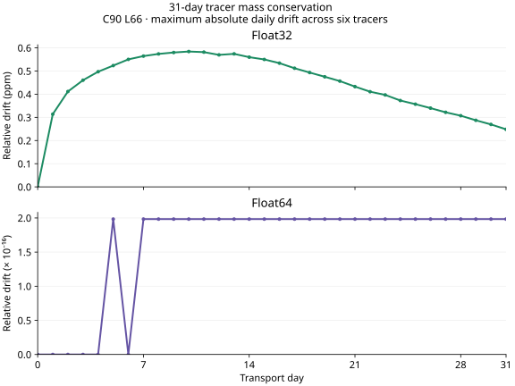
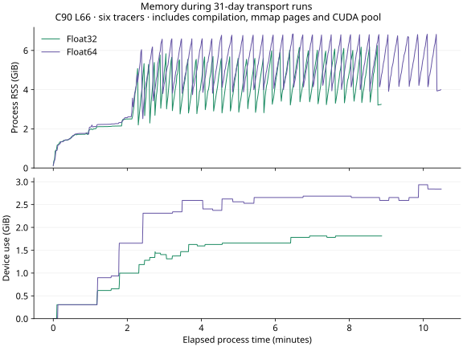

# 31-day mass conservation and memory on V100

The conservative C90 L66 configuration now completes all 31 December 2018
daily inputs in both Float32 and Float64: 744 windows and 7,630 transport
substeps. The files total 96,542,170,112 bytes
on disk. Six pressure-layer tracers target 1e35 molecules each at
pressure fractions 0.2–0.9. PPM, full-column collaborative TM5 convection,
conservative Dkg diffusion, no emissions, and `preserve_tracer_mass` window
resets match the preceding day/week experiments. No normalization or positivity
clamp is applied. The archive uses experimental three-hour convection with
hourly transport; these results do not establish TM5/GCHP forcing parity.

## Daily totals and final fields

| Precision | Largest absolute daily relative drift | Final relative drift magnitude |
|---|---:|---:|
| Float32 | 5.840147681050429e-7 | 2.483101223179083e-7 |
| Float64 | 1.9828344355813393e-16 | 1.9828344355813393e-16 |

Each value is the maximum across six tracers, measured from the compensated
Float64 `<tracer>_total_mass` snapshot scalars. These scalars sum model storage,
`dry VMR × dry-air mass`; they are not physical kilograms of each species.
Subtracting the initial total before division retains Float64 total ulps.
Daily sampling does not bound within-day excursions.

The Float32 maximum occurs on day 10. Its later decrease reflects the net
accumulation/cancellation of errors; the endpoint alone would understate the
worst observed drift. The earlier exploratory 1e-7 target remains unmet.
All six first-week total series match the earlier weekly runs exactly in both
precisions. The 31-day result extends that measured forcing sequence; it is
not a bound for other inputs or configurations.



NetCDF spatial fields are Float32 even for a Float64 simulation. Both runs
therefore save the complete final packed tracer panels in native precision,
outside the timed model call. The shape is `(96,96,66,6)` per panel, including
three-cell halos. Across every panel/tracer interior, maximum Float32-to-
Float64 relative L2 difference in native storage is 1.7405416450965061e-6.
All final interior tracer values are nonnegative in this experiment. Earlier snapshots
still contain small negative column means: minima are -1.4576256868181758e-11
and -1.457626658258859e-11 mol/mol for Float32 and Float64 respectively.
Conservation therefore does not establish positivity at every step or accuracy
against an atmospheric reference model.

Both model runs pass 30 output/completeness checks. The cross-precision
comparison passes 72 total/metadata checks and 112 native-field checks; the
weekly-prefix comparisons add 12 checks. All 256 checks pass. The native
comparison records field differences rather than imposing an unvalidated
accuracy threshold. The Float64 total-drift check uses a 1e-13 tolerance;
the measured result is given above.

## Host and device memory

| Measurement | Float32 | Float64 |
|---|---:|---:|
| GNU time maximum process RSS | 6.241 GiB | 6.833 GiB |
| Maximum sampled process RSS | 6.251 GiB | 6.841 GiB |
| Maximum sampled device use | 1,856 MiB | 3,006 MiB |
| Cumulative host allocation in model call | 170.564 GB | 322.357 GB |
| Timed model call, including first compilation | 521.554 s | 616.276 s |

Process RSS includes resident mmap pages and compilation. Device samples
include CUDA context and allocator-pool reservations. Host sampling uses
`ps` once per second for the Julia child owned by GNU time; device sampling
uses only the authorized GPU every 500 ms. GNU time and sampled RSS counters
are retained separately. Samples can miss brief peaks. The raw host archive
also retains one final Float32 row with zero RSS/VSZ after process exit;
the plot excludes that row from the live-process series.



The runs execute sequentially; plot curves align their elapsed process times.
RSS varies substantially during the run, and device reservations increase
before settling into a narrower range. These records characterize one month;
they do not establish the absence of leaks in longer or different workloads.
The input files' total size is not a measurement of physical storage traffic.
Prefetch timers overlap transport, and neither this run nor its nested timing
CSV provides a cold-storage bandwidth measurement. The two model-call timings
include compilation and are not a matched warmed precision-speed comparison.
Use the [day launch experiment](../main_f64_ppm_tiles_v100_20260906/README.md)
for the isolated performance result.

The caller-side `prefetch_fetch_wait` timer accumulates 130.063 s in Float32
and 0.691 s in Float64. This identifies window-readiness waits in the smaller
compute workload. Run order, cache state, and overlap differ, so the counts
do not isolate disk speed or promise an equivalent wall-time saving. The
recorded host-load sections total 314.804/185.451 s, and backend-copy sections
30.018/124.996 s. Those sections can overlap GPU work or include synchronization.
CSV `fraction_of_total` uses the sum of recorded sections as its denominator,
not model wall time; its allocation columns are unmeasured zeroes. Isolate
these read/copy/wait stages before changing buffer ownership or staging.

## Reproduction and review

Numerical source matches `362db581`, staged at `/tmp/atmos-f64-ppm`. The
subsequent state-help change only moves docstrings. The environment is Julia
1.12.6, CUDA.jl 5.11.3, CUDA runtime 12.6, four Julia threads, one OpenBLAS
thread, and tofu GPU 0 (Tesla V100-PCIE-16GB). Other GPUs were not used.

Set `ATMOSTR_BENCHMARK_OUTPUT_ROOT` to a directory with ample space. The
measured output root is
`/home/cfranken/data/AtmosTransport/benchmarks/revamp-20260906`. From this
artifact directory, run the two jobs sequentially:

```bash
bash run_with_monitor.sh conservative Float32 6 /tmp/atmos-f64-ppm
bash run_with_monitor.sh conservative Float64 6 /tmp/atmos-f64-ppm
```

The wrapper selects
`CUDA_VISIBLE_DEVICES=GPU-59ee7ef9-898f-524a-dde1-7a0426a41ecb` explicitly.
`run.jl` names all daily inputs and writes configuration, results, NetCDF,
timing CSV, and a native final-state file. `check_results.jl` takes the two
output folders and a comparison-output folder; run it with GPUs hidden.
`check_weekly_prefix.jl` takes a monthly result TOML and the corresponding
weekly result TOML. Large NetCDF/native files and full progress logs remain
on tofu. The per-precision `checks.log` files retain input sizes, total series,
field extrema, and check summaries from those logs.

`plot.py` rebuilds the mass figure from `daily_drift.csv`; pass the manual's
asset path as its output argument. `plot_memory.py` rebuilds `memory.svg` and
`resources.json` from the raw monitor files. Both use Matplotlib. No GPU is
needed for those plotting and comparison steps.

Critical Codex self-review checked daily completeness, subtraction before
normalization, native precision and array ordering, excluded halos, the
separate interpretation of cumulative allocation/RSS/device counters, and
monitor cleanup. The previous numerical and adjoint checks remain applicable:
this extension adds measurements and documentation, with no model-code change.
The strict documentation build and 191 local documentation checks pass, and
both generated figures were inspected.
